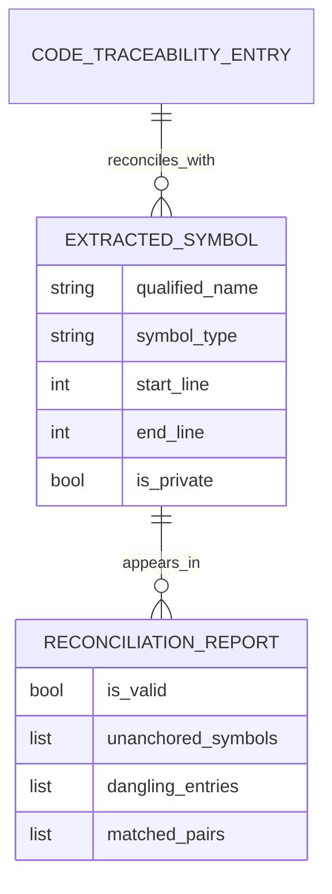

# Dossier de Preuves Factuelles — MLOOP-331-BE

**Récit** : Moteur d'Extraction AST & Résolution Déterministe des Symboles de Code  
**Épopée** : EPIC-33-REQUIREMENT-TO-CODE-TRACEABILITY-AND-CODE-EVIDENCE  
**Statut** : READY_FOR_DEV (validated_by: Marco, validated_at: 2026-09-25T17:18:38.646725+00:00)  
**Date constitution** : 2026-09-25

---

## 1. Maquettes SSOT & Notes d'Atelier

Aucune maquette UI/UX requise (récit backend pur — moteur d'analyse statique AST).

---

## 2. Matrice de Résolution des Conflits

| Conflit Identifié | Source | Résolution | Décision |
|-------------------|--------|------------|----------|
| Analyse statique vs dynamique | ADR-0394 §4.1 | Analyse statique pure via `ast.parse` (zéro exécution, zéro import) | Acceptée |
| Tolérance helpers privés | ADR-0394 §4.2 | Helper privé imbriqué sous symbole couvert = toléré sans entrée distincte | Acceptée |
| Ancrage canonique | ADR-0394 §4.1 | Notation normalisée `chemin/fichier.py::NomClasse.methode` | Acceptée |

---

## 3. Extraits Verbatim Sourcés

### Extrait 1 — ADR-0394 (Lignes 1-50)
> « La traçabilité des exigences doit s'étendre de bout en bout jusqu'au code physique sans rompre l'étanchéité no-code du récit fonctionnel. »
> ➔ Fait établi : L'extraction AST doit produire des symboles qualifiés sans exécuter le code.

### Extrait 2 — ADR-0369 (Standards Robustesse Python Senior)
> « Typage Structurel : Injection des collaborateurs lourds via `typing.Protocol`. »
> ➔ Fait établi : `CodeEvidenceTracer` doit utiliser des Protocols pour l'extraction.

### Extrait 3 — ADR-0369 (Zéro Dépendance Externe)
> « Zéro Dépendance Externe & Analyse Sécurisée : L'analyse statique s'effectue exclusivement par inspection déclarative de l'AST sans importer ni exécuter le code cible. »
> ➔ Fait établi : Utilisation exclusive de `ast.parse` + `ast.NodeVisitor`.

---

## 4. Structure de Données DBML / Mermaid ERD

---

## 5. Contrats Déclaratifs Cibles

| Composant | Contrat | Fichier |
|-----------|---------|---------|
| CodeEvidenceTracer | `extract_symbols_from_source(source_code: str, relative_path: str) -> List[ExtractedSymbol]` | `src/pipelines/code_evidence_tracer.py` |
| CodeEvidenceTracer | `extract_symbols_from_file(file_path: Path, base_dir: Optional[Path] = None) -> List[ExtractedSymbol]` | `src/pipelines/code_evidence_tracer.py` |
| CodeEvidenceTracer | `reconcile(extracted: List[ExtractedSymbol], matrix: List[CodeTraceabilityEntry], allow_private_implicit: bool = True) -> ReconciliationReport` | `src/pipelines/code_evidence_tracer.py` |
| ExtractedSymbol | TypedDict: `qualified_name`, `symbol_type`, `start_line`, `end_line`, `is_private` | `src/pipelines/code_evidence_tracer.py` |
| ReconciliationReport | TypedDict: `is_valid`, `unanchored_symbols`, `dangling_entries`, `matched_pairs` | `src/pipelines/code_evidence_tracer.py` |

---

## 6. Frontière Active & Admission of Limits

| Zone | Statut | Commentaire |
|------|--------|-------------|
| Extraction classes/méthodes/fonctions | ✅ Spécifié | `ClassDef`, `FunctionDef`, `AsyncFunctionDef` |
| Qualification canonique | ✅ Spécifié | `chemin/fichier.py::NomClasse.methode` |
| Tolérance helpers privés | ✅ Spécifié | Imbriqués sous symbole couvert = tolérés |
| Détection Ghost Code | ✅ Spécifié | Symboles publics non ancrés = échec |
| Réconciliation exacte | ✅ Spécifié | Indexation par `ast_symbol` |
| **Analyse dynamique/runtime** | ❌ Hors périmètre | Couvert par pytest/coverage |
| **Parseur TypeScript** | ❌ Hors périmètre | Story ultérieure frontend |
| **Sonde Vibe-Check Check 29** | ❌ Hors périmètre | Couvert par MLOOP-333-BE |
| **Insertion code dans Markdown** | ❌ Interdit | Gate G4 — zéro pollution no-code |

---

## 7. Preuves de Conformité (Références Croisées)

| Critère | Preuve |
|---------|--------|
| Extraction déterministe | `CodeEvidenceTracer.extract_symbols_from_file` — test `test_code_evidence_tracer.py` |
| Qualification canonique | `ExtractedSymbol.qualified_name` — format normalisé |
| Tolérance helpers privés | Paramètre `allow_private_implicit` — test unitaire |
| Détection Ghost Code | `ReconciliationReport.unanchored_symbols` — test `test_code_evidence_tracer.py` |
| Zéro exécution code | `ast.parse` uniquement — pas d'import du module cible |

---

*Dossier constitué le 2026-09-25 par l'Orchestrateur mLoop pour lever le blocage Check 28 sur MLOOP-331-BE.*