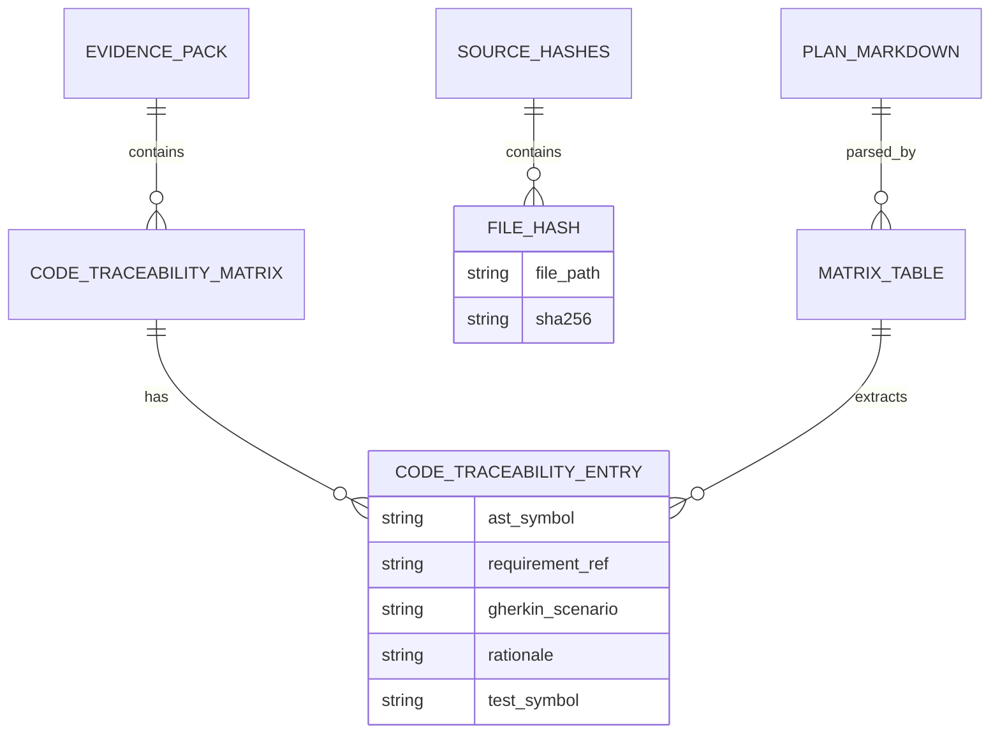

# Dossier de Preuves Factuelles — MLOOP-332-BE

**Récit** : Pipeline d'Harmonisation Synchrone EvidencePack 2.0 & Archivage des Preuves  
**Épopée** : EPIC-33-REQUIREMENT-TO-CODE-TRACEABILITY-AND-CODE-EVIDENCE  
**Statut** : READY_FOR_DEV (validated_by: Marco, validated_at: 2026-09-25T17:51:58.042995+00:00)  
**Date constitution** : 2026-09-25

---

## 1. Maquettes SSOT & Notes d'Atelier

Aucune maquette UI/UX requise (récit backend pur — pipeline de synchronisation).

---

## 2. Matrice de Résolution des Conflits

| Conflit Identifié | Source | Résolution | Décision |
|-------------------|--------|------------|----------|
| Format Markdown vs OpenSpec tasks.md | ADR-0394 §3.2 | Double passerelle déclarative (priorité plan.md, fallback tasks.md) | Acceptée |
| Atomicité vs Idempotence | ADR-0394 §4.1 | Synchronisation tout-ou-rien + rejouable | Acceptée |
| Préservation blocs protégés | ADR-0394 §4.3 | pack_preserver.py (fusion non-destructrice) | Acceptée |

---

## 3. Extraits Verbatim Sourcés

### Extrait 1 — ADR-0394 (Lignes 1-50)
> « La traçabilité des exigences doit s'étendre de bout en bout jusqu'au code physique sans rompre l'étanchéité no-code du récit fonctionnel. »
> ➔ Fait établi : La synchronisation EvidencePack doit préserver la pureté no-code des User Stories.

### Extrait 2 — MLOOP-330-BE (Critères d'acceptation, Lignes 49-60)
> « Validation Déterministe d'une Entrée de Traçabilité : Le symbole AST doit respecter le format qualifié `chemin/fichier.ext::Symbole`. »
> ➔ Fait établi : Le parseur de plan doit extraire des symboles qualifiés canoniques.

### Extrait 3 — MLOOP-331-BE (Critères d'acceptation, Lignes 55-67)
> « Extraction Déterministe des Symboles AST : Parcours de l'AST via un visiteur sans exécution de code. »
> ➔ Fait établi : L'extraction statique utilise `ast.parse` sans import/exécution.

---

## 4. Structure de Données DBML / Mermaid ERD

---

## 5. Contrats Déclaratifs Cibles

| Composant | Contrat | Fichier |
|-----------|---------|---------|
| PlanEvidenceParser | `extract_matrix_from_plan(plan_path: Path) -> List[CodeTraceabilityEntry]` | `src/pipelines/evidence_pack.py` |
| PlanEvidenceParser | `extract_matrix_from_text(content: str) -> List[CodeTraceabilityEntry]` | `src/pipelines/evidence_pack.py` |
| EvidenceSynchronizer | `sync_story_evidence(story_id: str, plan_path: Optional[Path] = None, base_dir: Optional[Path] = None) -> Path` | `src/pipelines/evidence_pack.py` |
| EvidencePackEngine | `validate_code_traceability(entries: List[CodeTraceabilityEntry]) -> bool` | `src/pipelines/evidence_pack.py` |
| EvidencePackEngine | `set_code_traceability(story_id: str, entries: List[CodeTraceabilityEntry]) -> Path` | `src/pipelines/evidence_pack.py` |

---

## 6. Frontière Active & Admission of Limits

| Zone | Statut | Commentaire |
|------|--------|-------------|
| Parsing Markdown GFM | ✅ Spécifié | Tableau pipes standard, entêtes, délimiteurs |
| Validation quintuplet | ✅ Spécifié | Via `EvidencePackEngine.validate_code_traceability` |
| SHA-256 fichiers sources | ✅ Spécifié | Calcul déterministe sur disque |
| Fusion atomique non-destructrice | ✅ Spécifié | Via `pack_preserver.py` |
| Fallback OpenSpec tasks.md | ✅ Spécifié | Adaptateur de secours |
| **Extraction AST runtime** | ❌ Hors périmètre | Couvert par MLOOP-331-BE |
| **Sonde Vibe-Check Check 29** | ❌ Hors périmètre | Couvert par MLOOP-333-BE |
| **Insertion code dans Markdown** | ❌ Interdit | Gate G4 — zéro pollution no-code |

---

## 7. Preuves de Conformité (Références Croisées)

| Critère | Preuve |
|---------|--------|
| Parsing déterministe table Markdown | `PlanEvidenceParser.extract_matrix_from_plan` — test unitaire `test_plan_evidence_parser.py` |
| Validation quintuplet | `EvidencePackEngine.validate_code_traceability` — test `test_evidence_pack_traceability.py` |
| SHA-256 fichiers sources | `EvidenceSynchronizer.sync_story_evidence` — calcul sur `Path.read_bytes()` |
| Atomicité tout-ou-rien | `pack_preserver.PackPreserver.merge` — test `test_pack_preserver.py` |
| Préservation blocs protégés | `tdd_cycle`, `fact_check_certificate` inchangés post-sync |
| Double passerelle plan.md / tasks.md | `PlanEvidenceParser` + adaptateur OpenSpec |

---

*Dossier constitué le 2026-09-25 par l'Orchestrateur mLoop pour lever le blocage Check 28 (cascade detection) sur MLOOP-332-BE.*