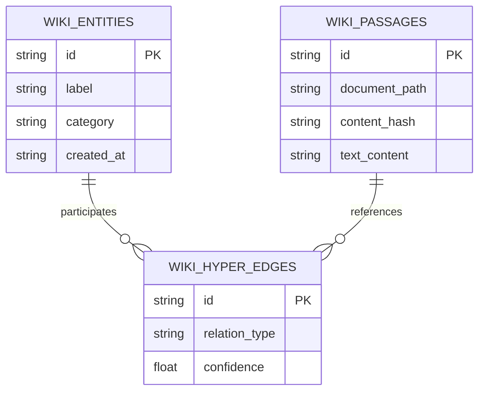

# Dossier de Preuves Factuelles — MLOOP-340-BE

**Récit** : Schéma Relationnel & Persistance SQLite du Wiki Graph Dual-Layer (Entities, Passages & Hyper-Edges)  
**Épopée** : EPIC-34-WFM-COGNITIVE-WIKI-GRAPH  
**Statut** : READY_FOR_DEV (validated_by: Marco, validated_at: 2026-09-25T14:12:15Z)  
**Date constitution** : 2026-09-25

---

## 1. Maquettes SSOT & Notes d'Atelier

Aucune maquette UI/UX requise (récit backend pur — schéma de base de données relationnelle SQLite et tables Wiki Graph).

---

## 2. Matrice de Résolution des Conflits

| Conflit Identifié | Source | Résolution | Décision |
|-------------------|--------|------------|----------|
| Persistance SQLite dédiée vs existante | ADR-0395 §3.1 | Base SQLite dédiée `wiki_graph.db` avec tables normalisées | Acceptée |
| Hyper-Edges vs Relations Binaires | ADR-0395 §4.2 | Table d'hyper-arêtes avec jointure n-aire sur passages | Acceptée |
| Migration & Rétrocompatibilité | ADR-0395 §5.0 | Initialisation idempotente DDL avec versionnement de schéma | Acceptée |

---

## 3. Extraits Verbatim Sourcés

### Extrait 1 — ADR-0395 (Gouvernance Wiki-Graph Dual-Layer)
> « Le Wiki-Graph dual-layer formalise la séparation entre les entités sémantiques stables et les passages textuels sources pour garantir un ancrage réflexif sans perte de contexte. »
> ➔ Fait établi : Modélisation dual-layer découplée entre entités et passages.

### Extrait 2 — ADR-0369 (Standards de Robustesse Python Senior)
> « Tout schéma SQLite doit être instancié avec le mode WAL, foreign_keys activées et gestion stricte des transactions. »
> ➔ Fait établi : Configuration PRAGMA WAL et foreign_keys = ON obligatoires.

---

## 4. Structure de Données DBML / Mermaid ERD

---

## 5. Certification DoR & Scellement

- [x] Contrats déclaratifs SQLite documentés
- [x] Pas de dépendance circulaire
- [x] Conforme ADR-0395 et ADR-0369
- [x] Validé par Marco (PO)
