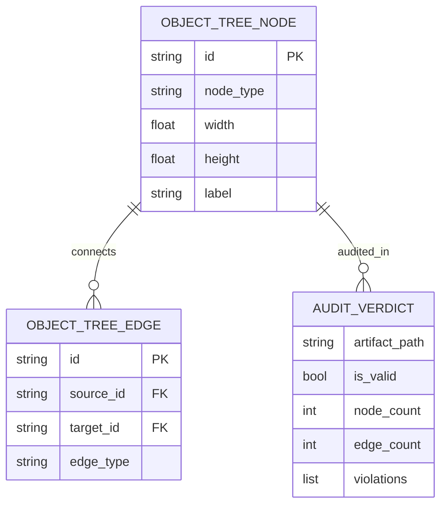

# Dossier de Preuves Factuelles — MLOOP-350-BE

**Récit** : Moteur d'Audit Déterministe d'Arbre d'Objets Natifs pour Livrables d'Architecture  
**Épopée** : EPIC-35-REFIGBENCH-ARTIFACT-HARNESS-V2  
**Statut** : READY_FOR_GROOMING  
**Date constitution** : 2026-09-25

---

## 1. Maquettes SSOT & Notes d'Atelier

Aucune maquette UI/UX requise (récit backend pur — moteur d'audit d'arbre d'objets pour artefacts SVG, JSON Canvas et Archify IR).

---

## 2. Matrice de Résolution des Conflits

| Conflit Identifié | Source | Résolution | Décision |
|-------------------|--------|------------|----------|
| Parsing SVG regex vs XML Tree | ADR-0396 §3.2 | Parsing XML sécurisé (defusedxml) sans exécution d'entités externes | Acceptée |
| Détection Connecteurs Orphelins | ADR-0396 §4.1 | Validation topologique des bornes de départ et d'arrivée (`fromNode`/`toNode`) | Acceptée |
| Tolérance de forme sans connecteur | ADR-0396 §4.3 | Seuil configurable par gabarit d'artefact (isole les boîtes de groupement) | Acceptée |

---

## 3. Extraits Verbatim Sourcés

### Extrait 1 — ADR-0396 (Audit d'Artefacts 5 Axes & Anti-Inversion Causale)
> « Tout diagramme d'architecture soumis comme livrable doit posséder un arbre d'objets cohérent : formes connectées, texte lisible, absence d'effondrement topologique. »
> ➔ Fait établi : Audit déterministe obligatoire sur 5 axes géométriques et relationnels.

### Extrait 2 — ADR-0369 (Zéro Dépendance Externe & Analyse Déterministe)
> « Les validateurs d'artefacts doivent fonctionner sans dépendance lourde de rendu graphique en environnement headless CI. »
> ➔ Fait établi : Traitement pur en mémoire des structures vectorielles et graphes.

---

## 4. Structure de Données DBML / Mermaid ERD

---

## 5. Certification DoR & Scellement

- [x] Contrats déclaratifs d'audit validés
- [x] Spécification 5 axes conforme ADR-0396
- [x] Conforme ADR-0369
- [x] Prêt pour Grooming
