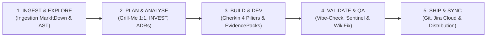

# 🌀 Memory Loop — Cognitive Pure State-Graph Multi-Agent Engine (mLoop)

[](https://www.python.org/downloads/)
[](https://github.com/astral-sh/uv)
[](standards/adr-system/README.md)
[](standards/protocols/CLI_PIPELINE_GUIDE.md)
[](tests/)

**Memory Loop (mLoop)** est le **Cerveau & Backend d'État Déterministe** du cycle de vie logiciel. Il pilote la transformation de la matière brute en spécifications fonctionnelles et architectures de haute précision consommables sans ambiguïté par les développeurs et les agents de codage (*Universal Dev Handoff*).

---

## 🧭 Accès Rapide aux Documents Majeurs

| Document | Description | Lien |
| :--- | :--- | :---: |
| 🛠️ **Guide d'Installation** | Procédure pas-à-pas pour déployer votre environnement de travail local | [**`docs/INSTALL.md`**](docs/INSTALL.md) |
| 📖 **Guide du Pipeline CLI** | Matrice exhaustive des **122 commandes réelles** réparties en 5 phases | [**`CLI_PIPELINE_GUIDE.md`**](standards/protocols/CLI_PIPELINE_GUIDE.md) |
| 📜 **Journal des Modifications** | Historique complet des versions, refactorings et jalons livrés | [**`CHANGELOG.md`**](CHANGELOG.md) |
| 🗄️ **Schémas BD & Graphes** | Structure détaillée des bases SQLite FTS5, de CodeGraph et de Graphify | [**`SCHEMAS_BD_ET_GRAPHES.md`**](docs/01-architecture/SCHEMAS_BD_ET_GRAPHES.md) |
| 🏛️ **Catalogue des 101 ADRs** | Source Unique de Vérité Constitutionnelle (Normes & Standards d'Architecture) | [**`standards/adr-system/`**](standards/adr-system/README.md) |
| 🧰 **Boîte à Outils Transverse** | Index des utilitaires (Archify, drawDB, Office, Jira, Hooks Git) | [**`tools/README.md`**](tools/README.md) |

---

## 🤝 Premier Démarrage : Laissez l'Agent vous Accompagner !

> [!TIP]
> **Philosophie Pédagogique Agentique** : Nous ne recommandons pas l'usage d'un script "boîte noire" aveugle.  
> Pour vous familiariser avec le fonctionnement d'un framework cognitif, ouvrez votre assistant IA préféré (**Antigravity**, **OpenCode**, **Claude Code**, **Cursor** ou **Cline**) à la racine du dépôt et écrivez-lui simplement :
> 
> ```text
> "Peux-tu m'accompagner pas-à-pas pour installer et initialiser Memory Loop ?"
> ```
> 
> **Votre agent exécutera les étapes avec vous en toute transparence :**
> 1. ✅ Contrôle des prérequis système (Python 3.12 avec SQLite FTS5, Node.js, `uv`, Git).
> 2. 📦 Création du `.venv` et synchronisation déterministe via `uv sync --all-extras`.
> 3. 🔑 Configuration assistée de votre clé dans `~/.secrets/litellm-key` et `.env`.
> 4. 🕸️ Installation globale des moteurs de graphes (**CodeGraph** & **Graphify**).
> 5. 🗄️ Initialisation des bases de données locales (`memory/loop_mem.db`, `.codegraph/`).
> 6. 🛡️ Activation des garde-fous Git pre-commit & post-commit.
> 7. 🩺 Lancement du diagnostic `doctor`, du `vibe-check` (23 contrôles) et de la suite de tests unitaires (1 386 tests).

---

## 🔄 Le Cycle de Vie en 5 Phases Souveraines (ADR-0375)



---

## ⚡ Séquence d'Amorçage Obligatoire (Boot Sequence - ADR-0322)

Au tout premier tour d'une session de travail sur un projet, l'orchestrateur exécute mécaniquement :

```powershell
# 1. Anti-amnésie : restauration de l'état cognitif et de l'historique
uv run python src/swarm.py resume --project <nom_du_projet>

# 2. Guardrail pré-vol de sécurité : 23 contrôles déterministes stricts
uv run python src/swarm.py vibe-check --project <nom_du_projet>

# 3. Verrou d'attention sur le récit actif (Phase >= 2)
uv run python src/swarm.py focus --project <nom_du_projet> --story <chemin_ou_id>
# (En Phase 1, remplacer par 'uv run python src/swarm.py lifecycle-status --project <nom_du_projet>')
```

---

## 💳 Suivi du Budget IA & Modèles

Memory Loop embarque un module de monitoring de consommation en temps réel connecté au proxy LiteLLM :

```powershell
# Diagnostic de consommation et solde restant
uv run python tools/budget/check_budget.py

# Détail des dépenses par modèle et par jour
uv run python tools/budget/check_budget.py --details
```

---

## 📜 Licence & Gouvernance

Framework souverain sous gouvernance stricte multi-agents — Équipe Architecture & Ingénierie Nmédia.
Consultez [`AGENTS.md`](AGENTS.md) pour les règles constitutionnelles complètes.
