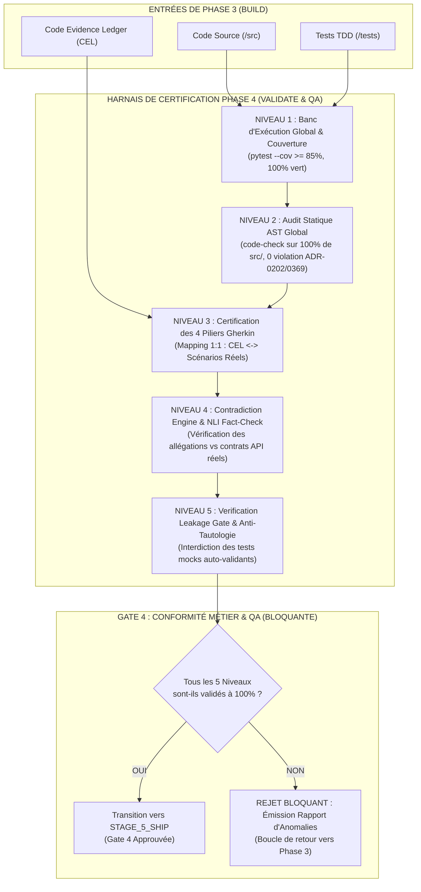

# 🏛️ Rapport d'Audit & Cadrage d'Architecture : Réalignement Déterministe de la Phase 4 (STAGE_4_VALIDATE & QA)

**Auteur** : Co-Architecte Senior mLoop  
**Destinataires** : Marco (Product Owner / Architecte), Lead Architect  
**Date** : 19 Septembre 2026  
**Statut** : Rapport d'Audit Normatif & Proposition de Standard (Future ADR-0383)  
**Contexte de mission** : Analyse en tâche de fond suite au constat de Marco : *« La phase 4 n'est pas vraiment alignée, est-ce qu'on peut initier les travaux en parallèle ? »*

---

## 1. Contexte & Diagnostic Stratégique

Lors des phases d'amorçage de l'écosystème mLoop, l'effort d'ingénierie s'est massivement concentré sur :
1. **La Phase 1 (INGEST & EXPLORE)** : Blindée par l'ADR-0377/ADR-0378 (Check 13 Anti-Ghost-Bias, `source_manifest.json`, LOD sidecars, Gate 1 impitoyable).
2. **La Phase 2 (PLAN & ANALYSE)** : Blindée par l'ADR-0373/ADR-0375/ADR-0379 (Grill-Me 1:1, DoR 6/6, 4 Piliers Gherkin, Multi-Draft Challenge, StandardsGraph SQLite).
3. **La Phase 3 (BUILD & DEV)** : Récemment dotée du disjoncteur `PingPongGuard` (MLOOP-070-BE), de l'intercepteur frontière `boundary_wrapper.py` (MLOOP-071-BE), du socle OpenInference (MLOOP-072-BE), du linter AST `code-check` (MLOOP-080-BE), du Tournoi Multi-Draft (MLOOP-081-BE), de l'enforcement TDD Red-Green (MLOOP-082-BE) et de l'intégration SDD souveraine (ADR-0382).

**Le constat de Marco est d'une lucidité implacable** :
Alors que la Phase 3 monte à un niveau d'exigence mathématique (CEL ligne par ligne, Red-Green cryptographique, zéro fuite de tokens), **la Phase 4 (VALIDATE & QA) est restée figée dans un état transitoire et désaligné**.

Elle souffre d'un flou conceptuel majeur : elle tente d'auditer des fichiers Markdown de stories (tâche qui appartient en réalité à la Phase 2) au lieu de certifier le **comportement physique du code applicatif produit en Phase 3**. Pire encore, sa porte de sortie (**Gate 4**) est actuellement une **coquille vide** dans le code source de mLoop (`src/core/lifecycle.py`), ne réalisant aucun contrôle bloquant automatisé avant d'autoriser la transition vers la Phase 5 (SHIP).

---

## 2. Analyse de l'Existant (Audit du Code Source & des Protocoles)

Un examen approfondi des fichiers de référence révèle les dysfonctionnements factuels suivants :

### 2.1 La Porte 4 (`approve_gate(gate=4)`) est une Coquille Vide (`src/core/lifecycle.py`)
Dans `src/core/lifecycle.py` (lignes 516-565) :
- **Gate 1** possède des gardes bloquantes strictes : vérification de la présence de `source_manifest.json`, interdiction physique de stories dans `backlog/stories/` (Check 13), vérification des conversions UTF-8.
- **Gate 4**, en revanche, n'exécute **strictement aucun contrôle métier ni technique** : elle calcule un simple hash de dossier et valide le passage vers `STAGE_5_SHIP`, même si 100% des tests unitaires sont cassés, même si le code viole l'ADR-0202, et même si aucune validation QA n'a été menée.

### 2.2 Confusion Fondamentale : `evals.py` Audite le Backlog, Pas le Logiciel
Dans `src/pipelines/evals.py` :
- La classe `EvalsEngine.run_evals()` parcourt `backlog/stories/*.md` et appelle `RubberDuckEngine.evaluate_file(story_file)`.
- **Anomalie majeure** : `RubberDuckEngine` vérifie si les récits Markdown contiennent des parenthèses, des sections manquantes ou des critères flous. C'est exactement le travail de la **Gate 2 (Definition of Ready)** en Phase 2 !
- En Phase 4, après que les développeurs ou les agents ont passé des heures à coder et tester le composant en Phase 3, exécuter `run_evals` ne fait que ré-auditer la prose des tickets sans tester une seule ligne de code exécutable.

### 2.3 `AutoEvalHarvester` Récolte des Erreurs de Rédaction au Lieu de Bugs Code
Dans `src/pipelines/eval_harvester.py` :
- Les cas de tests d'évaluation générés proviennent de `harvest_from_wikifix()` et de `wikifix_report.md`.
- Les catégories récoltées sont `blueprint_drift`, `invest_criteria`, `technical_leak`.
- Ces anomalies sont des défauts de formatage de spécifications de Phase 2, et non des cas de régression fonctionnelle ou des échecs d'invariants système de Phase 3/4.

### 2.4 Le Persona de `Sentinel` est Déphasé (`.agents/agents/sentinel.md`)
- Le profil déclare : *« Priorité : Le calcul rigoureux du score INVEST »*.
- Or, le score INVEST qualifie la granularité d'un ticket avant développement. En Phase 4, Sentinel devrait être l'auditeur impitoyable de la conformité du code aux 4 Piliers Gherkin, de l'absence de fuites de mémoire, de la robustesse face aux pannes et de la vérification NLI.

### 2.5 Désalignement du Catalogue des Commandes CLI
Dans `src/core/lifecycle.py` (`COMMAND_MIN_STAGE`) :
- Seules 3 commandes sont autorisées en Phase 4 : `aoep`, `eval`, `audit-loop`.
- Or, le protocole `PHASE_FILES_AND_TEST_PLAN.md` affirme que Phase 4 requiert `struct-check`, `rubber-duck`, `wikifix`, `fact-check`. Ces commandes sont déclarées en `STAGE_2_PLAN_ANALYSE` dans le code !

---

## 3. Gap Analysis : Les 5 Fractures Majeures

```text
┌────────────────────────────────────────────────────────────────────────────────────────┐
│               LES 5 FRACTURES ARCHITECTURALES DE LA PHASE 4 ACTUELLE                   │
├────────────────────────────────────────────────────────────────────────────────────────┤
│                                                                                        │
│   FRACTURE 1 : CONFUSION DE PHASE (QA Spec vs QA Code)                                 │
│   Phase 4 audite la syntaxe des stories Markdown au lieu du logiciel construit.        │
│                                                                                        │
│   FRACTURE 2 : ANGLE MORT SUR LE CODE EVIDENCE LEDGER (CEL)                            │
│   Phase 3 trace chaque ligne (CEL-070, CEL-071), mais Phase 4 ignore totalement le CEL.│
│                                                                                        │
│   FRACTURE 3 : GHERKIN 4 PILIERS NON VÉRIFIÉS SUR LE CODE PHYSIQUE                     │
│   Les 4 Piliers (Nominal, Rejet, Résilience, Observabilité) sont écrits dans la story, │
│   mais aucun banc de certification ne prouve leur exécution intégrale de bout en bout. │
│                                                                                        │
│   FRACTURE 4 : ISOLEMENT DES RUNNABLE GATES & NLI (ADR-0341 / ADR-0354)                │
│   L'anti-tautologie (mocks auto-validants) et la polarité NLI restent théoriques et    │
│   ne bloquent pas physiquement la Gate 4.                                              │
│                                                                                        │
│   FRACTURE 5 : PASSOIRE DE GATE 4 DANS LE RUNTIME                                      │
│   approve_gate(gate=4) valide la transition vers SHIP sans aucun contrôle bloquant.    │
│                                                                                        │
└────────────────────────────────────────────────────────────────────────────────────────┘
```

---

## 4. Architecture Cible : Le Harnais Déterministe de Phase 4 (ADR-0383)

Pour aligner définitivement la Phase 4, nous proposons d'instaurer formellement l'**ADR-0383** :  
*« Standard du Harnais Déterministe de Phase 4 : Evals Suites, Contradiction Engine, Traçabilité des 4 Piliers Gherkin & Verrouillage de Gate 4 »*.

### 4.1 Les 5 Niveaux de Certification Déterministe de Phase 4



---

## 5. Spécification des 5 Niveaux de Certification

### Niveau 1 : Banc d'Exécution Global & Non-Régression
- Exécution de l'intégralité de la suite de tests du projet : tests unitaires, tests d'intégration, tests de composants.
- **Règle bloquante** : 100% de tests au vert (`exit_code == 0`). Zéro tolérance pour les tests sautés non documentés (`@pytest.mark.skip` sans raison explicite).
- **Couverture minimale** : Plafond constitutionnel de couverture sur les modules modifiés $\ge 85\%$.

### Niveau 2 : Audit Statique AST Global (`code-check`)
- Exécution du linter `src/core/ast_checker.py` (issu de `MLOOP-080-BE`) sur l'ensemble de l'arborescence `src/`.
- **Règles auditées** :
  * ADR-0202 : Fichiers $\le 300$ lignes et $\le 15$ Ko.
  * ADR-0369 R2 : Zéro connexion SQLite ou descripteur de fichier hors bloc `with`.
  * ADR-0369 R3 : Zéro `subprocess.run` ou appel HTTP sans `timeout`.
  * ADR-0369 R4 : Zéro `except Exception: pass` nu.
  * ADR-0369 R7 : Dépréciation explicite avec `stacklevel=2`.

### Niveau 3 : Certification des 4 Piliers Gherkin via le Code Evidence Ledger
- Le vérificateur charge `Projects/<projet>/memory/evidence/EPIC-X_code_evidence_ledger.json`.
- Pour chaque récit du sprint :
  1. **Pilier 1 (Nominal)** : Vérification que les scénarios nominaux sont adossés à des tests validés.
  2. **Pilier 2 (Exceptions & Rejets)** : Vérification de la couverture des contrats d'erreur (`pytest.raises`, statuts HTTP 400/401/403/429/500).
  3. **Pilier 3 (Résilience & Mode Dégradé)** : Vérification de l'isolation aux pannes, des circuits breakers (`PingPongGuard`, `FinancialCircuitBreaker`) et des timeouts.
  4. **Pilier 4 (UX & Observabilité)** : Vérification que les événements sont bien émis vers `EventLogger` (`memory/events.jsonl`) sous la taxonomie OpenInference / OTel GenAI.
- **Règle bloquante** : Zéro blindspot toléré. Un pilier non couvert bloque la Gate 4.

### Niveau 4 : Contradiction Engine & Certification NLI (`src/engine/fact_check/`)
- Moteur d'inférence en langage naturel reliant les spécifications documentaires (`docs/01-architecture/`, `docs/03-models/`) aux contrats réels du code (schémas Pydantic, routes FastAPI, tables SQLite).
- **Contrôle** : Toute contradiction sémantique (*Contradiction Score > 0.85*) ou allégation fonctionnelle non supportée par une structure physique du code déclenche un drapeau rouge QA.

### Niveau 5 : Verification Leakage Gate (ADR-0354)
- Audit automatisé des suites de tests pytest :
  1. *Critère Black-Box* : Rejet de toute assertion accédant directement à un membre privé (`assert obj._internal_cache == ...`).
  2. *Critère Anti-Tautologie* : Rejet des tests comparant la sortie d'une fonction avec une valeur codée en dur injectée dans le mock au sein du corps du même test (`mock.return_value = "X"; assert call() == "X"`).

---

## 6. Implémentation Déterministe dans `src/core/lifecycle.py`

Voici la logique bloquante à injecter dans `ProjectLifecycleManager.approve_gate()` pour la Gate 4 :

```python
        # Validations bloquantes spécifiques Gate 4 (ADR-0383 / QA & Certification Déterministe)
        if gate_number == 4:
            # 1. Vérification du rapport d'audit QA global
            qa_report_file = project_path / "memory" / "qa_certification_report.json"
            if not qa_report_file.exists():
                raise ValueError(
                    f"Approbation de Gate 4 refusée : aucun rapport de certification QA "
                    f"n'a été trouvé sous memory/qa_certification_report.json pour '{project_path.name}'. "
                    f"Lancez 'python src/swarm.py validate-sprint --project {project_path.name}' avant d'approuver la Gate 4."
                )

            with open(qa_report_file, "r", encoding="utf-8") as f:
                qa_data = json.load(f)

            # 2. Vérification des tests 100% au vert
            if not qa_data.get("pytest_all_passed", False):
                failed_count = qa_data.get("failed_tests_count", 0)
                raise ValueError(
                    f"Approbation de Gate 4 refusée : la suite de tests comporte {failed_count} échecs. "
                    f"La Gate 4 exige 100% de tests au vert."
                )

            # 3. Vérification du linter AST (0 violation ADR-0202 et ADR-0369)
            if qa_data.get("ast_violations_count", 0) > 0:
                violations = qa_data.get("ast_violations", [])
                raise ValueError(
                    f"Approbation de Gate 4 refusée : {len(violations)} violations de standards AST "
                    f"(ADR-0202 / ADR-0369) détectées : {violations[:3]}."
                )

            # 4. Vérification de l'intégrité du Code Evidence Ledger (Zéro Blindspot sur les 4 Piliers)
            if not qa_data.get("cel_coverage_complete", False):
                missing_pillars = qa_data.get("missing_gherkin_pillars", [])
                raise ValueError(
                    f"Approbation de Gate 4 refusée : le Code Evidence Ledger présente des angles morts "
                    f"sur les 4 Piliers Gherkin : {missing_pillars}."
                )

            # 5. Vérification de la signature humaine obligatoire (Marco / Lead Architect)
            if not approver or approver.lower() in ("ai", "swarm", "bot", "sentinel"):
                raise ValueError(
                    "Approbation de Gate 4 refusée : la Gate 4 exige obligatoirement une signature "
                    "humaine formelle (ex: approver='Marco' ou 'LeadArchitect')."
                )
```

---

## 7. Commandes CLI et Livrables Opposables de Phase 4

### 7.1 Nouvelles Commandes CLI Proposées
1. `python src/swarm.py validate-sprint --project <P>` :
   Exécute la chaîne complète des 5 niveaux de certification, génère `memory/qa_certification_report.json` et `memory/qa_certification_report.md`.
2. `python src/swarm.py test-4pillars --story <ID>` :
   Audite spécifiquement le raccordement entre le code physique et les 4 Piliers Gherkin de la story.
3. `python src/swarm.py nli-audit --project <P>` :
   Vérifie la non-contradiction sémantique entre les contrats API de `src/` et la documentation de `docs/`.
4. `python src/swarm.py gate-approve --gate 4 --approver Marco --notes "Recette validée"` :
   Approuve la Gate 4 sous condition de succès des 5 contrôles bloquants ci-dessus.

### 7.2 Livrables Opposables Produits en Phase 4
- `Projects/<projet>/memory/qa_certification_report.json` : Preuve cryptographique d'exécution du banc complet.
- `Projects/<projet>/memory/qa_certification_report.md` : Tableau de bord de synthèse lisible pour Marco.
- `Projects/<projet>/memory/evals/regression_evals.json` : Suite de cas de régression moissonnée pour Dream RSI (ADR-0372).

---

## 8. Proposition de Découpage pour les Travaux en Parallèle (Épopée EPIC-9)

Pour matérialiser ce réalignement en tâche de fond sans perturber le sprint actif d'EPIC-7, nous recommandons la création de l'épopée d'infrastructure de validation :  
**`EPIC-9-STAGE4-DETERMINISTIC-VALIDATION`** découpée en 3 récits :

1. **`MLOOP-090-BE` : Moteur de Certification Sprint & Runner 4 Piliers** :
   Création de `src/pipelines/qa_certifier.py` et de la commande `validate-sprint` orchestrant Pytest, `code-check` AST et le matching du Code Evidence Ledger.
2. **`MLOOP-091-BE` : Moteur Contradiction Engine NLI & Verification Leakage Gate** :
   Connexion de `src/engine/fact_check/` au code source pour certifier l'absence de divergence sémantique et bannir les tests tautologiques (ADR-0354).
3. **`MLOOP-092-BE` : Verrous Bloquants de Gate 4 & Tableau de Bord Cockpit QA** :
   Injection des 5 règles bloquantes dans `src/core/lifecycle.py` et affichage du badge holographique *Gate 4 Readiness* dans l'onglet Gouvernance du Cockpit.

---

## 9. Conclusion & Recommandation Immédiate

L'analyse confirme à 100% l'intuition de Marco : **la Phase 4 souffrait d'un décalage anachronique en persistant à auditer les stories au lieu du code**.

Avec cette architecture cible :
- La Phase 3 produit le code, les tests unitaires et le Code Evidence Ledger ligne par ligne.
- La Phase 4 prend ce livrable physique et le soumet aux 5 niveaux de certification déterministe.
- La Gate 4 cesse d'être une passoire et devient un mur de qualité infranchissable sans validation éprouvée et signature humaine.
