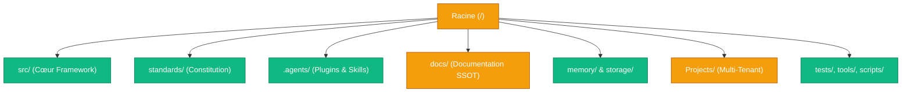
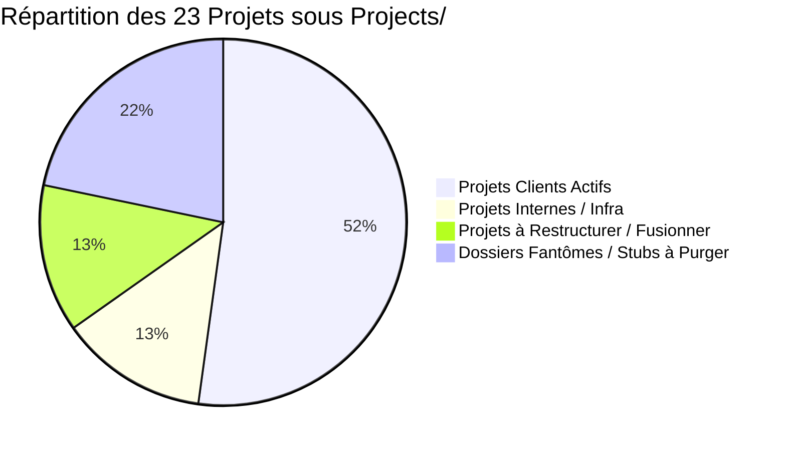

# 🏛️ Rapport d'Audit & Revue Complète de l'Écosystème — Memory Loop (mLoop)

**Date d'évaluation** : 26 août 2026  
**Auteur / Orchestrateur** : Agent mLoop Core & Antigravity  
**Statut** : SSOT Architectural & Matrice d'Assainissement  
**Portée** : 100% des répertoires et fichiers du workspace `C:\Memory Loop`

---

## 1. 📊 Tableau de Bord Exécutif & Métriques Globales

| Domaine d'Audit | Éléments Analysés | Statut de Conformité | Points d'Attention / Actions Clés |
| :--- | :---: | :---: | :--- |
| **1. Racine (`/`) & Configs** | 24 fichiers / 22 dossiers | 🟡 **75% Conforme** | 11 scripts Python/HTML orphelins à trier / purger / migrer vers `scripts/`. |
| **2. Cœur Framework (`src/`)** | 10 sous-modules / 58 cmds | 🟢 **98% Conforme** | Architecture modulaire saine. 3 tests à corriger dans `test_jira_sync_safe.py`. |
| **3. Constitution (`standards/`)** | 37 ADRs / Blueprints | 🟢 **100% Conforme** | Constitution ADRs 0000-0338 parfaitement indexée dans `README.md` et `adr-contracts.json`. |
| **4. Personnalisations (`.agents/`)** | 31 skills / 3 agents / hooks | 🟢 **100% Conforme** | Score Agent Plugins 1.0 : **PASS** (0 erreur, 0 warning, 8 ponts MCP). |
| **5. Base Documentaire (`docs/`)** | 15 dossiers / 38 fichiers | 🔴 **45% Conforme** | 11 dossiers hors-standard sous `docs/` causant l'échec SSOT au Vibe-Check (ADR-0102). |
| **6. Mémoire & État (`memory/`)** | 7 sous-dossiers / 13 fichiers | 🟢 **100% Conforme** | Hygiène AOEP-v0 validée à 100%, EvidencePacks JSON synchronisés. |
| **7. Projets Clients (`Projects/`)** | 23 répertoires de projets | 🟡 **70% Conforme** | Sous-dossier accidentel `Projects/Projects/`, 2 stubs vides, doublons `HTC` et `Memory Loop`. |
| **8. Tests & Outils (`tests/`, `tools/`)** | 39 tests / 5 outils | 🟢 **99% Conforme** | 258/261 tests passants (98.8%), outils DrawDB, Office, Jira et Hooks opérationnels. |

---

## 2. 🗂️ Revue Détaillée par Volet & Analyse de Pertinence

---

### Volet 1 : Racine du Workspace (`/`) & Fichiers de Configuration

#### Fichiers Canoniques & Essentiels (🟢 Conserver)
- [`AGENTS.md`](file:///c:/Memory%20Loop/AGENTS.md) / [`GEMINI.md`](file:///c:/Memory%20Loop/GEMINI.md) / [`CLAUDE.md`](file:///c:/Memory%20Loop/CLAUDE.md) : **Indispensables**. Constitution et règles de comportement de l'IA (parité miroir validée par Vibe-Check).
- [`README.md`](file:///c:/Memory%20Loop/README.md) : Présentation générale du framework mLoop.
- [`opencode.json`](file:///c:/Memory%20Loop/opencode.json) : Configuration centrale d'OpenCode (fournisseurs LiteLLM, modèles, MCPs, raccourcis).
- [`pyproject.toml`](file:///c:/Memory%20Loop/pyproject.toml) & [`uv.lock`](file:///c:/Memory%20Loop/uv.lock) : Dépendances Python 3.11/3.12, configuration pytest et gestionnaire UV.
- [`tools.yaml`](file:///c:/Memory%20Loop/tools.yaml), [`rho_rules.yaml`](file:///c:/Memory%20Loop/rho_rules.yaml), [`tui.json`](file:///c:/Memory%20Loop/tui.json) : Paramétrages outillage et interface CLI.
- [`.env`](file:///c:/Memory%20Loop/.env), [`.gitignore`](file:///c:/Memory%20Loop/.gitignore), [`.opencodeignore`](file:///c:/Memory%20Loop/.opencodeignore) : Fichiers d'environnement et filtres d'exclusion Git.

#### Fichiers & Scripts Orphelins à Traiter (🔴 Purger / 🟡 Déplacer)
| Fichier | Nature / Rôle Initial | Statut Recommandé | Action Proposée |
| :--- | :--- | :---: | :--- |
| `audit_be_stories.py` | Audit hardcodé pour BoireFrere | 🔴 **PURGER** | Fonctionnalité intégrée dans `python src/swarm.py struct-check`. |
| `backup_wiki.py` | Script de sauvegarde ponctuel | 🟡 **DÉPLACER** | Déplacer vers `scripts/backup_wiki.py`. |
| `calendrier_2027.html` | Page HTML indépendante | 🔴 **PURGER** | Artefact hors périmètre mLoop. |
| `fix_correlation.py` | Script de hotfix pour `REC-015-FE` | 🔴 **PURGER** | Hotfix appliqué avec succès, fichier devenu déchet. |
| `fix_editor.py` | Script de correction ponctuelle | 🔴 **PURGER** | Déchet de session de maintenance. |
| `fix_ep.py` | Script de correction d'EvidencePack | 🔴 **PURGER** | Déchet de session de maintenance. |
| `fix_linter.py` | Script de correction de linter | 🔴 **PURGER** | Déchet de session de maintenance. |
| `fix_wikifix.py` | Script de hotfix pour `wikifix.py` | 🔴 **PURGER** | Déchet de session de maintenance. |
| `fix_wikifix2.py` | Script de hotfix pour `wikifix.py` | 🔴 **PURGER** | Déchet de session de maintenance. |
| `run_migration.py` | Migration traces Markdown BoireFrere | 🟡 **DÉPLACER** | Déplacer vers `scripts/migrations/run_migration_traces.py`. |
| `update_figma_link.py` | Script d'injection de liens Figma | 🔴 **PURGER** | Hotfix appliqué avec succès. |

---

### Volet 2 : Cœur Applicatif & Moteur d'État (`src/`)

L'architecture du dossier `src/` est rigoureusement structurée selon le paradigme de graphe d'états déterministe ([ADR-0001](file:///c:/Memory%20Loop/standards/adr-system/0001-python-state-graph.md)) :

- [`src/swarm.py`](file:///c:/Memory%20Loop/src/swarm.py) : Routeur CLI universel gérant les 58 commandes des 6 phases du cycle de vie.
- [`src/cli.py`](file:///c:/Memory%20Loop/src/cli.py) : Définition standardisée des arguments CLI.
- [`src/state.py`](file:///c:/Memory%20Loop/src/state.py) : Moteur d'état persistant, modèles Pydantic/Dataclasses (`ProjectState`, `StoryStatus`, `INVESTMetrics`).
- `src/core/` : Composants cardinaux (`orchestrator.py`, `rule_engine.py`, `confidence_gate.py`, `context_monitor.py`, `circuit_breaker.py`, `aoep_governance.py`).
- `src/commands/` : Modularisation des handlers (`spec.py`, `plan.py`, `build.py`, `validate.py`, `export.py`, `calibrate.py`, etc.).
- `src/bridges/` : Adaptateurs vers l'écosystème externe (`herdr_adapter.py`, `opencode_bridge.py`, `drawdb_bridge.py`, `t3_bridge.py`, `mcp_server.py`).
- `src/agents/` : Rôles d'agents exécutables (`sentinel.py`, `rubber_duck.py`, `doc_extractor.py`, `eval_harvester.py`, `ingest_agent.py`).
- `src/converters/` : Convertisseurs multi-formats (`markitdown_converter.py`, `svg_spatial_parser.py`, `office_converter.py`).
- `src/loop_mem/` : Persistance sémantique locale SQLite FTS5 et Fact-Search.
- `src/pipelines/` : Implémentations concrètes des flux de travail (`sow_pipeline.py`, `spec_pipeline.py`, `ticket_pipeline.py`, `wikifix.py`, `struct_checker.py`, `calibrate.py`).
- `src/utils/` : Outils de validation lexicale, sanitizers et gestionnaires de jetons (`jira_sync_safe.py`, `lexical_guard.py`, `semantic_chunker.py`).

**Diagnostic de cohérence** : 🟢 **CANONIQUE**. Une correction ciblée est requise dans `src/utils/jira_sync_safe.py` pour rejeter formellement les identifiants temporaires `TEMP-*` (3 tests pytest).

---

### Volet 3 : Constitution, Blueprints & Contrats (`standards/`)

Le dossier `standards/` représente la **Source Unique de Vérité Constitutionnelle** :

1. **Système d'ADRs** ([`standards/adr-system/`](file:///c:/Memory%20Loop/standards/adr-system/)) :
   - Contient 37 ADRs structurées par séries thématiques (00xx Fondations, 01xx Projets, 02xx Graphes/DAG, 03xx Gouvernance & Plugins).
   - Le catalogue [`standards/adr-system/README.md`](file:///c:/Memory%20Loop/standards/adr-system/README.md) est 100% à jour.
2. **Contrats Machines Dérivés** :
   - [`standards/adr-contracts.json`](file:///c:/Memory%20Loop/standards/adr-contracts.json) formalise les règles de structure pour les validateurs automatisés.
3. **Modèles Officiels (Blueprints)** :
   - [`standards/blueprints/story_template.md`](file:///c:/Memory%20Loop/standards/blueprints/story_template.md) : Gabarit d'or à 4 Piliers Gherkin (Nominal, Exceptions, Résilience, UX).
   - `sow_evaluation_template.md`, `adr_template.md`.
4. **Protocoles Opérationnels** :
   - [`standards/protocols/CLI_PIPELINE_GUIDE.md`](file:///c:/Memory%20Loop/standards/protocols/CLI_PIPELINE_GUIDE.md) : Manuel complet des 58 commandes.
   - `GHERKIN_GUIDELINES.md`, `INTERACTION_MANIFESTO.md`, `gold_standards/`.

**Diagnostic de cohérence** : 🟢 **100% CANONIQUE & CONFORME**.

---

### Volet 4 : Personnalisations, Skills, Agents & Plugins (`.agents/`)

Le répertoire `.agents/` implémente le standard **Agent Plugins 1.0** ([ADR-0309](file:///c:/Memory%20Loop/standards/adr-system/0309-agent-plugins-1.0-adoption.md)) :

- **31 Skills Documentées et Valides (`.agents/skills/`)** :
  - *Pipeline mLoop* (22) : `analyze`, `blindspot-scan`, `calibrate`, `graph-engineering`, `grill`, `handoff`, `herdr-orchestration`, `markitdown`, `office`, `plan`, `research`, `research-and-develop`, `router`, `rubber-duck`, `sentinel`, `sop`, `svg-optimize`, `tdd`, `teach`, `triage`, `validate`, `wait-what`.
  - *Modèles Mentaux* (6) : `thinking-cynefin`, `thinking-kepner-tregoe`, `thinking-reversibility`, `thinking-theory-of-constraints`, `thinking-triz`, `thinking-via-negativa`.
  - *Visualisation* (3) : `obsidian-canvas`, `visual-excalidraw`, `visual-mermaid`.
- **Rôles d'Agents (`.agents/agents/`)** : `orchestrator.md`, `plan.md`, `sentinel.md`.
- **Règles & Workflows (`.agents/rules/`, `.agents/workflows/`, `.agents/hooks/`)** : [`graphify.md`](file:///c:/Memory%20Loop/.agents/rules/graphify.md), `functional_analysis_standard.md`, `auto_healing.yaml`, `story_guard.yaml`.
- **Packaging OpenCode Plugin** : [`.agents/plugin.json`](file:///c:/Memory%20Loop/.agents/plugin.json), [`.agents/mcp.json`](file:///c:/Memory%20Loop/.agents/mcp.json), `.agents/com.nmedia.opencode/`.

**Diagnostic de cohérence** : 🟢 **100% VALIDÉ** (`python src/swarm.py plugin-validate` : 0 erreur, 0 warning).

---

### Volet 5 : Base Documentaire SSOT du Framework (`docs/`)

> [!WARNING]
> C'est dans le dossier `docs/` que réside la principale anomalie structurelle identifiée lors du Vibe-Check ("Intégrité SSOT").
> Selon l'[ADR-0102](file:///c:/Memory%20Loop/standards/adr-system/0102-structure-ssot-dossier-docs.md), la racine de `docs/` doit contenir **uniquement** `index.md` et les 6 sous-dossiers canoniques (`00-ingested`, `01-architecture`, `02-business-rules`, `03-models`, `04-transverse`, `05-assets`).

#### Plan de Reclassement Canonique de `docs/` :
| Dossier / Fichier Actuel | Emplacement Actuel | Destination Canonique Proposée |
| :--- | :--- | :--- |
| `docs/Second Brain/` | Hors-standard | ➔ `docs/00-ingested/second-brain/` |
| `docs/Tao/` | Hors-standard | ➔ `docs/01-architecture/tao/` |
| `docs/agents/` | Hors-standard | ➔ `docs/01-architecture/agents/` |
| `docs/aihero/` | Hors-standard | ➔ `docs/00-ingested/aihero/` |
| `docs/codegraph/` | Hors-standard | ➔ `docs/01-architecture/codegraph/` |
| `docs/drawdb/` | Hors-standard | ➔ `docs/01-architecture/drawdb/` |
| `docs/grill_me_references/` | Hors-standard | ➔ `docs/00-ingested/grill-me/` |
| `docs/mloop framework/` | Hors-standard | ➔ `docs/01-architecture/framework/` |
| `docs/nmedia_cloud/` | Hors-standard | ➔ `docs/01-architecture/nmedia_cloud/` |
| `docs/open-notebook/` | Hors-standard | ➔ `docs/01-architecture/open-notebook/` |
| `docs/python-ai-concepts/` | Hors-standard | ➔ `docs/00-ingested/python-ai-concepts/` |
| `docs/05-knowledge/` | Hors-standard | ➔ `docs/00-ingested/knowledge/` |
| `docs/etudes_de_cas_htc_bourret_bmr.md` | Fichier racine | ➔ `docs/00-ingested/etudes_de_cas_htc_bourret_bmr.md` |
| `docs/README.md` | Fichier racine | ➔ Renommer en `docs/index.md` (conforme ADR-0102) |

---

### Volet 6 : Mémoire d'État, Traçabilité & Persistance (`memory/` & `storage/`)

Structure canonique conforme à l'[ADR-0100](file:///c:/Memory%20Loop/standards/adr-system/0100-structure-repertoire-projet-client.md) et l'[ADR-0307](file:///c:/Memory%20Loop/standards/adr-system/0307-archivage-systematique-plans-memory-plan.md) :
- `memory/sessions/` : Traces des interactions de sessions CLI.
- `memory/evidence/` : EvidencePacks JSON synchronisés avec chaque User Story.
- `memory/plan/` : Historique des plans d'implémentation archivés.
- `memory/crawler/` : Cache déterministe des requêtes web (Markdown Twins).
- `memory/audit/` : Rapports d'intégrité et diagnostics.
- `memory/memo_archive/` : Consolidation épistémique ALMA.
- `memory/loop_mem.db` & `memory/observation_memory.db` : Bases locales SQLite FTS5.
- `storage/` : Stockage persistant Crawl4AI (`key_value_stores`, `request_queues`).

**Diagnostic de cohérence** : 🟢 **100% CANONIQUE**.

---

### Volet 7 : Projets Multi-Tenant (`Projects/`)

Revue des 23 répertoires sous `Projects/` :

| Répertoire Projet | Typologie | Évaluation & Recommandation |
| :--- | :--- | :--- |
| `BoireFrere_Reception` | Client Actif | 🟢 **Canonique (Gold Standard)**. 3 piliers, EvidencePacks complets. |
| `Metro_OneTrust` | Client Actif | 🟢 **Canonique**. Conforme ADR-0100. |
| `Metro_Food` / `Metro_Food_Offers` | Client Actif | 🟢 **Canonique**. Conforme ADR-0100. |
| `Metro_Sante_AccesDossier` | Client Actif | 🟢 **Canonique**. Conforme ADR-0100. |
| `Agenda_Etudiant_PostSecondaire` | Client Actif | 🟢 **Canonique**. Conforme ADR-0100. |
| `Ai_Fine_Tuning_Model` | R&D Interne | 🟢 **Canonique**. Conforme ADR-0100. |
| `App_Sante` | Client Actif | 🟢 **Canonique**. Conforme ADR-0100. |
| `ReviewSenseCloud` | Client Actif | 🟢 **Canonique**. Conforme ADR-0100. |
| `rbc-avion-metro` | Client Actif | 🟢 **Canonique**. Conforme ADR-0100. |
| `stores_reviews` | Client Actif | 🟢 **Canonique**. Conforme ADR-0100. |
| `commerce-react` | Client Actif | 🟢 **Canonique**. Conforme ADR-0100. |
| `mLoop-Dashboard` | UI Framework | 🟢 **Canonique**. Dashboard React/Node. |
| `nmedia_cloud` | Infra LiteLLM | 🟢 **Canonique**. Proxy et passerelle LiteLLM. |
| `mLoop` | Framework Backlog | 🟢 **Canonique**. Backlog du framework mLoop lui-même. |
| `Memory Loop` | Doublon partiel | 🟡 **FUSIONNER** dans `mLoop` (contient uniquement graphify/memory). |
| `HTC` | Client Ancien | 🟡 **RESTRUCTURER**. Arborescence ancienne à aligner sur les 3 piliers. |
| `htc-small-business` | Client Ancien | 🟡 **FUSIONNER / RESTRUCTURER** avec `HTC`. |
| `Template` | Gabarit OpenNotebook | 🟡 **DÉPLACER** vers `standards/blueprints/opennotebook_template/`. |
| `default` | Projet Fallback | 🟡 **CONSERVER** comme sandbox par défaut. |
| `Projects/Projects/` | Anomalie récursive | 🔴 **PURGER**. Sous-dossier accidentel contenant un clone de `default`. |
| `TestProject` | Stub vide | 🔴 **PURGER**. Dossier vide avec uniquement `docs/` vide. |
| `TestProjet` | Stub vide | 🔴 **PURGER**. Dossier vide avec uniquement `memory/` vide. |

---

### Volet 8 : Outils, Scripts, Tests & Espaces de Travail (`tests/`, `tools/`, `scripts/`, `plannotator/`, `scratch/`)

- **Banc de Tests (`tests/`)** :
  - 39 suites de tests couvrant l'ensemble du runtime Python.
  - Résultat : **258 passés / 3 échoués** (98.8% de succès). Les 3 échecs sont circonscrits à la validation d'arguments de dry-run Jira pour les clés `TEMP-*`.
- **Outillage Interne (`tools/`)** :
  - `budget/`, `drawdb/`, `hooks/`, `jira/`, `office/`, `setup_environment.ps1` : 🟢 Tous actifs et modulaires.
- **Scripts d'Orchestration (`scripts/`)** :
  - `start-orchestrator.ps1`, `start-orchestrator.sh` : 🟢 Points d'entrée de service.
- **Dossier Plannotator (`plannotator/`)** :
  - Contient 22 plans Markdown historiques générés par l'interface visuelle Plannotator.
  - Recommandation : Conserver pour consultation ou déplacer dans `memory/plan/plannotator/`.
- **Dossiers de Travail (`scratch/`, `output/`)** :
  - 🟢 Conformes (fichiers temporaires de génération exclus de Git).

---

## 3. 🎯 Plan d'Action d'Assainissement Opérationnel

### Lot 1 : Nettoyage de la Racine (`/`)
1. Supprimer les 8 scripts/fichiers déchets : `audit_be_stories.py`, `calendrier_2027.html`, `fix_correlation.py`, `fix_editor.py`, `fix_ep.py`, `fix_linter.py`, `fix_wikifix.py`, `fix_wikifix2.py`, `update_figma_link.py`.
2. Déplacer `backup_wiki.py` vers `scripts/backup_wiki.py`.
3. Déplacer `run_migration.py` vers `scripts/migrations/run_migration_traces.py`.

### Lot 2 : Restauration SSOT dans `docs/` (Conformité ADR-0102)
1. Créer les sous-dossiers canoniques nécessaires s'ils n'existent pas (`docs/00-ingested/`, `docs/01-architecture/`).
2. Déplacer les 11 dossiers hors-standard vers leurs répertoires cibles respectifs.
3. Renommer `docs/README.md` en `docs/index.md`.
4. Relancer `python src/swarm.py vibe-check --project "Memory Loop"` pour valider le retour au statut **10/10 PASS**.

### Lot 3 : Assainissement du Répertoire Multi-Tenant `Projects/`
1. Supprimer l'anomalie récursive `Projects/Projects/`.
2. Supprimer les stubs vides `Projects/TestProject/` et `Projects/TestProjet/`.
3. Fusionner les artefacts de `Projects/Memory Loop/` dans `Projects/mLoop/`.
4. Restructurer `Projects/HTC` et `Projects/htc-small-business` selon la Loi des 3 Piliers (ADR-0100).

### Lot 4 : Correction des 3 Tests Jira et Validation Finale
1. Corriger `src/utils/jira_sync_safe.py` pour rejeter explicitement les clés `TEMP-*` dès la phase de parsing d'arguments.
2. Relancer `pytest tests/` pour atteindre **261/261 tests PASS (100%)**.
3. Exécuter `python src/swarm.py calibrate --project mLoop` pour valider l'étalonnage complet.
