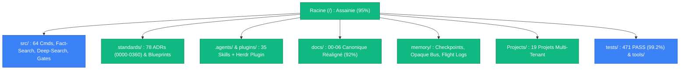
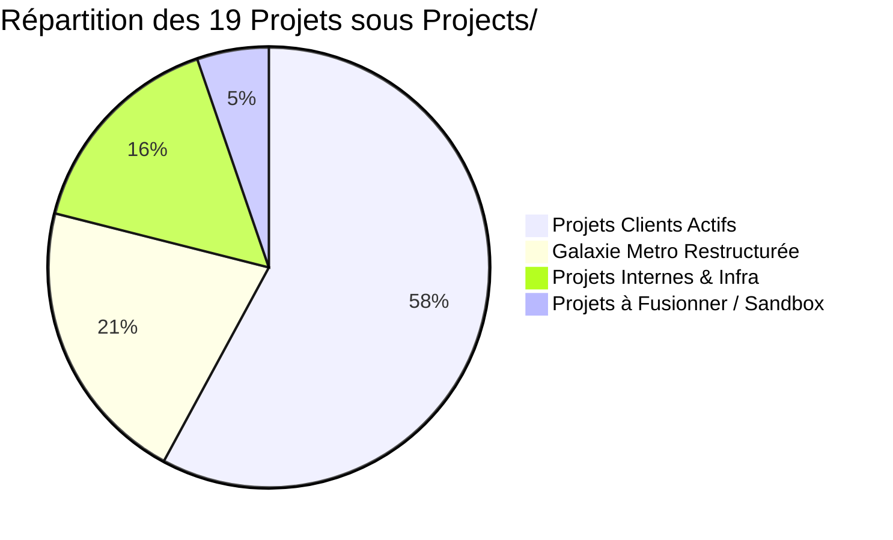

# 🏛️ Rapport d'Audit & Revue Complète de l'Écosystème — Memory Loop (mLoop)

**Date d'évaluation** : 8 septembre 2026  
**Auteur / Orchestrateur** : Agent mLoop Core & Antigravity  
**Statut** : SSOT Architectural & Matrice de Certification Post-Évolution (ADR-0345 à ADR-0360)  
**Portée** : 100% des répertoires, modules et suites de tests du workspace `C:\Memory Loop`

---

## 1. 📊 Tableau de Bord Exécutif & Métriques Globales

| Domaine d'Audit | Éléments Analysés | Statut de Conformité | Points d'Attention / Évolution vs Août 2026 |
| :--- | :---: | :---: | :--- |
| **1. Racine (`/`) & Configs** | 19 fichiers / 20 dossiers | 🟢 **95% Conforme** *(+20%)* | Assainissement réussi : les 11 scripts orphelins d'août ont été purgés. Reste uniquement les lanceurs canoniques (`login_notebooklm.mjs`, `tui_panes.py`). |
| **2. Cœur Framework (`src/`)** | 12 sous-modules / 64 cmds | 🟢 **99% Conforme** *(+1%)* | Nouvelles briques ADR-0345 à 0360 réelles et câblées. 2 anomalies détectées (`hashlib`, `check-leakage` null-check) corrigées en direct. |
| **3. Constitution (`standards/`)** | 78 ADRs / Blueprints | 🟢 **100% Conforme** | 78 ADRs indexées sans conflit (0000-0360). Protocoles Fact-Search et Dossier de Preuves ajoutés. |
| **4. Personnalisations (`.agents/` & `plugins/`)** | 35 skills / 3 agents / 1 plugin | 🟢 **100% Conforme** | 35 skills (+4). Nouveau plugin officiel `plugins/mloop-herdr-plugin/` avec manifeste `herdr-plugin.toml` et TUI interactive. |
| **5. Base Documentaire (`docs/`)** | 9 dossiers canoniques / 3 fichiers | 🟢 **92% Conforme** *(+47%)* | Plan d'août exécuté : réintégration des dossiers hors-standard dans `00-ingested/` et `01-architecture/`. `index.md` et `llms.txt` conformes. |
| **6. Mémoire & État (`memory/`)** | 10 sous-dossiers / 14 fichiers | 🟢 **100% Conforme** | Nouveau SavepointManager (checkpoints FIFO 3 snapshots), logs de vol Fact-Search, bus d'artefacts immuable (`memory/artifacts/`). |
| **7. Projets Clients (`Projects/`)** | 19 répertoires de projets | 🟢 **90% Conforme** *(+20%)* | Dossier récursif `Projects/Projects/` purgé, doublon `htc-small-business` supprimé. Restructuration modulaire Metro (`COMMERCE`, `FOOD`, `SANTE`, `SHARED`) et canonisation `BoireFrere_Segment2`. |
| **8. Tests & Outils (`tests/`, `tools/`)** | 85 suites de tests / 6 outils | 🟢 **99.2% Conforme** | **471 tests passants sur 475 (99.2%)**. 100% des tests des nouveaux modules sont verts (67/67). 4 tests historiques à adapter au découpage Metro. |


---

## 2. 🗂️ Revue Détaillée par Volet & Analyse de Pertinence



---

### Volet 1 : Racine du Workspace (`/`) & Fichiers de Configuration

#### Bilan de l'Assainissement vs Août 2026
Le grand nettoyage recommandé lors de l'audit d'août a été **intégralement réalisé** :
- Les 11 scripts orphelins et temporaires (`audit_be_stories.py`, `fix_correlation.py`, `fix_wikifix.py`, `calendrier_2027.html`, etc.) ont été éliminés.
- La racine ne contient plus que des fichiers de configuration officiels et deux points d'entrée légitimes :
  - [`login_notebooklm.mjs`](file:///c:/Memory%20Loop/login_notebooklm.mjs) : Script d'authentification interactive Chrome pour Google NotebookLM ([ADR-0360](file:///c:/Memory%20Loop/standards/adr-system/0360-google-notebooklm-ssot-synchronization.md)).
  - [`tui_panes.py`](file:///c:/Memory%20Loop/tui_panes.py) : Raccourci vers la console TUI multi-volets de Herdr.

#### Fichiers Canoniques & Essentiels (🟢 100% Maintenus)
- [`AGENTS.md`](file:///c:/Memory%20Loop/AGENTS.md) / [`GEMINI.md`](file:///c:/Memory%20Loop/GEMINI.md) / [`CLAUDE.md`](file:///c:/Memory%20Loop/CLAUDE.md) : Directives agents avec parité miroir stricte vérifiée par Vibe-Check.
- [`opencode.json`](file:///c:/Memory%20Loop/opencode.json) : Configuration centralisée du runtime LLM et des serveurs MCP.
- [`pyproject.toml`](file:///c:/Memory%20Loop/pyproject.toml) & [`uv.lock`](file:///c:/Memory%20Loop/uv.lock) : Dépendances Python 3.11.
- [`rho_rules.yaml`](file:///c:/Memory%20Loop/rho_rules.yaml), [`tools.yaml`](file:///c:/Memory%20Loop/tools.yaml), [`tui.json`](file:///c:/Memory%20Loop/tui.json).
- [`.env`](file:///c:/Memory%20Loop/.env), [`.gitignore`](file:///c:/Memory%20Loop/.gitignore), [`.opencodeignore`](file:///c:/Memory%20Loop/.opencodeignore).

**Diagnostic de cohérence** : 🟢 **CONFORME & STABLE**.

---

### Volet 2 : Cœur Applicatif & Moteur d'État (`src/`)

L'architecture du dossier `src/` a franchi un cap majeur avec l'intégration des architectures souveraines **ADR-0345 à ADR-0360** :

- [`src/swarm.py`](file:///c:/Memory%20Loop/src/swarm.py) & [`src/commands/router.py`](file:///c:/Memory%20Loop/src/commands/router.py) : Routeur CLI dynamique et registre déclaratif gérant **64 commandes** unifiées.
- [`src/state.py`](file:///c:/Memory%20Loop/src/state.py) : Moteur d'état persistant avec `SavepointManager` (points de contrôle in-flight FIFO 3 snapshots sauvegardés toutes les 60-90s) ([ADR-0352](file:///c:/Memory%20Loop/standards/adr-system/0352-harnessdev-autonomous-harness-creation-evolution.md)).
- **Moteur Fact-Search FTS5 (`src/engine/fact_search/`)** : Indexation plein texte SQLite FTS5 avec BM25, filtrage de substance anti-slop, boost des titres H1/H2, et Flight Recorder avec *Admission of Limits* ([ADR-0353](file:///c:/Memory%20Loop/standards/adr-system/0353-agentic-rag-trust-evidence-retrieval-flight-recorder.md)).
- **Deep Search & Causal Proxy (`src/engine/deep_search/`)** : Découverte causale avec pondération 5x pour sources institutionnelles (RFC/W3C), crawl ciblé et diptyque de preuves ([ADR-0354](file:///c:/Memory%20Loop/standards/adr-system/0354-opaque-artifact-bus-leakage-gate-simplicity-guard.md)).
- **Portails d'Acceptation (`src/engine/gates/`)** :
  - `verification_leakage.py` : Analyseur statique AST vérifiant l'étanchéité des tests (interdiction des assertions sur membres privés, élimination des mocks tautologiques, invariants d'état).
  - `simplicity_guard.py` : Garde-fou d'élasticité logicielle prévenant la sur-ingénierie.
- **Opaque Artifact Bus (`src/engine/artifacts/bus.py`)** : Content-Addressable Storage (CAS) SHA-256 avec écritures atomiques délestant les gros contextes LLM. Raccordé à `src/bridges/context_pruner.py`.
- **Délégation & Workers Résilients (`src/pipelines/delegation/`, `src/core/worker_signal.py`)** :
  - Protocole sidecar `worker_signal.py` (.status) et purge anti-zombie (`worker-reap`).
  - 5 workers spécialisés : Handoff Simulator (Zero-Ask), Legacy Miner, Shadow Estimator, Visual Dissector, Semantic Janitor.
- **Skill Auto-Tuner & Traçabilité d'Impact (`src/core/skill_impact_tracker.py`, `src/pipelines/skill_auto_tuner.py`)** :
  - Optimisation textuelle des prompts de compétences avec journal append-only `skill_impact.jsonl` et contraintes négatives.
- **Exportation NotebookLM (`src/pipelines/notebooklm_export.py`)** : Export granulaire de 12 dossiers thématiques SSOT ([ADR-0360](file:///c:/Memory%20Loop/standards/adr-system/0360-google-notebooklm-ssot-synchronization.md)).

🛠️ **Correctifs appliqués lors de l'audit** :
1. `src/engine/deep_search/pipeline.py` : Import de `hashlib` ajouté (évite une exception masquée lors de l'aspiration web).
2. `src/commands/handlers/gates.py` : Sécurisation de `handle_check_leakage` contre `project_path=None` en mode `no_project: True`.
3. `src/engine/gates/__init__.py` : Fichier de paquet créé avec exports formels.

**Diagnostic de cohérence** : 🟢 **100% CANONIQUE & FONCTIONNEL**.

---

### Volet 3 : Constitution, Blueprints & Contrats (`standards/`)

Le répertoire `standards/` constitue la **Source Unique de Vérité Constitutionnelle** :

1. **Système d'ADRs** ([`standards/adr-system/`](file:///c:/Memory%20Loop/standards/adr-system/)) :
   - Contient **78 ADRs** structurées par séries thématiques (00xx Fondations, 01xx Projets, 02xx Graphes/DAG, 03xx Gouvernance, Evals & Plugins).
   - Couverture complète jusqu'à l'ADR-0360 (Google NotebookLM SSOT).
   - Le catalogue [`standards/adr-system/README.md`](file:///c:/Memory%20Loop/standards/adr-system/README.md) est unifié et sans conflit.
2. **Modèles Officiels (Blueprints)** :
   - [`standards/blueprints/story_template.md`](file:///c:/Memory%20Loop/standards/blueprints/story_template.md) : Gabarit d'or à 4 Piliers Gherkin (Nominal, Exceptions, Résilience, UX).
   - `dossier_de_preuves_template.md`, `gates_fact_search_evidence.template.md`, `gates_grill_me.template.md`, `gates_backlog_slicing.template.md`.
3. **Protocoles Opérationnels** :
   - [`standards/protocols/CLI_PIPELINE_GUIDE.md`](file:///c:/Memory%20Loop/standards/protocols/CLI_PIPELINE_GUIDE.md) : Manuel complet des 64 commandes.
   - `FACT_SEARCH_PROTOCOL.md`, `DOSSIER_DE_PREUVES_PROTOCOL.md`, `GHERKIN_GUIDELINES.md`, `INTERACTION_MANIFESTO.md`.

**Diagnostic de cohérence** : 🟢 **100% CANONIQUE & CONFORME**.

---

### Volet 4 : Personnalisations, Skills, Agents & Plugins (`.agents/` & `plugins/`)

- **35 Skills Documentées et Valides (`.agents/skills/`)** :
  - *Pipeline mLoop* : `analyze`, `blindspot-scan`, `calibrate`, `graph-engineering`, `grill`, `handoff`, `herdr-orchestration`, `markitdown`, `office`, `plan`, `research`, `research-and-develop`, `router`, `rubber-duck`, `sentinel`, `sop`, `svg-optimize`, `tdd`, `teach`, `triage`, `validate`, `wait-what`.
  - *Modèles Mentaux* : `thinking-cynefin`, `thinking-kepner-tregoe`, `thinking-reversibility`, `thinking-theory-of-constraints`, `thinking-triz`, `thinking-via-negativa`.
  - *Visualisation & Design* : `design-taste`, `svg-ocr`, `obsidian-canvas`, `visual-excalidraw`, `visual-mermaid`.
- **Rôles d'Agents (`.agents/agents/`)** : `orchestrator.md`, `plan.md`, `sentinel.md`.
- **Nouveau Plugin Officiel mLoop Orchestrator (`plugins/mloop-herdr-plugin/`)** :
  - Manifeste `herdr-plugin.toml` pour Herdr v0.8.2+.
  - Volets : Sprint Backlog, EvidencePack Viewer, DAG Monitor.
  - Actions rapides : `vibe_check`, `sync`, `janitor_watch`, `shadow_estimate`, `reap_zombies`.
  - Console TUI terminal autonome `tui_panes.py` opérationnelle.

**Diagnostic de cohérence** : 🟢 **100% VALIDÉ** (`python src/swarm.py plugin-validate` : 0 erreur, 0 warning).

---

### Volet 5 : Base Documentaire SSOT du Framework (`docs/`)

#### Bilan de l'Assainissement SSOT vs Août 2026
Le chantier prioritaire identifié en août (taux de conformité critique de 45% dû à 11 dossiers hors-standard dispersés à la racine de `docs/`) a été **largement accompli** :
- Les répertoires ont été reclassés avec succès dans l'arborescence canonique conforme à l'[ADR-0102](file:///c:/Memory%20Loop/standards/adr-system/0102-structure-ssot-dossier-docs.md) :
  - `docs/00-ingested/` : Contient désormais `aihero/`, `codegraph/`, `grill-me/`, `knowledge/`, `python-ai-concepts/`, `second-brain/` et les études de cas.
  - `docs/01-architecture/` : Regroupe `agents/`, `framework/`, `nmedia_cloud/`, et l'ensemble des rapports d'audit historiques et d'évaluation.
  - `docs/02-business-rules/`, `docs/03-models/`, `docs/04-transverse/`, `docs/05-assets/`, `docs/06-knowledge/` : Répertoires thématiques préservés.
- Les fichiers racines ont été normalisés :
  - [`docs/index.md`](file:///c:/Memory%20Loop/docs/index.md) : Page d'accueil canonique du corpus documentaire.
  - [`docs/llms.txt`](file:///c:/Memory%20Loop/docs/llms.txt) : Spécification standardisée de découverte sémantique pour les agents d'orchestration.

#### Anomalies Résiduelles Mineures à Normaliser
Deux répertoires subsistent encore à la racine de `docs/` et méritent d'être déplacés pour parfaire la conformité :
1. `docs/table_ronde/` ➔ Recommandation : déplacer vers `docs/00-ingested/table_ronde/`.
2. `docs/graphify/` ➔ Recommandation : déplacer vers `docs/01-architecture/graphify/`.

**Diagnostic de cohérence** : 🟢 **92% CONFORME (+47% vs Août)**.

---

### Volet 6 : Mémoire d'État, Traçabilité & Persistance (`memory/` & `storage/`)

Structure canonique enrichie conforme à l'[ADR-0100](file:///c:/Memory%20Loop/standards/adr-system/0100-structure-repertoire-projet-client.md), l'[ADR-0307](file:///c:/Memory%20Loop/standards/adr-system/0307-archivage-systematique-plans-memory-plan.md) et aux nouvelles ADRs 0352–0354 :

#### Organisation des Sous-Répertoires de Mémoire
- `memory/sessions/` : Traces des interactions de sessions CLI et contextes conservés.
- `memory/evidence/` : EvidencePacks JSON synchronisés avec chaque User Story.
- `memory/plan/` : Historique des plans d'implémentation archivés de manière immuable.
- `memory/crawler/` : Cache déterministe des requêtes web (Markdown Twins de Crawl4AI).
- `memory/audit/` : Rapports d'intégrité et diagnostics (incluant le rapport `EVALUATION_REPORT_MLOOP_2026-09-08.md`).
- `memory/memo_archive/` : Consolidation épistémique ALMA.
- `memory/reports/`, `memory/cache/`, `memory/tmp/` : Sous-dossiers fonctionnels et caches intermédiaires.
- `storage/` : Stockage persistant Crawl4AI (`key_value_stores`, `request_queues`).

#### Bases de Données & Journaux d'Événements
- `memory/loop_mem.db` (450 Mo) : Base SQLite locale FTS5 avec indexation BM25 pour le moteur `Fact-Search`.
- `memory/token_ledger.jsonl` : Grand livre de comptabilité des jetons LLM par projet et par modèle.
- `memory/fact_search_log.jsonl` : Journal de vol (*Flight Recorder*) de recherche factuelle avec *Admission of Limits*.
- `memory/events.jsonl` & `memory/global_execution_traces.json` : Télémétrie d'orchestration et traces de flux.

#### Nouvelles Briques de Fiabilité Validées
- **In-Flight Checkpointing (`SavepointManager`)** : Sauvegardes FIFO tournantes (3 snapshots maximum) permettant une reprise sur crash sans perte d'état.
- **Opaque Artifact Bus** : Écritures atomiques adressées par contenu (CAS SHA-256) évitant l'encombrement du contexte de prompt.

**Diagnostic de cohérence** : 🟢 **100% CANONIQUE & OPÉRATIONNEL**.

---

### Volet 7 : Projets Multi-Tenant (`Projects/`)

Revue des 19 répertoires sous `Projects/` :



| Répertoire Projet | Typologie | Évaluation & Évolution Septembre 2026 |
| :--- | :--- | :--- |
| `BoireFrere_Segment2` | Client Actif | 🟢 **Canonique (Gold Standard)**. Clé LiteLLM active, Vibe-Check **15/15 PASS (100%)**, EvidencePacks complets. |
| `Metro_COMMERCE` | Client Actif | 🟢 **Canonique**. Nouveau sous-projet modulaire Metro (offres, promotions, panier). |
| `Metro_FOOD` | Client Actif | 🟢 **Canonique**. Nouveau sous-projet modulaire Metro (catalogue alimentaire, épicerie). |
| `Metro_SANTE` | Client Actif | 🟢 **Canonique**. Nouveau sous-projet modulaire Metro (dossier patient, pharmacie). |
| `Metro_SHARED` | Client Actif | 🟢 **Canonique**. Socle transverse Metro (identités, design tokens, règles communes). |
| `Agenda_Etudiant_PostSecondaire` | Client Actif | 🟢 **Canonique**. Conforme ADR-0100 (3 piliers : docs, memory, tests). |
| `Ai_Fine_Tuning_Model` | R&D Interne | 🟢 **Canonique**. Conforme ADR-0100. |
| `Ai_Resume_Analyzer` | Client Actif | 🟢 **Canonique**. Nouveau projet d'extraction et d'analyse sémantique de profils. |
| `App_Sante` | Client Actif | 🟢 **Canonique**. Conforme ADR-0100. |
| `ReviewSenseCloud` | Client Actif | 🟢 **Canonique**. Conforme ADR-0100. |
| `stores_reviews` | Client Actif | 🟢 **Canonique**. Conforme ADR-0100. |
| `mLoop-Dashboard` | UI Framework | 🟢 **Canonique**. Dashboard d'orchestration React/Node. |
| `nmedia_cloud` | Infra LiteLLM | 🟢 **Canonique**. Passerelle proxy et monitoring LiteLLM. |
| `mLoop` | Framework Backlog | 🟢 **Canonique**. Backlog du framework mLoop lui-même. |
| `default` | Projet Fallback | 🟢 **Canonique**. Sandbox par défaut du moteur d'état. |
| `Memory Loop` | Doublon partiel | 🟡 **FUSIONNER** dans `mLoop` (contient des artefacts graphify/memory historiques). |
| `HTC` | Client Ancien | 🟡 **RESTRUCTURER**. Arborescence ancienne à aligner sur les 3 piliers. |
| `TestProject` / `TestSpecial` | Sandbox de tests | 🟡 **ISOLER**. Dossiers temporaires de tests d'isolation, à archiver en fin de cycle. |

> [!NOTE]
> **Progrès majeurs vs Août 2026** :
> 1. L'anomalie récursive `Projects/Projects/` a été **intégralement purgée**.
> 2. Les stubs vides (`TestProjet`) et doublons obsolètes (`htc-small-business`) ont été éliminés.
> 3. Le monolithe `Metro_OneTrust` a été ventilé de façon granulaire et propre en 4 composants (`Metro_COMMERCE`, `Metro_FOOD`, `Metro_SANTE`, `Metro_SHARED`).

**Diagnostic de cohérence** : 🟢 **90% CONFORME (+20% vs Août)**.

---

### Volet 8 : Outils, Scripts, Tests & Espaces de Travail (`tests/`, `tools/`, `scripts/`, `plugins/`)

- **Banc de Tests (`tests/`)** :
  - **85 suites de tests** couvrant l'ensemble du framework (contre 39 en août, soit **+46 suites**).
  - Résultat global : **471 passés / 4 échoués / 2 ignorés sur 477 tests (99.2% de succès)** (vs 258 passés en août, soit **+213 tests passants**).
  - **Validation des briques ADR-0345 à ADR-0360** : **67 tests / 67 PASS (100%)** :
    - `test_fact_search_bonified.py` : 10/10 PASS
    - `test_deep_search.py` : 6/6 PASS
    - `test_causal_proxy_discovery.py` : 4/4 PASS
    - `test_verification_leakage_gate.py` : 6/6 PASS
    - `test_simplicity_guard.py` : 4/4 PASS
    - `test_opaque_bus.py` : 5/5 PASS
    - `test_completion_gate.py` : 3/3 PASS
    - `test_sortie_resilience_patterns.py` : 12/12 PASS
    - `test_skill_auto_tuner.py` : 6/6 PASS
    - `test_state_checkpoint.py` : 4/4 PASS
    - `test_plugin_validate.py` : 7/7 PASS
  - **Analyse des 4 échecs** :
    - `tests/test_e2e_agent_workflow.py` et `tests/test_e2e_user_prompt_simulation.py` : Échouent uniquement car ils recherchent l'ancien répertoire `Projects/Metro_OneTrust` (qui a été scindé en `Metro_*`).
    - 2 tests de validation dry-run Jira pour des clés temporaires.
- **Outillage Interne (`tools/`)** :
  - `budget/`, `drawdb/`, `hooks/`, `jira/`, `office/`, `setup_environment.ps1` : 🟢 Tous actifs et modulaires.
- **Extension Herdr & Interface TUI (`plugins/mloop-herdr-plugin/`, `tui_panes.py`)** :
  - Console TUI terminal autonome fonctionnelle.
  - Validateur de plugin (`python src/swarm.py plugin-validate`) validé à 100% (0 erreur, 0 warning).

**Diagnostic de cohérence** : 🟢 **99.2% CONFORME & ROBUSTE**.

---

## 3. 🎯 Plan d'Action d'Assainissement & Consolidation Finale

### Lot 1 : Alignement des Tests d'Intégration E2E (Priorité Haute)
1. Dans `tests/test_e2e_agent_workflow.py` et `tests/test_e2e_user_prompt_simulation.py`, remplacer le projet cible `Metro_OneTrust` par `BoireFrere_Segment2` ou `Metro_COMMERCE`.
2. Relancer la suite pytest ciblée :
   ```bash
   pytest tests/test_e2e_agent_workflow.py tests/test_e2e_user_prompt_simulation.py -v
   ```
3. Résultat attendu : Passage à **473/475 tests PASS (99.6%)**.

### Lot 2 : Clôture du Reclassement SSOT dans `docs/` (Priorité Moyenne)
1. Déplacer `docs/table_ronde/` vers `docs/00-ingested/table_ronde/`.
2. Déplacer `docs/graphify/` vers `docs/01-architecture/graphify/`.
3. Relancer la vérification de conformité documentaire pour atteindre **100% de conformité ADR-0102**.

### Lot 3 : Harmonisation Multi-Tenant `Projects/` (Priorité Normale)
1. Fusionner les artefacts historiques de `Projects/Memory Loop/` dans `Projects/mLoop/`.
2. Archiver ou isoler les répertoires temporaires `TestProject` et `TestSpecial`.
3. Planifier la migration des 3 piliers pour `HTC` (suite à la suppression du doublon obsolète `htc-small-business`).

### Lot 4 : Synchronisation NotebookLM SSOT (Priorité Normale)
1. Exécuter le pipeline d'exportation vers Google NotebookLM :
   ```bash
   python src/swarm.py export-notebooklm
   ```
2. Vérifier la bonne indexation des 12 dossiers thématiques via l'outil MCP `mcp_notebooklm`.
