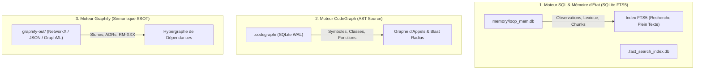

# 🗄️ Schémas des Bases de Données & Graphes de Connaissances — Memory Loop (mLoop)

Ce document récapitule les architectures, structures de tables, schémas relationnels et modèles de graphes exploités par les trois moteurs de connaissances de **Memory Loop** :
1. **Moteur SQL / FTS5 (Mémoire d'État & Fact-Search)**
2. **Moteur CodeGraph (Indexation AST & Graphe de Code)**
3. **Moteur Graphify (Graphe Sémantique & Hypergraphe de Spécifications)**

---

## 🧭 Vue d'Ensemble des 3 Moteurs de Données



---

## 1. 🗃️ Moteur SQL & Mémoire d'État (`memory/loop_mem.db`)

Le backend SQLite est géré avec le mode **PRAGMA journal_mode=WAL** et un `busy_timeout` de 20 000 ms (implémentation : [`src/loop_mem/db/_db_connection.py`](file:///C:/Memory%20Loop/src/loop_mem/db/_db_connection.py)).

### Schéma DDL Détaillé

```sql
-- 1. Observations de Session (Traçabilité & Découvertes)
CREATE TABLE IF NOT EXISTS observations (
    id INTEGER PRIMARY KEY AUTOINCREMENT,
    project_name TEXT NOT NULL,
    type TEXT NOT NULL CHECK(type IN ('decision', 'bugfix', 'feature', 'discovery')),
    file_scope TEXT,
    timestamp TEXT NOT NULL,
    content TEXT NOT NULL
);

-- Index Plein Texte FTS5 pour les Observations
CREATE VIRTUAL TABLE IF NOT EXISTS observations_fts USING fts5(
    observation_id UNINDEXED,
    project_name UNINDEXED,
    type UNINDEXED,
    content
);

-- 2. Mémoire RHO (Auto-Healing Sémantique & Résolution de Pannes)
CREATE TABLE IF NOT EXISTS rho_memory (
    id INTEGER PRIMARY KEY AUTOINCREMENT,
    project_name TEXT NOT NULL,
    keyword TEXT NOT NULL,
    error_trace TEXT NOT NULL,
    solution TEXT NOT NULL,
    embedding_json TEXT
);

-- 3. Lexique Métier Dynamique par Projet (ADR-0327)
CREATE TABLE IF NOT EXISTS project_lexicon (
    id INTEGER PRIMARY KEY AUTOINCREMENT,
    project_name TEXT NOT NULL,
    term TEXT NOT NULL,
    aliases_json TEXT,
    category TEXT,
    definition TEXT,
    target_type TEXT,
    target_id TEXT,
    source_file TEXT,
    last_updated TEXT NOT NULL,
    UNIQUE(project_name, term)
);

-- Index Plein Texte FTS5 pour le Lexique
CREATE VIRTUAL TABLE IF NOT EXISTS project_lexicon_fts USING fts5(
    lexicon_id UNINDEXED,
    project_name UNINDEXED,
    term,
    aliases,
    category UNINDEXED,
    definition,
    target_id
);

-- 4. Chunks Documentaires SSOT & Fact-Search 2.0 (ADR-0326)
CREATE TABLE IF NOT EXISTS docs_chunks (
    id INTEGER PRIMARY KEY AUTOINCREMENT,
    project_name TEXT NOT NULL,
    doc_path TEXT NOT NULL,
    ssot_layer TEXT NOT NULL,
    section_h1 TEXT,
    section_h2 TEXT,
    breadcrumb TEXT,
    line_start INTEGER,
    line_end INTEGER,
    content TEXT NOT NULL,
    last_updated TEXT NOT NULL,
    UNIQUE(project_name, doc_path, line_start, line_end)
);

-- Index FTS5 pour le Découpage Documentaire
CREATE VIRTUAL TABLE IF NOT EXISTS docs_chunks_fts USING fts5(
    chunk_id UNINDEXED,
    project_name UNINDEXED,
    ssot_layer UNINDEXED,
    doc_path UNINDEXED,
    breadcrumb,
    section_h1,
    section_h2,
    content
);
```

### Tables Annexes du Core Framework

* **Graphe des Standards (`src/core/standards_graph.py`)** :
  * `standards_nodes` : Indexe les ADRs, gabarits et protocoles SSOT.
  * `standards_edges` : Relations d'héritage, d'extension ou de supersession (`SUPERSEDES`).
  * `sync_meta` : Checkpoint de fraîcheur et empreintes SHA-256.
* **Traçabilité des Spawns d'Agents (`src/engine/agent_graph.py`)** :
  * `agent_spawn_edges` : Cartographie des sous-agents délégués (parent, enfant, rôle, tour de parole).
* **Cache Sémantique (`src/core/semantic_cache.py`)** :
  * `semantic_cache` : Cache des requêtes d'embedding et réponses d'inférence.

---

## 2. ⚡ Moteur CodeGraph (Indexation AST du Code Source)

CodeGraph (`.codegraph/`) est un moteur compilé (Rust/Node) qui produit une base **SQLite locale** stockant la structure syntaxique abstraite (AST Tree-Sitter) du code applicatif.

### Structure Conceptuelle du Modèle CodeGraph

| Entité / Table | Rôle & Types Indexés | Champs Clés |
| :--- | :--- | :--- |
| **`files`** | Fichiers sources indexés | `path`, `language`, `hash`, `mtime`, `size` |
| **`symbols` (Nodes)** | Éléments syntaxiques extraits | `kind` (class, method, function, property, interface, route), `name`, `signature`, `file_id`, `line_start`, `line_end` |
| **`edges` (Relations)** | Arêtes du graphe de dépendance | `source_id`, `target_id`, `kind` (`calls`, `imports`, `implements`, `references`, `extends`) |
| **`fts_symbols`** | Index FTS5 de recherche textuelle rapide | Recherche de symboles sans lecture disque |

### Initialisation & Synchronisation :
```powershell
# Initialiser l'index
uv run python src/swarm.py code-init --path src

# Consulter les métriques du graphe
uv run python src/swarm.py code-status
```

---

## 3. 🕸️ Moteur Graphify (Graphe Sémantique & Spécifications)

Graphify ([`src/pipelines/graphify/`](file:///C:/Memory%20Loop/src/pipelines/graphify/)) ne repose pas sur une base SQL tabulaire, mais sur un **modèle de graphe orienté (NetworkX)** exporté dans le répertoire `graphify-out/` sous plusieurs formats portables :
* `graphify-out/graph.json` : Export sérialisé JSON (nœuds, arêtes, métadonnées).
* `graphify-out/graph.graphml` : Format universel XML pour Gephi, Cytoscape ou visualisations de graphe.
* `graphify-out/communities.json` : Détection de clusters et communautés sémantiques (Louvain).

### Typologie des Nœuds Graphify :
* `DOC` : Document Markdown normalisé (`docs/00-ingested/`, `docs/01-architecture/`).
* `STORY` : User Story (`backlog/stories/ST-*.md`).
* `RULE` : Règle métier atomique (`docs/02-business-rules/RM-*.md`).
* `ADR` : Décision d'architecture souveraine (`standards/adr-system/ADR-*.md`).
* `MODEL` : Entité ou schéma de données (`docs/03-models/`).

### Typologie des Arêtes Sémantiques :
* `IMPLEMENTS` : Une Story implémente une Règle ou un ADR.
* `CONSTRAINED_BY` : Un flux est contraint par une règle métier.
* `SUPERSEDES` : Un standard remplace une version antérieure.
* `REFERENCES` : Référence croisée ou citation d'évidence.

### Synchronisation :
```powershell
uv run python src/swarm.py sync --project <nom_projet>
```
