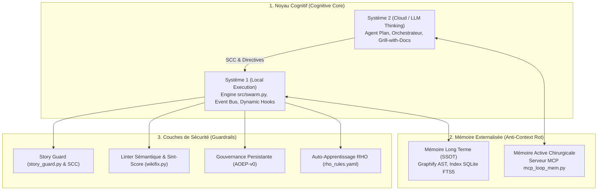

# 🏛️ SSOT Architecture : Anatomie de la Boucle Agentique mLoop (v2.0.0)

- **Version** : 2.0.0
- **Statut** : APPROUVÉ & VIVANT
- **Source de Vérité (SSOT)** : `docs/01-architecture/03-anatomie-boucle-agentique-mloop.md`

---

## 📖 Vision & Déterminisme Agentique

mLoop est un **Backend d'État et de Validation Déterministe** piloté par l'IDE. Alors que les agents IA classiques fonctionnent selon des boucles probables sans contraintes strictes (provoquant des dérives sémantiques et la "Pourriture du Contexte"), mLoop encadre chaque décision et action par des verrous physiques et déterministes.



---

## 1. Le Noyau Cognitif (Cognitive Core)

mLoop sépare strictement la réflexion stratégique de l'exécution brute via une architecture asymétrique à deux couches :

### 🧠 Système 2 (Cloud / IDE Thinking)
- **Rôle** : Réflexion stratégique, architecture, analyse d'affaires, arbitrages DDD.
- **Composants** : Agent Plan, Orchestrateur et protocole *Grill with Docs*.
- **Directives** : *Facts vs Decisions* (exploration obligatoire des faits, questions systématiques à l'humain pour chaque décision) et *Confirmation Gate*.

### ⚡ Système 1 (Local Execution & Observabilité)
- **Rôle** : Exécution mécanique brute, synchronisation d'état, vérification des contraintes.
- **Composants** : Moteur Python `src/swarm.py`, Dynamic Hooks et Event Bus local.

---

## 2. La Mémoire Externalisée (Anti-Context Rot)

Pour éliminer la pourriture de contexte (*Context Rot*), mLoop s'appuie sur deux mécanismes de mémoire externalisée :

### 📚 Mémoire à Long Terme (SSOT)
- **Graphe de Connaissances Graphify** : Analyse AST statique (21+ nœuds, relations) mise à jour sans coût d'API (`graphify update .`).
- **Indexation SQLite FTS5** : Persistance de l'état du backlog, des arbitrages et des métadonnées dans `memory/state.db`.

### 🎯 Mémoire Active Chirurgicale
- **Pont MCP `mcp_loop_mem.py`** : Au lieu de charger l'historique complet, les agents interrogent le serveur MCP pour n'extraire que le fragment de contexte utile à l'action immédiate.

---

## 3. Les Couches de Sécurité (Safety Layers & Guardrails)

Chaque étape de la boucle agentique est soumise à des contrôles déterministes :

1. **Story Guard (`story_guard.py`)** : Verrou physique qui valide chaque écriture contre le *Story Constraint Contract (SCC)* de la Story active pour éviter le *Scope Creep*.
2. **Linter Sémantique & Sint-Score (`wikifix.py`)** : Audit déterministe de la structure des récits (conformité INVEST et scénarios Gherkin `Fonctionnalité:`).
3. **Gouvernance Persistante AOEP-v0 (`aoep_runner.py`)** : Évaluation automatique de la résilience, des invariants négatifs et du respect des obligations d'état (Pass Score 100%).
4. **Auto-Apprentissage RHO (`rho_optimizer.py`)** : *Retrospective Harness Optimization* qui cristallise les erreurs passées en règles sémantiques dans `rho_rules.yaml`.

---

## ⚙️ Commande de Validation d'Ensemble

L'intégrité globale de la boucle agentique mLoop se valide via la commande unique :
```bash
python src/swarm.py audit-loop --project <nom_projet>
```
