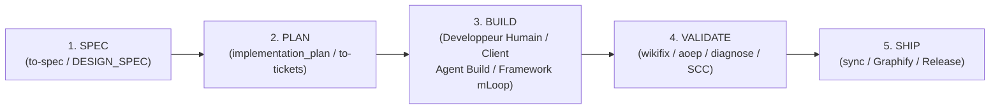

# 🏛️ SSOT Architecture : Cycle Spec-Driven Development (Spec -> Plan -> Build -> Validate -> Ship)

- **Version** : 2.0.0
- **Statut** : APPROUVÉ & VIVANT
- **Source de Vérité (SSOT)** : `docs/01-architecture/04-cycle-spec-plan-build-validate-ship.md`

---

## 🎯 Séparation Stricte : Projets Clients vs Framework mLoop

> [!IMPORTANT]
> **RÈGLE FONDAMENTALE D'ISOLATION ET DE RESPONSABILITÉ** :
> 1. **Projets Clients (`Projects/<nom_projet>/`)** : mLoop agit **exclusivement** comme un Backend d'État, de Business Analysis, d’Architecture et de Validation. Les agents n'écrivent **jamais** le code physique applicatif du client. La phase **Build** est strictement déléguée au développeur humain (ou à ses outils externes comme Aider/IDE).
> 2. **Framework mLoop (`C:\Memory Loop\src`)** : Par dérogation explicite pour faire évoluer le framework mLoop lui-même, les agents sont autorisés à réaliser des modifications sous `src/` sous réserve du protocole Plan-First.

---

## 🔄 Le Cycle en 5 Phases



---

### 1. Spec (Spécification)
- **Objectif** : Définir le "quoi" et le "pourquoi" sans se focaliser prématurément sur le code.
- **Outillage mLoop** : `python src/swarm.py to-spec` et `wayfinder`.
- **Livrables** : Fichiers de spécification sous `docs/01-architecture/spec_*.md` ou registres d'OQ.

### 2. Plan (Planification)
- **Objectif** : Transformer la spécification en feuille de route technique actionnable.
- **Outillage mLoop** : `implementation_plan.md` + `python src/swarm.py to-tickets`.
- **Livrables** : Stories verticaux tracer-bullet dans `backlog/stories/` avec métadonnées `blocked_by` et `sprint_backlog.md`.

### 3. Build (Construction)
- **Objectif** : Implémenter le code de manière incrémentale par tranches (*slices*) autonomes.
- **Responsabilité** :
  - *Projets Clients* : Développeur humain / Outils externes.
  - *Framework mLoop* : Agents sous exception mLoop avec protocole Plan-First.
- **Verrou Physique** : Contrôle du Story Constraint Contract (SCC) via `story_guard.py` pour empêcher toute écriture hors scope.

### 4. Validate (Validation & Tests)
- **Objectif** : Prouver déterministement que le code respecte le contrat et les critères d'acceptation.
- **Outillage mLoop** :
  - Audit sémantique Sint-Score & Gherkin (`python src/swarm.py wikifix`).
  - Gouvernance d'état persistant (`python src/swarm.py aoep`).
  - Harnais déterministe de reproduction de bugs (`python src/swarm.py diagnose`).
  - Validation de la boucle agentique (`python src/swarm.py audit-loop`).

### 5. Ship (Livraison & Déploiement)
- **Objectif** : Clôturer la tranche de valeur et synchroniser la base de connaissances.
- **Outillage mLoop** : `python src/swarm.py sync --project <nom>`.
- **Livrables** : Mise à jour du graphe sémantique `Graphify`, persistance SQLite FTS5 et mise à jour des statuts du backlog.

---

## 📊 Commande CLI de Diagnostic de Cycle

Pour évaluer l'état d'avancement d'un projet à travers les 5 phases :
```bash
python src/swarm.py cycle-status --project <nom_projet>
```
