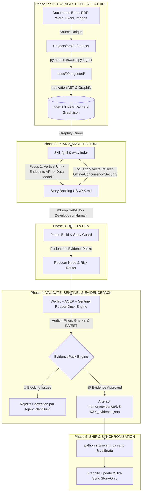

# 🏗️ Architecture d'Orchestration & Matrice du Harnais mLoop

Ce document constitue la référence d'architecture pour le **Harnais mLoop (Harness Supremacy Protocol)**. Il définit le flux synchrone allant de l'ingestion des documents bruts dans `reference/` jusqu'à la livraison et la synchronisation du graphe sémantique, en passant par le **Cycle Spec-Driven en 5 Phases**, la topologie **Graph Engineering (DAG Multi-Agents)** et le **Rubber-Duck Engine contradictoire** (Agent `sentinel`).

---

## 🧭 Graphique d'Orchestration Globale (Mermaid)

---

## 📋 Matrice des 5 Phases de Gouvernance du Harnais (ADR-0375)

| Phase Cycle | Rôle Agent | Outillage CLI & Skills | Tâches & Validation | Guardrail & Gate Obligatoire |
| :--- | :--- | :--- | :--- | :--- |
| **Phase 1: INGEST & EXPLORE** | `explorer` / `orchestrator` | `python src/swarm.py ingest`, `markitdown_convert`, `source-manifest` | Ingestion des documents bruts déposés sous `reference/` vers `docs/00-ingested/` et assets vers `docs/05-assets/`. | **Gate 1** : Cadrage initial prêt. Source unique `reference/`, registre SHA256 anti-doublon et **interdiction formelle de créer des stories en Phase 1** (ADR-0378 / Anti-Ghost-Bias). |
| **Phase 2: PLAN & ANALYSE** | `plan` | `python src/swarm.py grill`, `fact-search`, `multi-draft`, `to-spec` | Dualité de Cadrage : Macro-découpage (`story_draft_template.md` au statut `DRAFT`, `grill_me: PENDING`) puis Entrevue fine **Grill-Me 1:1** avec ancrage verbatim (*Passage-Level Grounding* ADR-0320/0361). | **Gate 2 (DoR)** : Validation Definition of Ready (DoR 6/6, 4 Piliers Gherkin, dossier de preuves `_fact_dossier.md` scellé, statut `READY_FOR_DEV`). |
| **Phase 3: BUILD & DEV** | Développeur / Agent Aval (ou Self-Dev mLoop) | `python src/swarm.py agent-probe`, `graph-run`, `story_guard.py` | Universal Dev Handoff : consommation des spécifications sans ambiguïté par les runtimes agents avals (Cursor, Claude Code, Copilot, OpenCode). Auto-développement strict borné au framework `src/`. | **Gate 3 (DoD)** : Definition of Done (Suite de tests 100% au vert, zéro régression, respect strict du périmètre SCC). |
| **Phase 4: VALIDATE & QA** | `sentinel` / `rubber-duck` | `python src/swarm.py wikifix`, `rubber-duck`, `sentinel`, `aoep` | Audit contradictoire impitoyable (Avocat du Diable). Challenge des AC, des 4 Piliers Gherkin, détection d'APIs fictives et génération synchrone de l'EvidencePack JSON (`memory/evidence/`). | **Gate 4 (QA)** : Conformité Métier & Recette QA approuvée. Absence d'anomalie bloquante et preuves factuelles tracées. |
| **Phase 5: SHIP & SYNC** | `orchestrator` | `python src/swarm.py sync`, `guide --sync`, `vibe-check`, `jira_sync` | Clôture de cycle, auto-étalonnage continu (`vibe-check` 19/19 PASS), synchronisation bidirectionnelle Jira Cloud, mise à jour du graphe sémantique et push Git. | **Gate 5 (Clôture)** : Archivage mémoire scellé, synchronisation Jira/Git réussie et zéro dérive documentaire CLI (ADR-0370). |

---

## ⚡ Les Briques Majeures du Harnais Déterministe

1. **StandardsGraph & Confinement Shield ([ADR-0379](../../standards/adr-system/0379-standards-graph-and-runtime-confinement-shield.md))** :
   - Ingestion et évaluation topologique en SQLite In-Memory en `< 0.2 ms`.
   - Bouclier de confinement (`src/core/confinement_shield.py`) bloquant instantanément toute compétence non autorisée pour un agent.
2. **Paradigme Dual Harnais & PITR ([ADR-0371](../../standards/adr-system/0371-paradigme-dual-harnais-preventif-et-point-in-time-recovery-ag.))** :
   - Sauvegardes instantanées In-Flight et containment du blast radius.
   - Checkpoints et snapshots automatiques avant toute compaction LLM (`pre_compact`).
3. **Replay Simulator Dream RSI ([ADR-0372](../../standards/adr-system/0372-replay-simulator-hors-ligne-et-auto-amelioration-recursive-du.))** :
   - Rejeu hors-ligne sur traces d'exécution historiques pour auto-amélioration récursive du harnais et prévention des régressions.
4. **Sonde Runtimes Agents Aval ([ADR-0377](../../standards/adr-system/0377-sonde-runtimes-agents-aval-inspiration-agentmgr.md))** :
   - Diagnostic dynamique des runtimes locaux (Cursor, Claude Code, Copilot, OpenCode) pour sécuriser l'Universal Dev Handoff.
5. **Standard Rigueur Zéro-Blindspot ([ADR-0376](../../standards/adr-system/0376-standard-rigueur-zero-blindspot-ecosysteme-mloop.md))** :
   - Protocole d'audit 360° en 7 couches garantissant la cohérence absolue entre code Python, protocoles, directives et tests.

---

## 🔒 Configuration Cross-Model & Swarm Multi-Agents

Le Rubber-Duck Engine invoqué par l'agent `sentinel` et l'orchestration du Swarm utilisent des configurations de modèles souveraines et isolées :
- **Orchestrateur & Plan (System 2)** : Modèles de raisonnement stratégique (`gemini-3.8-flash`, `claude-sonnet-5`, `claude-opus-4.8`).
- **Sentinel & Rubber-Duck (Agent Critique)** : Modèle contradicteur haut débit (`gpt-5.6-terra-thinking`, `claude-opus-4.8` ou modèle d'audit alternatif).
- **Plugins AP 1.0** : Empaquetage standard de la configuration MCP sous `.agents/mcp.json` et du catalogue de skills sous `.agents/skills/`.
