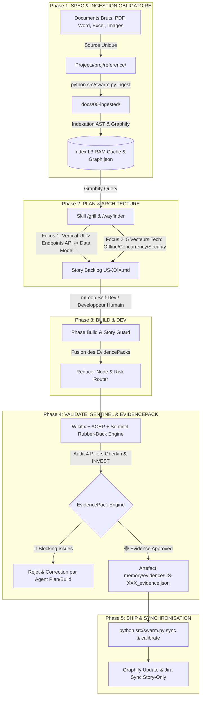

# 🏗️ Architecture d'Orchestration & Matrice du Harnais mLoop

Ce document constitue la référence d'architecture pour le **Harnais mLoop (Harness Supremacy Protocol)**. Il définit le flux synchrone allant de l'ingestion des documents bruts dans `reference/` jusqu'à la livraison et la synchronisation du graphe sémantique, en passant par le **Cycle Spec-Driven en 5 Phases**, la topologie **Graph Engineering (DAG Multi-Agents)** et le **Rubber-Duck Engine contradictoire** (Agent `sentinel`).

---

## 🧭 Graphique d'Orchestration Globale (Mermaid)

---

## 📋 Matrice des 5 Phases de Gouvernance du Harnais

| Phase Cycle | Rôle Agent | Outillage CLI & Skills | Tâches & Validation | Guardrail & Gate Obligatoire |
| :--- | :--- | :--- | :--- | :--- |
| **Phase 1: SPEC / INGEST** | `orchestrator` / `plan` | `python src/swarm.py ingest`, `markitdown_convert`, `office_read` | Ingestion des documents bruts déposés sous `reference/` vers `docs/00-ingested/`. | Source unique `reference/`. Registre SHA256 anti-doublon. |
| **Phase 2: PLAN / ARCHI** | `plan` | `python src/swarm.py grill`, `wayfinder`, `to-spec`, `to-tickets` | Double-Focus Grilling : (1) Découpage UI $\rightarrow$ API $\rightarrow$ Model, (2) 5 Vecteurs (*Offline, Concurrency, Partial Data, Security, Rate Limits*). | Protocole Plan-First + Blueprint Story + Auto-ADR & OQ. |
| **Phase 3: BUILD** | `build` (mLoop) / Humain | `python src/swarm.py graph-run`, `confidence`, `story_guard.py` | Implémentation incrémentale par tranches (*slices*). Exécution DAG Multi-Agents (Pattern Diamant) et protection du périmètre SCC par `story_guard`. | Story Constraint Contract (SCC) strict + Reducer Node Python. |
| **Phase 4: VALIDATE / QA** | `sentinel` / `validate` | `python src/swarm.py wikifix`, `rubber-duck`, `aoep`, `audit-loop` | Review contradictoire Read-Only via `sentinel`. Challenge des Critères d'Acceptation (AC), des **4 Piliers Gherkin** et génération autonome de l'EvidencePack. | `Wikifix` + `EvidencePackEngine` (`memory/evidence/`) + Score INVEST. |
| **Phase 5: SHIP / SYNC** | `orchestrator` | `python src/swarm.py sync`, `cycle-status`, `calibrate`, `jira_sync` | Clôture d'analyse, auto-étalonnage continu (`calibrate` 8/8 PASS) et synchronisation vers Graphify et Jira Cloud (Story-Only). | Indexation AST + Graphe de Connaissances réactualisé. |

---

## 🔒 Configuration Cross-Model & Swarm Multi-Agents

Le Rubber-Duck Engine invoqué par l'agent `sentinel` et l'orchestration du DAG utilisent des configurations de modèles souveraines et isolées :
- **Orchestrateur & Plan (System 2)** : Modèles de raisonnement stratégique (`gemini-3-flash-thinking`, `gemini-3.1-pro`).
- **Sentinel & Rubber-Duck (Agent Critique)** : Modèle contradicteur haut débit (`deepseek-r1` local via Ollama ou modèle alternatif).
- **Plugins AP 1.0** : Empaquetage standard de la configuration MCP sous `.agents/mcp.json` et du catalogue de skills sous `.agents/skills/`.
