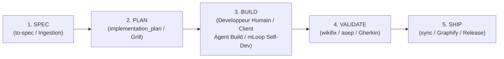

# mLoop - 11. Cycle à 5 Phases & Standard Agent Plugins 1.0 (ADR-0309)

## 1. Le Cycle de Développement Spec-Driven en 5 Phases

mLoop orchestre l'ingénierie et l'analyse système selon un cycle de vie strict en 5 phases :

### Matrice d'Outillage par Phase (CLI & MCP)
| Phase Cycle | Rôle Principal | Outils CLI Backbone & Plugins | Outils MCP & RAG | Guardrail & Validation |
| :--- | :--- | :--- | :--- | :--- |
| **1: SPEC / INGEST** | `orchestrator` / `plan` | `ingest`, `research`, `markitdown_convert`, `office_read` | `loop_mem_search` | Ingestion synchrone Open Notebook (registre SHA256 anti-doublons). |
| **2: PLAN / ARCHI** | `plan` | `grill`, `wayfinder`, `to-spec`, `to-tickets`, `resume`, `vibe-check` | `loop_mem_search`, `graphify query` | Protocole **Plan-First** (`implementation_plan.md`), **Grill-with-Docs** (Auto-ADR & OQ). |
| **3: BUILD / DEV** | `build` (mLoop) / Humain | `confidence`, `self-dev` | `loop_mem_preload_context` | Boundary strict (`C:\Memory Loop\src\` ou `Projects/
/backlog/`) + Fusion des `EvidencePacks`. |
| **4: VALIDATE / QA**| `sentinel` / `validate` | `wikifix`, `rubber-duck`, `audit-loop`, `aoep`, `vibe-check` | `loop_mem_search` | Blindage **4 Piliers Gherkin**, Score **INVEST**, Audit EvidencePack. |
| **5: SHIP / SYNC** | `orchestrator` | `sync`, `cycle-status`, `calibrate`, `plugin-validate`, `plugin-export` | `loop_mem_search` | Indexation Graphify, mise à jour du backlog et **8/8 PASS** au Calibrage. |

---

## 2. Standard Agent Plugins 1.0 (ADR-0309)

Pour garantir la portabilité multi-IDE et multi-clients de l'écosystème mLoop, le framework adopte la spécification **Agent Plugins 1.0** :

* **Structure de Package** :
  * Manifeste Plugin : `.agents/plugin.json` (métadonnées, version, auteur, dépendances).
  * Configuration MCP : `.agents/mcp.json` (déclaration des serveurs MCP locaux).
  * Catalogue de Skills Portables : `.agents/skills/` (21+ compétences documentées avec `SKILL.md`).
* **Multi-Distribution Portable** :
  * Commandes d'exportation :
    * `python src/swarm.py plugin-validate --project mLoop` : Valide la conformité du package contre le schéma AP 1.0.
    * `python src/swarm.py plugin-export --project mLoop --output <dir>` : Exporte un livrable autonome pour déploiement multi-clients.
  * Compatibilité IDEs : Cursor, VS Code, GitHub Copilot, OpenAI Codex, Kiro, Antigravity.

---

## 3. Moteur d'Auto-Calibrage (`mLoop Calibrate Engine`)

Le moteur `Calibrate Engine` garantit la cohérence permanente entre le code Python, les configurations de l'IDE, les compétences des agents et les mémoires sémantiques.

* **Les 8 Points de Contrôle d'Étalonnage** :
  1. `CLI -> OpenCode Shortcuts` : Alignement des raccourcis CLI.
  2. `MCP Bridges -> opencode.json` : Validation des déclarations de ponts MCP.
  3. `Skills -> Router Index` : Vérification du registre des 21+ compétences.
  4. `Directives AGENTS.md / GEMINI.md` : Audit des règles impératives système.
  5. `Gabarits standards/blueprints` : Conformité des modèles de stories et PRD.
  6. `Synchronisation SQLite & Graphify` : Alignement du graphe sémantique avec l'AST.
  7. `Registre Open Notebook SHA256` : Intégrité du cache documentaire.
  8. `Validation 3 Guardrails (audit-loop)` : Exécution de la suite de tests système (Exit 0).
* **Commande CLI** : `python src/swarm.py calibrate --project <nom_projet>` (exécute un Auto-Repair automatique si des écarts sont détectés).
