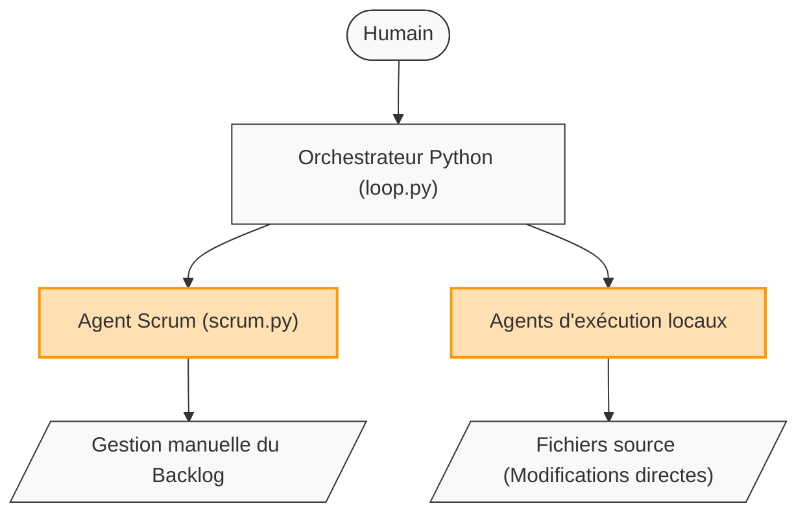
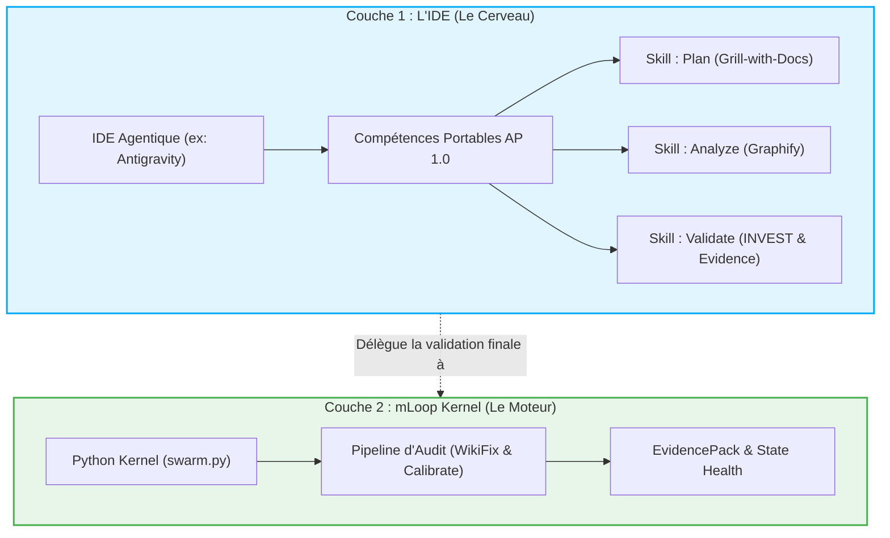
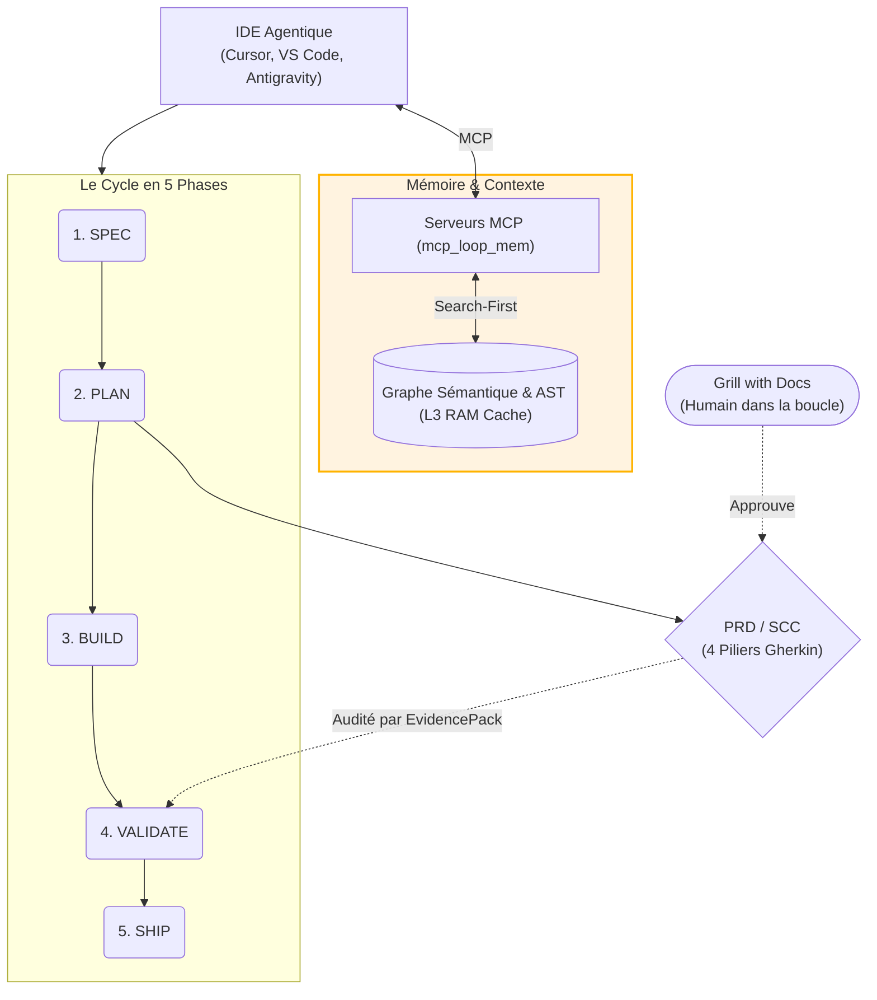

# Évolution Architecturale de Memory Loop (mLoop)

Ce document retrace l'évolution de l'architecture du projet Memory Loop, depuis son approche initiale par scripts locaux jusqu'à son architecture cognitive et déterministe actuelle (IDE-Driven, Graph Engineering DAG & Agent Plugins 1.0).

## 1. L'Approche Scriptée Initiale (v1.x)
À cette époque, tout passait par des scripts Python procéduraux. L'orchestrateur devait tout gérer et les agents fonctionnaient en silos, souvent avec des risques de perte de contexte ou de modifications de code imprévisibles (YOLO).



## 2. Le Pivot "IDE-Driven Framework" (v2.0.0)
La grande scission : l'éditeur de code (l'IDE) devient le "Cerveau" intelligent qui pilote le projet grâce aux *Skills Markdown Portables*, tandis que le code Python de mLoop devient un moteur de validation et d'état déterministe (le "Muscle").



## 3. L'Écosystème Spec-Driven en 5 Phases & Graphify L3
Le système mature tel qu'il est aujourd'hui : intégration de la mémoire à long terme (Graphify L3 In-Memory & AST via MCP `mcp_loop_mem.py`), exécution 100% locale, et la barrière stricte des contrats (PRD/SCC) avec l'humain dans la boucle (Grill with Docs). L'agent ne touche pas au code source de l'application cliente.



## 4. L'Écosystème Persistant, Graph DAG & Agent Plugins 1.0 (ADR-0309)
L'intégration du décodage spéculatif, du **Graph Engineering DAG Multi-Agents (Pattern Diamant)**, du standard **Agent Plugins 1.0** et du moteur **Calibrate Engine** complète l'architecture :

- **Graph Engineering DAG** : Topologie multi-agents (Scoper -> Fan-Out -> Reducer -> Risk Router -> Evaluator Node -> Final Judgment) avec State Checkpointing idempotent (`.mloop_tmp/checkpoints/`).
- **Standard Agent Plugins 1.0 (ADR-0309)** : Empaquetage portable du framework (`.agents/plugin.json`, `.agents/mcp.json`, 21+ skills) exportable vers multi-IDE (`python src/swarm.py plugin-export`).
- **Confidence Gate & RAM Cache** : Filtrage syntaxique ultraléger (< 10 ms) et préchargement d'engrammes en RAM pour requêtes sémantiques à 0ms de latence disque.
- **EvidencePackEngine & Suite AOEP-v0** : Audit d'état persistant (`memory/evidence/`), traçabilité par Tombstones et auto-étalonnage continu (`calibrate` 8/8 PASS).

```mermaid
flowchart TD
    Draft["Brouillon de Spécification"] --> Gate{"Confidence Gate\n(Syntactic Filter)"}
    Gate -. "REJECT (<70)" .-> Fix["Auto-Correction Locale"]
    Gate -. "PASS (>=70)" .-> DAG["Topologie Graph Engineering DAG"]
    
    subgraph RAM ["Mémoire RAM"]
        Cache["_PRELOAD_CACHE\n(Engrammes 1-Hop)"]
    end
    
    DAG <-->|Zero-Latency Read| Cache
    
    subgraph Governance ["Gouvernance & Sécurité"]
        AOEP["Suite AOEP-v0 & EvidencePacks"]
        Calibrate["Moteur Calibrate & RHO"]
    end
    
    Governance -. "Contrôle & Auto-Repair" .-> DAG
```"]
    end
    
    Governance -. "Contrôle en continu" .-> DeepReasoning
```

