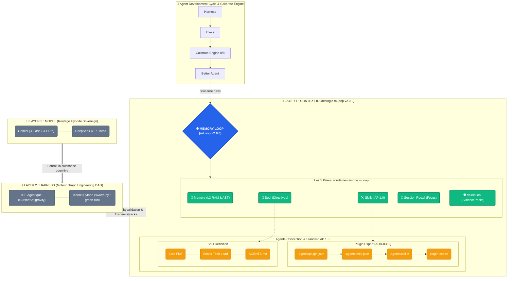

# Architecture Conceptuelle : Positionnement de Memory Loop (mLoop v2.0.0)

Le diagramme ci-dessous illustre comment **Memory Loop (mLoop v2.0.0)** se positionne comme le cœur névralgique de la **Couche 1 (L'ÊTRE)**, incarnant les 5 piliers et la conception poussée des agents.

### Analyse du positionnement de mLoop (v2.0.0) :

1. **Les 3 Couches (Layers)** : mLoop habite le **Layer 1 (Context)**. Il utilise le Layer 2 pour exécuter ses topologies DAG (`graph-run`) et valider l'intégrité déterministe via le Kernel (`src/swarm.py`).
2. **Les 5 Piliers v2.0.0** : Memory (L3 RAM Cache), Skills Portables (AP 1.0), Soul (Zero-Fluff), Session Recall (Focus lock), Validation (EvidencePacks & 4 Piliers Gherkin).
3. **Layer 3 (Modèles Stratifiés & Confidence Gate)** : Routage souverain. Les modèles de raisonnement Cloud/Local pilotent la stratégie, tandis que le Confidence Gate et le Reducer Node Python assurent la gouvernance physique.
