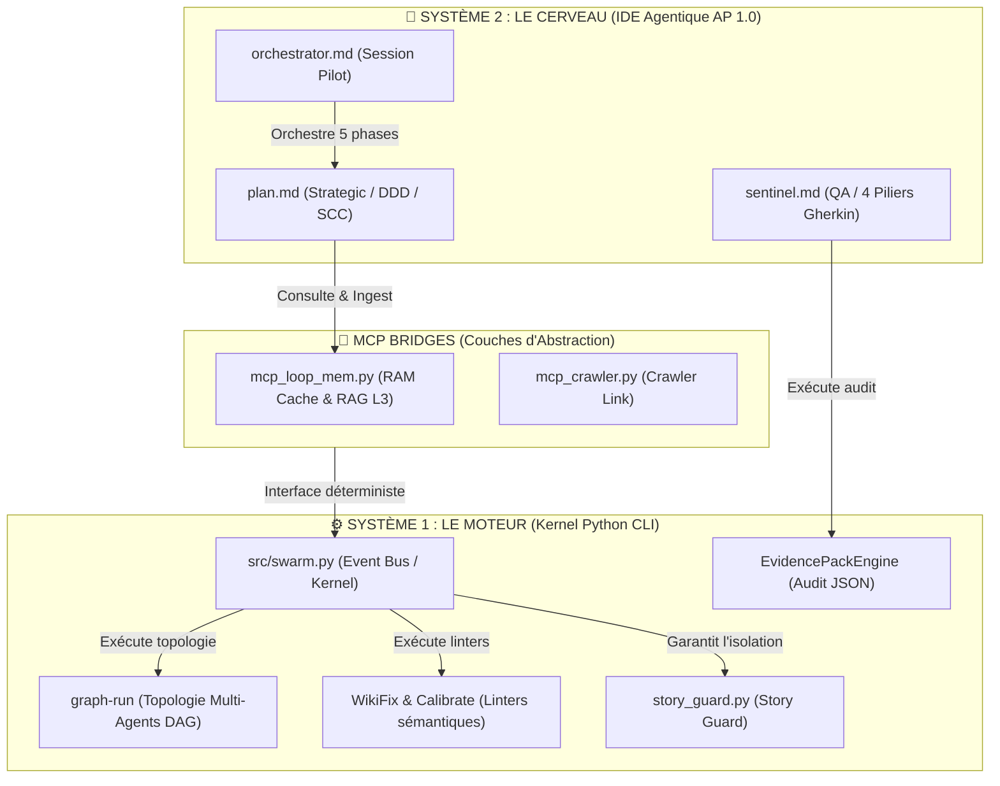

# 🧠 Rapport de Synthèse : Routage Hybride & Architecture Asymétrique dans mLoop (v2.0.0)

> **Version :** v2.0.0-mLoop | **Classification :** Architecture & Gouvernance Swarm
> **Statut :** DOCUMENT PARTICIPATIF (SSOT)

---

## 1. Vision Globale : Le Paradigme Asymétrique (Système 1 vs Système 2)

Le framework **Memory Loop (mLoop)** repose sur une séparation hermétique entre la réflexion cognitive (l'**ÊTRE** / Cerveau) et l'exécution mécanique (le **FAIRE** / Moteur). Ce paradigme, documenté dans l'[AGENTS.md](file:///c:/Memory%20Loop/AGENTS.md), structure le Swarm en deux niveaux :



*   **Système 2 (Le Cerveau)** : Implanté dans l'**IDE Agentique** (Cursor, VS Code, Antigravity). Il gère la réflexion stratégique, l'interaction humaine (*Grill with Docs*), la modélisation DDD et la rédaction des *Story Constraint Contracts* (SCC).
*   **Système 1 (Le Moteur)** : Implanté localement dans la structure Python `src/`. C'est un ensemble d'automates déterministes (linters `wikifix`, parseurs AST `graphify`, `story_guard`, `calibrate` et `EvidencePackEngine`).

---

## 2. Configuration & Routage des Agents

Le routage sémantique est configuré au niveau de l'IDE via le frontmatter YAML des fichiers de définition d'agents dans `.agents/agents/` et les compétences portables `.agents/skills/` (Standard AP 1.0) :

| Agent | Rôle | Modèle Préféré (`model_pref`) | Missions Clefs |
| :--- | :--- | :--- | :--- |
| [orchestrator](file:///c:/Memory%20Loop/.agents/agents/orchestrator.md) | Supervision générale & Workflow | `gemini-3-flash-preview-thinking` | Pilotage des 5 phases, gestion du nœud `ML_ACTIVE_STATE`, execution DAG (`graph-run`). |
| [plan](file:///c:/Memory%20Loop/.agents/agents/plan.md) | Strategic & Architecture | `gemini-3.1-pro-preview-thinking` | Modélisation DDD, protocoles *Grill with Docs*, création des PRD et des SCC (Stories verticaux). |
| [sentinel / validate](file:///c:/Memory%20Loop/.agents/agents/sentinel.md) | Validation & Audit QA | `claude-opus-4.8` | Audit des **4 Piliers Gherkin**, calcul INVEST, EvidencePackEngine (`memory/evidence/`), `wikifix`. |

---

## 3. Le Flux Spec-Driven en 5 Phases

Le flux sémantique global suit une transition réactive à travers 5 phases strictes :

```text
[1. SPEC] ──► [2. PLAN / GRILL] ──► [3. BUILD / DAG] ──► [4. VALIDATE / EVIDENCE] ──► [5. SHIP / SYNC]
```

1.  **`SPEC`** (Phase 1 - Ingestion) : Ingestion des ressources sous `reference/` vers `docs/00-ingested/` via `ingest` et `markitdown_convert`.
2.  **`PLAN`** (Phase 2 - Architecture & Grill) : L'agent pose **une seule question à la fois** avec une recommandation (*Grill with Docs*), met à jour `CONTEXT.md` et génère le SCC dans `backlog/stories/US-XXX.md`.
3.  **`BUILD`** (Phase 3 - Implémentation & DAG) : Exécution de la topologie DAG Multi-Agents (`graph-run`) avec fusion déterministe Reducer Node en Python et verrou de périmètre `story_guard.py`.
4.  **`VALIDATE`** (Phase 4 - Certification & Evidence) : Invoque `wikifix`, valide les 4 Piliers Gherkin, calcule le Score INVEST et génère l'artefact JSON `memory/evidence/<STORY_ID>_evidence.json`.
5.  **`SHIP`** (Phase 5 - Synchronisation & Calibrage) : Exécute `sync` pour mettre à jour Graphify, synchronise vers Jira Cloud (`jira_sync` Story-Only) et valide les 8 points de contrôle `calibrate` (8/8 PASS).

---

## 4. Les Compétences Portables (Skills AP 1.0)

Les 21+ compétences portables (`.agents/skills/`) sont distribuables au standard Agent Plugins 1.0 (ADR-0309) :
*   **`analyze`** : Ingestion déterministe et mise à jour du graphe sémantique L3.
*   **`plan`** : Grill avec Docs, découpage vertical tracer-bullet.
*   **`validate` / `sentinel`** : Audit EvidencePack, INVEST score et 4 Piliers Gherkin.
*   **`graph-engineering`** : Orchestration de la topologie DAG (Pattern Diamant, Risk Router).
*   **`calibrate`** : Auto-étalonnage continu et auto-réparation des 8 composants de l'écosystème.

---

## 5. Le Kernel CLI Python & Pipelines Kernel

Le moteur physique réside dans `src/` :
*   [swarm.py](file:///c:/Memory%20Loop/src/swarm.py) : Point d'entrée CLI centralisé (`resume`, `sync`, `wikifix`, `calibrate`, `graph-run`, `aoep`, `cycle-status`, `plugin-validate`, `plugin-export`, `jira_sync`).
*   **Moteur d'Auto-Calibrage (`calibrate.py`)** : Teste et auto-répare les 8 composants système.
*   **EvidencePackEngine (`evidence.py`)** : Structuration déterministe des preuves d'audit JSON (`memory/evidence/`).
*   **Garde-Fou Physique (`story_guard.py`)** : Interception et rejet des modifications de fichiers hors-périmètre SCC.

---

## 6. Bilan d'Audit & Résolution des Angles Morts (v2.0.0)

1. **Auto-Synchronisation & Calibrage** : La commande `python src/swarm.py calibrate` exécute un Auto-Repair vérifiant la synchronisation et l'intégrité des 8 composants système.
2. **Calculateur INVEST & EvidencePack** : L'agent `sentinel` génère un rapport JSON formel d'évidence d'audit avec score INVEST déterministe.
3. **Souveraineté & RAG L3 In-Memory** : La recherche sémantique s'appuie sur le moteur *L3 In-Memory* et le parser AST, éliminant toute dépendance rigide et garantissant un temps de réponse instantané.
