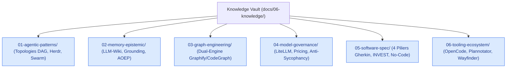

# 📚 Bibliothèque du Savoir (Knowledge Vault) — Memory Loop

Ce répertoire constitue la **Bibliothèque du Savoir Curé et Distillé** de Memory Loop.
Il stocke des fiches de connaissances atomiques, normalisées au format **Open Knowledge Format (OKF v0.1)**, permettant une réutilisation immédiate par les agents IA sans bruit sémantique.

---

## 🗂️ Domaines du Savoir

### 1. [01-agentic-patterns/](01-agentic-patterns/)
- `KN-001` : [Topologie DAG en Diamant et Barrière de Synchronisation](01-agentic-patterns/KN-001_diamond_dag_topology.md)
- `KN-002` : [Multiplexage PTY et Isolation de Contexte Herdr](01-agentic-patterns/KN-002_herdr_pty_multiplexing.md)

### 2. [02-memory-epistemic/](02-memory-epistemic/)
- `KN-010` : [Paradigme LLM-Wiki v2 et Format OKF](02-memory-epistemic/KN-010_llm_wiki_v2_okf_standard.md)
- `KN-011` : [Grounding Épistémique et Découplage des Preuves (DeepPaperNote)](02-memory-epistemic/KN-011_epistemic_grounding_deeppapernote.md)

### 3. [03-graph-engineering/](03-graph-engineering/)
- `KN-020` : [Double Moteur de Graphes Sémantique & AST (Graphify + CodeGraph)](03-graph-engineering/KN-020_dual_engine_graph_codegraph_graphify.md)

### 4. [04-model-governance/](04-model-governance/)
- `KN-030` : [Routage Multi-Modèles LiteLLM, Forensics & Gestion Budgétaire](04-model-governance/KN-030_litellm_model_routing_pricing.md)

### 5. [05-software-spec/](05-software-spec/)
- `KN-040` : [Standard BDD Gherkin 4 Piliers, INVEST et Pureté Déclarative](05-software-spec/KN-040_gherkin_4_pillars_invest.md)

### 6. [06-tooling-ecosystem/](06-tooling-ecosystem/)
- `KN-050` : [OpenCode CLI Runtime & Orchestration Multi-Fournisseurs](06-tooling-ecosystem/KN-050_opencode_cli_runtime.md)
- `KN-051` : [Plannotator — Annotation et Validation Visuelle de Plans](06-tooling-ecosystem/KN-051_plannotator_workflow.md)
- `KN-052` : [Pattern Wayfinder — Cartographie Décisionnelle et Navigation dans le Brouillard](06-tooling-ecosystem/KN-052_wayfinder_fog_of_war.md)

