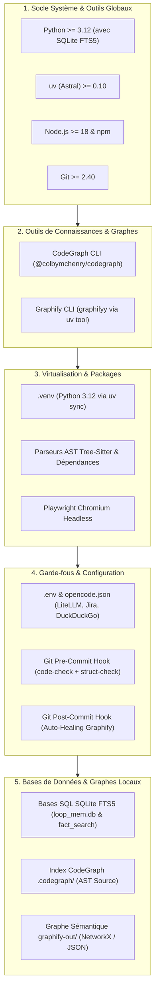

# 🛠️ Guide d'Installation & Déploiement Souverain — Memory Loop (mLoop)

Ce guide décrit la procédure d'installation officielle et déterministe pour déployer l'écosystème **Memory Loop (mLoop)** sur un environnement de travail local (Windows PowerShell 7+, Linux, macOS).

---

## 🧭 Architecture d'un Poste de Travail mLoop



---

## 📋 1. Prérequis Système

| Outil | Version Requise | Rôle | Commande d'Installation / Vérification |
| :--- | :--- | :--- | :--- |
| **Python** | `>= 3.12` | Runtime principal du framework mLoop | `winget install Python.Python.3.12` ou `uv python install 3.12` |
| **uv** | `>= 0.10` | Gestionnaire d'environnement & paquets ultra-rapide | `powershell -c "irm https://astral.sh/uv/install.ps1 \| iex"` |
| **Node.js & npm** | `>= 18` | Runtime pour CodeGraph CLI et les serveurs MCP | `winget install OpenJS.NodeJS.LTS` |
| **Git** | `>= 2.40` | Gestion de versions et garde-fous pre-commit | `winget install Git.Git` |
| **SQLite3 + FTS5** | Inclus dans Python | Moteur de recherche plein texte et état de session | Validé nativement par Python 3.12 |
| **CodeGraph CLI** | `>= 1.5.0` | Indexeur AST de code source physique (WAL) | `npm install -g @colbymchenry/codegraph` |
| **Graphify CLI** | `>= 0.9.0` | Extracteur sémantique et mise à jour du graphe | `uv tool install graphifyy` |
| **Playwright** | Chromium | Moteur headless pour crawler web et rendu JS | `uv run playwright install chromium` |

---

## ⚡ 2. Procédure d'Installation Pas-à-Pas

### Étape 1 : Cloner le Répertoire & Se Positionner
```powershell
git clone <URL_DU_DEPOT> "C:\Memory Loop"
cd "C:\Memory Loop"
```

---

### Étape 2 : Créer le Virtualenv & Synchroniser les Dépendances Python
Memory Loop utilise `uv` pour garantir une résolution rapide et déterministe des dépendances (y compris les parseurs `tree-sitter`) :

```powershell
# 1. Créer l'environnement virtuel avec Python 3.12
uv venv --python 3.12 .venv

# 2. Installer toutes les dépendances (coeur + dev + tree-sitter)
uv sync --all-extras

# 3. Installer les binaires de navigation Playwright Chromium
uv run playwright install chromium
```

---

### Étape 3 : Installer les Moteurs de Graphes Globaux (CodeGraph & Graphify)

Pour permettre l'exploration architecturale AST et l'auto-healing du graphe :

```powershell
# 1. Installer le moteur CodeGraph globalement via npm
npm install -g @colbymchenry/codegraph

# 2. Configurer les connexions MCP CodeGraph pour vos agents IA
codegraph install

# 3. Installer le CLI Graphify de façon isolée via uv tool
uv tool install graphifyy
```

---

### Étape 4 : Configurer les Variables d'Environnement (`.env` & `opencode.json`)
Copiez le modèle `.env.example` vers `.env` et renseignez vos clés :

```powershell
Copy-Item .env.example .env
```

**Clés principales dans `.env` :**
* `LITELLM_BASE_URL` et `LITELLM_API_KEY` : Accès aux modèles d'IA (ou `GOOGLE_AI_STUDIO_KEY`, `OPENROUTER_API_KEY`).
* `JIRA_URL`, `JIRA_EMAIL`, `JIRA_API_TOKEN` : Synchronisation des spécifications et stories.
* `GITHUB_TOKEN` : Synchronisation des dépôts et pull requests.
* `FIRECRAWL_API_KEY` / `CONTEXT7_API_KEY` : Recherche documentaire et extraction web.

**Configuration OpenCode (`opencode.json`) :**
Si vous utilisez OpenCode, copiez si nécessaire `opencode.example.json` vers `opencode.json` (qui intègre désormais le serveur MCP DuckDuckGo pour la recherche web gratuite sans clé).

---

### Étape 5 : Activer les Garde-Fous Git (Hooks MLOOP-105-BE)
Installez les hooks Git pour garantir l'intégrité architecturale à chaque commit :

```powershell
# Hook pre-commit (vérification de structure et linter AST)
uv run python src/swarm.py install-hooks --project mLoop

# Hook post-commit (mise à jour continue du graphe de connaissances via Graphify)
uv run python tools/hooks/install_git_hooks.py
```

---

### Étape 6 : Initialiser les Bases de Données SQL & les Graphes

Cette étape instancie physiquement les trois moteurs de stockage de connaissances de mLoop :

```powershell
# 1. Vérifier la prise en charge de SQLite FTS5
uv run python -c "import sqlite3; con = sqlite3.connect(':memory:'); con.execute('CREATE VIRTUAL TABLE t USING fts5(x);'); print('[OK] SQLite FTS5 opérationnel')"

# 2. Initialiser et compiler la base CodeGraph (AST SQLite WAL dans .codegraph/)
uv run python src/swarm.py code-init --path src

# 3. Initialiser les bases SQL (memory/loop_mem.db et .fact_search_index.db) et le graphe Graphify
uv run python src/swarm.py sync --project mLoop
```

> 📖 Pour consulter les schémas DDL complets de toutes les tables SQLite, les index FTS5 et la structure NetworkX, référez-vous à :  
> 👉 **[`docs/01-architecture/SCHEMAS_BD_ET_GRAPHES.md`](01-architecture/SCHEMAS_BD_ET_GRAPHES.md)**

---

### Étape 7 : Diagnostic & Bilan de Santé (Sanity Check)
Validez l'installation avec les commandes de diagnostic intégrées :

```powershell
# 1. Bilan d'hygiène des compétences et détection des runtimes agents aval
uv run python src/swarm.py doctor

# 2. Contrôle pré-vol de sécurité (23 contrôles déterministes)
uv run python src/swarm.py vibe-check --project mLoop

# 3. Vérification de l'état du graphe de code
uv run python src/swarm.py code-status

# 4. Exécution de la suite complète de tests unitaires
uv run pytest tests/ -q
```

---

## 🤖 3. Runtimes Agents Aval & Intégration IDE

mLoop orchestre les agents aval suivants lorsqu'ils sont présents dans le `PATH` :
- **Herdr** (`herdr`) : Multiplexeur PTY pour l'isolation des tâches out-of-process (`scripts/start-orchestrator.ps1`).
- **OpenCode** (`opencode`) : Générateur de code universel connecté à `opencode.json`.
- **Claude Code** (`claude`) : Moteur de refactoring profond et de spikes techniques.
- **Cline** (`cline`) : Worker de compilation et d'exécution locale.

Pour vérifier la disponibilité de vos agents :
```powershell
uv run python src/swarm.py doctor --agents
```

---

## 🚨 Dépannage Fréquent

1. **Erreur `requires-python >= 3.12`** :
   Exécutez `uv venv --python 3.12 .venv` pour forcer l'usage du binaire Python 3.12.
2. **Erreur `codegraph n'est pas reconnu`** :
   Installez le binaire global avec `npm install -g @colbymchenry/codegraph` puis redémarrez votre terminal.
3. **Erreur `graphify n'est pas reconnu` lors du post-commit** :
   Installez le CLI avec `uv tool install graphifyy`.
4. **Erreur `no such module: fts5` en SQLite** :
   Votre version de Python a été compilée sans le support FTS5. Réinstallez la distribution officielle Python 3.12 via `winget install Python.Python.3.12` ou `uv python install 3.12`.
5. **Erreur `playwright executable not found`** :
   Exécutez `uv run playwright install chromium`.
