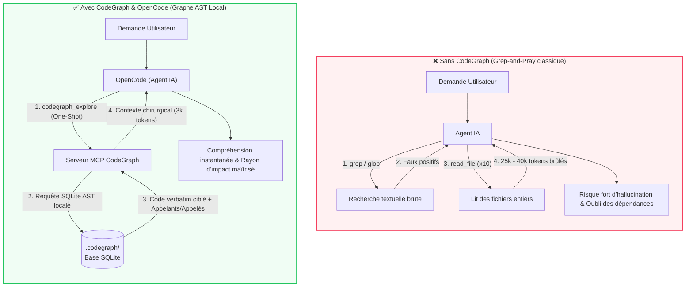
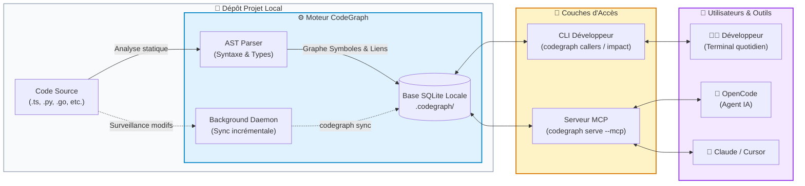

# 🗺️ Guide Complet CodeGraph : Intelligence de Code & Graphe de Connaissances

> **Guide de référence pour l'équipe de développement**  
> *Outil : CodeGraph (`@colbymchenry/codegraph`) & Intégration OpenCode / MCP*

---

## 🧭 1. Présentation Générale : Qu'est-ce que CodeGraph ?

### Le Problème : La cécité des recherches textuelles (Grep-and-Pray)
Lorsque les développeurs ou les agents d'IA naviguent dans une base de code volumineuse :
* Les recherches textuelles (`grep`, `find_in_files`) renvoient des centaines de faux positifs (commentaires, chaînes de caractères, variables locales).
* Les agents IA enchaînent des dizaines d'appels `grep` $\rightarrow$ `cat` $\rightarrow$ `read_file`, consommant **des dizaines de milliers de jetons** pour simplement comprendre qui appelle une fonction.
* Les dépendances transversales et les impacts cachés d'une modification sont invisibles.

### La Solution : Un Graphe de Connaissances Local en SQLite
**CodeGraph** analyse statiquement l'AST (Abstract Syntax Tree) de votre projet et extrait :
* Les symboles : fonctions, méthodes, classes, interfaces, types, routes.
* Les relations : qui appelle qui (*callers/callees*), qui importe qui, qui hérite de qui.
* Le rayon d'impact (*blast radius*) de chaque symbole.

Toutes ces données sont stockées **100% localement** dans une base SQLite ultra-rapide à la racine du dépôt : `.codegraph/`.

---

## 📊 2. Schémas d'Architecture & Flux de Données

### Schéma A : Comparatif de Flux (Avant vs Avec CodeGraph)



---

### Schéma B : Topologie Locale & Interfaces



---

## 🛠️ 3. Installation & Déploiement

### Prérequis
* **Node.js** version 18 ou supérieure (`node -v`).
* Gestionnaire de paquets `npm` ou `pnpm`.

### Installation Globale du CLI
Installez le package CodeGraph sur votre poste :

```bash
npm install -g @colbymchenry/codegraph
```

Vérifiez l'accès au binaire :
```bash
codegraph --version
```

Pour les futures mises à jour :
```bash
codegraph upgrade
```

---

## ⚙️ 4. Stratégie & Cycle d'Indexation (Pour l'Utilisateur et Pour l'Agent)

L'indexation transforme le code source en graphe relationnel. **Qui indexe quoi, quand et comment ?**

### A. Côté Utilisateur (Le Développeur)

L'utilisateur a le contrôle complet sur la création et la maintenance de l'index via le CLI :

| Commande | Action | Quand l'utiliser ? |
| :--- | :--- | :--- |
| **`codegraph init`** | Initialisation & indexation initiale | **Une seule fois** lors de l'onboarding sur le projet. |
| **`codegraph sync`** | Synchronisation différentielle (delta) | Après un `git pull`, un rebase ou un changement de branche. |
| **`codegraph index`** | Reconstruction totale depuis zéro (*clean rebuild*) | En cas de corruption, d'incohérence majeure ou de gros refactoring. |
| **`codegraph status`** | Vérification de l'état de santé | Pour vérifier le nombre de symboles, fichiers indexés et date de fraîcheur. |
| **`codegraph daemon`** | Gestion du démon de surveillance arrière-plan | Pour activer/arrêter la synchronisation automatique en tâche de fond. |
| **`codegraph unlock`** | Déblocage de verrou SQLite orphelin | Si une indexation a été brutalement interrompue (`kill -9`). |

#### Procédure d'Initialisation Développeur :
```bash
# 1. Se placer à la racine du dépôt
cd /chemin/vers/mon-projet

# 2. Construire l'index initial (analyse AST -> SQLite)
codegraph init

# 3. Protéger Git (l'index est local et ne doit jamais être commité)
echo ".codegraph/" >> .gitignore

# 4. Vérifier que tout est vert
codegraph status
```

---

### B. Côté Agent IA (Directives & Règles de Conduite)

Pour éviter que l'agent ne prenne des initiatives destructrices ou gourmandes en CPU/RAM :

#### 1. Règle d'or : L'Agent NE DOIT PAS lancer `codegraph init` seul
L'indexation initiale est une décision d'infrastructure appartenant à l'utilisateur :
* **Si `.codegraph/` n'existe pas** : L'agent ne doit pas lancer `codegraph init` spontanément. Il doit utiliser ses outils de lecture standard (`view_file`, `grep`) et informer courtoisement l'utilisateur :
  > *"Ce projet n'est pas encore indexé par CodeGraph. Pour des recherches 10x plus rapides et économiques, vous pouvez lancer `codegraph init` dans votre terminal."*

#### 2. Mise à jour de l'index post-édition (`codegraph sync`)
* Lorsque l'agent génère ou modifie plusieurs fichiers de code :
  * Si le démon CodeGraph est actif, l'index est mis à jour automatiquement.
  * Si l'agent constate qu'une fonction qu'il vient de créer n'apparaît pas encore dans `codegraph_explore`, il a l'autorisation explicite d'exécuter `codegraph sync` via son outil de commande shell pour rafraîchir le delta.

---

## 🔌 5. Comment l'intégrer dans `opencode.json` (ou `opencode.jsonc`)

Pour qu'OpenCode puisse dialoguer avec CodeGraph, il suffit de déclarer le serveur MCP dans sa configuration.

### A. Emplacement du fichier de configuration
OpenCode supporte deux niveaux de configuration :
1. **Au niveau Global (pour tous vos projets)** :
   * **Windows** : `%USERPROFILE%\.config\opencode\opencode.jsonc` (ou `opencode.json`)
   * **macOS / Linux** : `~/.config/opencode/opencode.jsonc` (ou `opencode.json`)
2. **Au niveau Projet (spécifique au dépôt)** :
   * `.opencode/opencode.jsonc` (à la racine de votre projet)

---

### B. Méthode Automatique via CLI
CodeGraph peut écrire lui-même la configuration dans OpenCode :

```bash
# Configuration globale
codegraph install --target opencode --location global --yes

# Ou configuration locale au projet courant
codegraph install --target opencode --location local --yes
```

---

### C. Méthode Manuelle : Extrait de Configuration Complet
Ajoutez le bloc `"mcp"` avec l'entrée `"codegraph"` dans votre fichier `opencode.json` / `opencode.jsonc` :

```jsonc
{
  "$schema": "https://opencode.ai/config.json",

  // Modèles et fournisseurs habituels
  "model": "anthropic/claude-3-7-sonnet",
  "small_model": "anthropic/claude-3-5-haiku",

  // -------------------------------------------------------------
  // CONFIGURATION DU SERVEUR MCP CODEGRAPH
  // -------------------------------------------------------------
  "mcp": {
    "codegraph": {
      "type": "local",
      "command": [
        "codegraph",
        "serve",
        "--mcp"
      ],
      "enabled": true
    }
  }
}
```

### D. Comment vérifier que l'intégration fonctionne ?
Lancez OpenCode dans votre projet :
```bash
opencode
```
Dans l'interface OpenCode, tapez `/mcp` ou posez une question sur le code :
> *"Où est définie la fonction principale d'authentification ?"*

Vous verrez OpenCode invoquer automatiquement l'outil **`codegraph_explore`** !

---

## 🤖 6. Comment l'intégrer dans `AGENTS.md` (Directives Techniques)

Le fichier `AGENTS.md` (ou `CLAUDE.md`) placé à la racine de votre dépôt est lu par les agents à chaque démarrage. En y ajoutant des règles explicites, vous forcez l'agent à adopter le réflexe CodeGraph plutôt que de gaspiller des jetons.

### A. Emplacement du fichier
Placez ou complétez le fichier `AGENTS.md` directement à la racine de votre projet :
```
mon-projet/
├── .codegraph/
├── src/
├── package.json
└── AGENTS.md   <-- Insérer ici
```

---

### B. Bloc de Directives Prêt à l'Emploi pour `AGENTS.md`
Copiez-collez le bloc suivant dans votre fichier `AGENTS.md` :

```markdown
<!-- ============================================================= -->
<!-- DIRECTIVES TECHNIQUES AGENT : NAVIGATION VIA CODEGRAPH        -->
<!-- ============================================================= -->

## 🧭 Intelligence de Code & Exploration : CodeGraph MCP

Ce dépôt dispose d'un index de connaissances relationnel local via le serveur MCP `codegraph`.

### 1. Règle d'Or : Appel en Première Intention (Call FIRST)
- **OBLIGATION** : Pour toute tâche d'analyse, recherche de bogue, localisation de fonction ou découverte d'architecture, appelle TOUJOURS l'outil `codegraph_explore` EN PREMIER.
- **INTERDICTION** : Ne lance JAMAIS de recherche textuelle brute (`grep`, `find_in_files`, `glob`) ni de lectures en série (`read_file`) pour localiser des symboles existants.

### 2. Économie de Contexte & Fichiers Déjà Lus
- L'outil `codegraph_explore` renvoie le code source verbatim, numéroté, ainsi que l'arbre d'appel (*call path*).
- **RÈGLE STRICTE** : Tout code source affiché dans le résultat de `codegraph_explore` est considéré comme **DÉJÀ LU**. Il est strictement interdit de ré-exécuter `read_file` ou `view_file` sur ces fichiers, afin d'économiser la fenêtre d'attention.

### 3. Contrôle du Rayon d'Impact (Blast Radius) Avant Édition
- Avant de modifier la signature, le comportement ou la visibilité d'une classe, fonction ou endpoint :
  1. Identifie la liste des appelants (*callers*) via `codegraph_explore`.
  2. Assure-toi que chaque site d'appel reste compatible.

### 4. Directives d'Indexation & Gestion de l'Index
- **Initialisation** : Ne lance JAMAIS `codegraph init` de ta propre initiative. L'indexation initiale relève du choix de l'utilisateur. Si l'outil MCP t'indique que l'index `.codegraph/` est absent, bascule gracieusement en recherche native et suggère à l'utilisateur d'exécuter `codegraph init`.
- **Synchronisation Post-Édition** : Après un refactoring massif touchant plusieurs modules, si les nouveaux symboles ne remontent pas immédiatement dans `codegraph_explore`, tu es autorisé à exécuter `codegraph sync` pour forcer la mise à jour différentielle.

### 5. Formulation des Requêtes
- Renseigne dans `query` les symboles clés séparés par un espace (ex: `"AuthService validateToken sessionHandler"`).
- Si tu travailles dans un sous-projet ou monorepo, spécifie toujours le chemin relatif ou absolu via l'argument `projectPath`.

### 6. Résilience & Dégradation Gracieuse
- Si `codegraph_explore` échoue ou indique un verrou (`database is locked`) :
  1. Bascule immédiatement en mode de lecture natif (`grep`, `read_file`).
  2. Signale en une ligne : `[Info : CodeGraph indisponible, bascule en recherche native]`.
```

---

## 💻 7. Guide Rapide CLI pour Développeurs

Pour les développeurs souhaitant naviguer dans le terminal sans lancer d'IA :

```bash
# 1. Lister les appelants d'une fonction
codegraph callers loginUser

# 2. Lister les fonctions appelées par une fonction
codegraph callees processPayment

# 3. Mesurer l'impact d'une classe avant refactoring
codegraph impact UserService

# 4. Trouver les tests unitaires affectés par un fichier modifié
codegraph affected src/auth/jwt.ts

# 5. Explorer un domaine en une commande (code + appels)
codegraph explore "database connection pool timeout"
```

---

## 📌 8. Résumé pour Onboarder un Collègue en 3 Minutes

1. **Installer** : `npm install -g @colbymchenry/codegraph`
2. **Configurer OpenCode** : `codegraph install --target opencode --location global --yes`
3. **Initialiser son repo** : `codegraph init && echo ".codegraph/" >> .gitignore`
4. **Coller les directives** dans `AGENTS.md` à la racine du projet.
5. **Lancer OpenCode** : `opencode` et profiter d'un agent qui comprend le code en un éclair !
