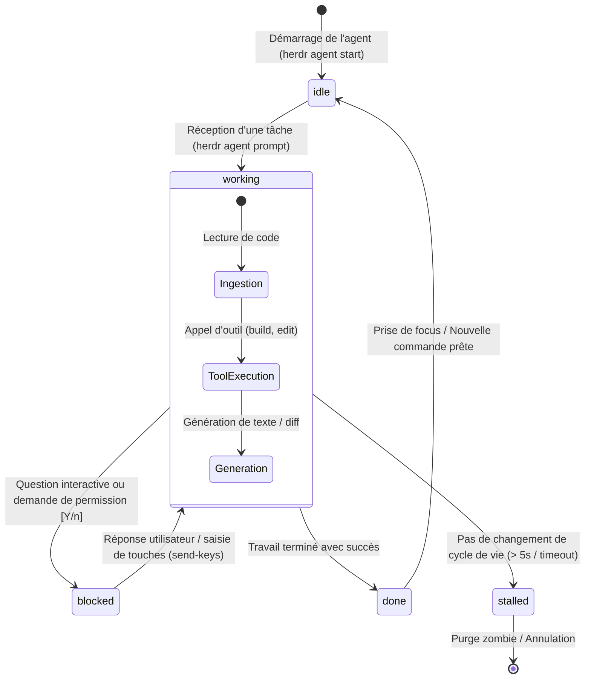
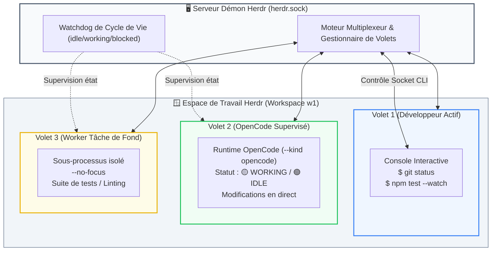

# 🤠 Guide Complet Herdr : Orchestration Terminal pour Développeurs & Agents IA

> **Guide de référence pour l'équipe de développement**  
> *Outil : Herdr (`herdr.dev`) & Intégration OpenCode / Agents Autonomes*

---

## 🧭 1. Présentation Générale : Qu'est-ce que Herdr ?

### Le Problème : La frustration des terminaux classiques face aux agents
L'arrivée des agents de code en ligne de commande (**OpenCode**, **Claude Code**, **Codex**, **Gemini**) a transformé le terminal :
* **Monopolisation de l'écran** : Pendant qu'un agent génère un composant ou lance des tests, votre terminal est verrouillé ; impossible de lancer une commande Git ou un test rapide.
* **Cécité des multiplexeurs (tmux / screen)** : Les multiplexeurs classiques ne comprennent pas les agents. Ils ne savent pas si un LLM réfléchit, a fini sa tâche, ou s'il est **bloqué en attente d'une validation utilisateur** (`[Y/n]`).
* **Pollution du répertoire courant** : Deux agents (ou un développeur et un agent) travaillant sur le même dossier se marchent sur les pieds et écrasent leur code.

### La Solution : Herdr (Terminal Workspace Manager pour Agents IA)
**Herdr** ([herdr.dev](https://herdr.dev)) est un gestionnaire d'espace de travail en terminal moderne, pensé dès le départ pour la cohabitation fluide entre développeurs et agents autonomes.

---

## 📊 2. Schémas d'Architecture & Cycle de Vie

### Schéma A : Cycle de Vie Supervisé des Agents dans Herdr

Herdr surveille en continu les processus PTY des agents et classifie leur état en temps réel :



---

### Schéma B : Topologie Multiplexée & Dual-Pane avec OpenCode



---

## 🛠️ 3. Installation & Déploiement

Herdr est distribué sous forme d'un binaire autonome natif ultra-performant.

### Installation sous Windows (PowerShell)
Ouvrez PowerShell en tant qu'utilisateur standard :

```powershell
irm https://herdr.dev/install.ps1 | iex
```

*Le binaire s'installe sous `%USERPROFILE%\.herdr\bin\herdr.exe` et s'ajoute automatiquement au `PATH` utilisateur.*

### Installation sous macOS & Linux
Ouvrez votre terminal Bash ou Zsh :

```bash
curl -fsSL https://herdr.dev/install.sh | bash
```

### Vérification de l'installation
Redémarrez votre terminal, puis vérifiez :

```bash
herdr --version
# herdr 0.8.0...
```

Inspectez l'état du serveur démon local :
```bash
herdr status
```

---

## ⚙️ 4. Démarrage & Utilisation Quotidienne (TUI Développeur)

### 1. Lancer l'environnement
À la racine de votre projet :

```bash
herdr
```

Herdr démarre une session persistante. Vous pouvez détacher la session, fermer votre terminal ou votre ordinateur, et la retrouver intacte :
```bash
# Reconnecter la session
herdr session attach
```

### 2. Raccourcis Clavier Essentiels dans le TUI

| Action | Raccourci |
| :--- | :--- |
| **Naviguer entre les volets** | `Alt + Flèches` (ou `Ctrl + W` puis flèches) |
| **Split Vertical (vers la droite)** | `Ctrl + B` puis `%` |
| **Split Horizontal (vers le bas)** | `Ctrl + B` puis `"` |
| **Fermer un volet** | `Ctrl + D` ou commande `exit` |
| **Créer un nouvel onglet** | `Ctrl + B` puis `c` |
| **Changer d'onglet** | `Alt + 1`, `Alt + 2`, `Alt + 3`... |
| **Détacher la session (quitter sans fermer)** | `Ctrl + B` puis `d` |

---

## 🔌 5. Comment l'intégrer dans `opencode.json` (ou `opencode.jsonc`)

L'intégration d'OpenCode avec Herdr opère sur deux plans :
1. **La configuration du Runtime** : Permettre à OpenCode d'exécuter les commandes CLI `herdr` sans bloquer sur des confirmations interactives de sécurité.
2. **L'exposition MCP (Optionnelle)** : Connecter le bridge MCP pour que l'agent manipule les volets via des appels d'outils JSON structurés (`herdr_pane_split`, `herdr_agent_start`).

### A. Emplacement du fichier de configuration
* **Global** : `~/.config/opencode/opencode.jsonc` (ou `%USERPROFILE%\.config\opencode\opencode.jsonc` sous Windows).
* **Par projet** : `.opencode/opencode.jsonc` à la racine du dépôt.

---

### B. Configuration OpenCode Complète (`opencode.jsonc`)

Ajoutez les permissions de commandes pour `herdr` et, si souhaité, le pont MCP :

```jsonc
{
  "$schema": "https://opencode.ai/config.json",

  // Modèles préférés
  "model": "anthropic/claude-3-7-sonnet",
  "small_model": "anthropic/claude-3-5-haiku",

  // -------------------------------------------------------------
  // AUTORISATIONS DES COMMANDES CLI HERDR
  // Permet à l'agent d'orchestrer des sous-volets sans prompt bloquant
  // -------------------------------------------------------------
  "permissions": {
    "bash": {
      "allow": [
        "herdr agent *",
        "herdr pane *",
        "herdr workspace *",
        "herdr worktree *"
      ]
    }
  },

  // -------------------------------------------------------------
  // SERVEUR MCP HERDR (Optionnel : si utilisation du bridge Python/Socket)
  // -------------------------------------------------------------
  "mcp": {
    "herdr": {
      "type": "local",
      "command": [
        "python",
        "-m",
        "src.bridges.mcp_herdr"
      ],
      "enabled": false
    }
  }
}
```

---

## 🤖 6. Comment l'intégrer dans `AGENTS.md` (Directives Techniques)

Pour qu'un agent OpenCode sache qu'il évolue dans Herdr et qu'il puisse déléguer des tâches de fond sans déranger le développeur, configurez votre fichier `AGENTS.md`.

### A. Emplacement du fichier
Placez ou complétez le fichier `AGENTS.md` directement à la racine de votre projet (`./AGENTS.md`).

---

### B. Bloc de Directives Prêt à l'Emploi pour `AGENTS.md`
Copiez-collez le bloc suivant dans votre fichier `AGENTS.md` :

```markdown
<!-- ============================================================= -->
<!-- DIRECTIVES TECHNIQUES AGENT : ORCHESTRATION TERMINAL HERDR   -->
<!-- ============================================================= -->

## 🤠 Orchestration Terminal & Sous-Workers : Herdr

Ce projet prend en charge l'environnement de terminal multiplexé Herdr ([herdr.dev](https://herdr.dev)).

### 1. Détection Automatique de l'Environnement
- Herdr injecte automatiquement dans chaque volet les variables d'environnement suivantes :
  - `$HERDR_WORKSPACE_ID` (identifiant de l'espace, ex: `w1`)
  - `$HERDR_TAB_ID` (identifiant de l'onglet, ex: `w1:t1`)
  - `$HERDR_PANE_ID` (identifiant du volet courant, ex: `w1:p1`)
- **RÈGLE** : Si `$HERDR_PANE_ID` est défini, active le mode supervisé Herdr. En cas d'absence, applique une **dégradation gracieuse en mode console standard inline**.

### 2. Règle de Non-Intrusion du Focus (Règle d'Or)
- Lorsque tu dois exécuter une suite de tests lente, un serveur de dev ou déléguer du travail à un sous-agent :
  - **OBLIGATION ABSOLUE** : Utilise TOUJOURS le flag `--no-focus`.
  - Commande de création :
    `herdr pane split --current --direction right --cwd "$PWD" --no-focus`
  - **INTERDICTION** : Ne vole JAMAIS le focus visuel de l'utilisateur actif.

### 3. Règle de Géométrie des Volets
- Avant de découper un volet, inspecte sa disposition géométrique :
  `herdr pane layout --pane "$HERDR_PANE_ID"`
- **Règle** : Si le volet est large, découpe vers la droite (`--direction right`). S'il est étroit ou vertical, découpe vers le bas (`--direction down`). Ne crée jamais de découpages excessifs rendant les terminaux illisibles.

### 4. Pilotage Supervisé d'un Sous-Agent OpenCode
- Pour déléguer une sous-tâche à un agent secondaire :
  1. Démarre l'agent dans le volet retourné :
     `herdr agent start worker-tests --kind opencode --pane <nouveau_pane_id>`
  2. Soumets la directive avec attente atomique du cycle de vie :
     `herdr agent prompt worker-tests "Exécute les tests unitaires et corrige les régressions" --wait --timeout 180000`
  3. L'argument `--wait` surveille automatiquement la transition d'état et redonne la main dès que le statut passe à `idle`, `done` ou `blocked`.

### 5. Lecture Sécurisée des Résultats
- Lis la sortie du volet sans coupure de lignes avec :
  `herdr agent read worker-tests --source recent-unwrapped --lines 80`

### 6. Garde-fous et Sécurité Système
- **STRICTEMENT INTERDIT** : Ne lance JAMAIS `herdr server stop` depuis une session active.
- **STRICTEMENT INTERDIT** : Ne ferme aucun volet ou onglet (`herdr pane close`) que tu n'as pas toi-même initialisé.
- En cas d'erreur de communication socket, journalise l'incident et continue en mode local.
```

---

## 💻 7. Guide Rapide CLI pour Développeurs

Pour piloter Herdr rapidement depuis votre terminal :

```bash
# 1. Ouvrir un volet à droite sans voler le focus
herdr pane split --direction right --no-focus

# 2. Exécuter une commande dans un volet spécifique et attendre la sortie
herdr pane run <pane-id> "npm test"
herdr pane wait-output <pane-id> --match "passed" --timeout 60000

# 3. Lancer un sous-agent OpenCode en tâche de fond
herdr agent start worker-1 --kind opencode --pane <pane-id>
herdr agent prompt worker-1 "Refactorise le module d'export" --wait

# 4. Créer un Git Worktree temporaire pour isoler l'agent
herdr worktree create feature-sandbox
```

---

## 📌 8. Résumé pour Onboarder un Collègue en 3 Minutes

1. **Installer** : `irm https://herdr.dev/install.ps1 | iex` (Windows) ou `curl -fsSL https://herdr.dev/install.sh | bash` (Mac/Linux).
2. **Configurer OpenCode** : Ajouter les permissions `herdr` dans `opencode.jsonc`.
3. **Coller les directives** dans `AGENTS.md` à la racine du projet.
4. **Lancer Herdr** : `herdr` et profiter du split d'écran automatique avec OpenCode !
