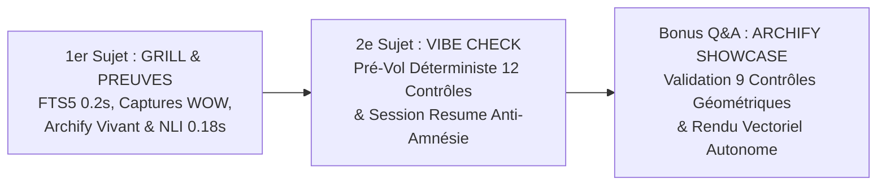

# 🎬 Guide de Démonstrations Concrètes en Direct (Table Ronde AI)
## Le Kit de Démo Live mLoop : Les Scénarios Réels à Projeter

> **Auteur** : Marco Lefrançois & Équipe Architecture mLoop  
> **Usage** : Aide-mémoire & script de démo live pour les projections en réunion / table ronde.  
> **Durée totale recommandée** : 5 à 7 minutes de manipulation (ou à la demande lors des Q&A).  
> **Ordre Officiel de Présentation** :
> 1. **1ᵉʳ Sujet** : *Grill-Me with Docs x Fact-Search, Fact-Check & Évidences* (avec Démo Archify Coup Double).
> 2. **2ᵉ Sujet** : *Vibe Coding vs Vibe Check* (Harnais Déterministe & Anti-Amnésie).

---

## 🎯 Vue d'Ensemble des Démonstrations



---

# 🥩 DÉMO 1 : Le 1ᵉʳ Sujet — Grill-Me with Docs x Fact-Search, Fact-Check & Évidences

### Objectif : Casser la boîte noire. Prouver que l'IA expose d'abord ce qu'elle a compris avec des extraits précis à la ligne près avant de questionner l'humain.

---

### Étape 1.1 : Recherche Déterministe en Temps Réel FTS5
Ouvre un terminal PowerShell à la racine de `Memory Loop` et tape :

```powershell
python tools/export/grill-with-docs-kit/scripts/fact_search.py search "date la plus vieille"
```

#### Ce que l'audience voit en direct (en 0.2 seconde) :
L'outil fouille **13 564 passages** de documentation et ressort :
```text
[3] 📄 Projects/BoireFrere_Segment2/docs/00-ingested/02-incubation/Atelier - Incubations et ventes - Boires.md (Lignes 311–370)
    Section: 🎙️ Transcription : Atelier - Incubations et ventes - Boires
    Extrait : - Antoine Prince : Ce qui vient faire apparaître les flèches ici...
```

---

### Étape 1.2 : Projeter les 2 Captures d'Écran de l'Effet « WOW »

#### 📸 Capture 1 : L'Anatomie du « Dossier de Preuves »
Projette la capture du dossier d'évidences :


> **Ce que tu dis** :  
> *« Regardez ce que l'agent produit avant même d'engager le dialogue. Il ne part pas en vrille dans des questions vagues : il dresse son **dossier de preuves en 4 blocs étanches** : maquettes SVG et note d'atelier au téléphone, extraits verbatim mot à mot, modèle relationnel DBML, et question d'arbitrage fermée avec recommandation motivée. »*

---

#### 📸 Capture 2 : L'Écran Scindé IDE — Le Choc de la Traçabilité
Projette l'écran scindé de l'IDE :


> 🎙️ **Le Pitch d'Impact (Marco Lefrançois)** :  
> *« Quand j'ai réfléchi à comment je pouvais savoir sur quel extrait de documentation l'agent s'était basé pour établir son raisonnement, j'avais constamment deux voix sur mes épaules, un peu comme l'ange et le démon — vous choisirez qui est qui !*  
> *D'un côté, **JF** me dit tout le temps : "Il faut être capable de vérifier efficacement ce que ton agent te rapporte, d'être convaincu que c'est la vérité, mais sans passer des heures à tout relire ! L'humain ne doit pas devenir le goulot d'étranglement de l'IA, il faut un juste milieu pour valider."*  
> *De l'autre côté, **Jean-Philippe** me rappelle sans cesse : "Prouve tes points ! Ne fais pas trop confiance à l'IA, sois en pleine possession de ton sujet pour l'utiliser à bon escient en tant qu'assistant vérifiable et cohérent."*  
> *Et c'est exactement là que le Grill-Me ordinaire a une lacune : **c'est une boîte noire**. La séquence de question est vraiment bien, il sait cerner le sujet et te poser les bonnes questions dont il n'a pas les réponses et soulève même de très bonnes pistes, par contre il n'expose jamais ce qu'il a compris au départ.*  
> *Le Grill with Docs jumelé avec le Fact-Search / Check et les fichiers d'évidence inverse la charge de la preuve :*  
> *1. **L'IA m'expose d'abord ses faits sourcés et ses extraits textuels** : à gauche le chat, à droite les lignes **301–324** et **424–455** de la transcription brute. Je valide ses preuves, je bonifie en 30 secondes sans passer des heures à tout relire.*  
> *2. **L'IA traduit l'oralité québécoise en règles d'ingénierie pures** : « mes œufs les plus vieux overall » et « je me fous de ton troupeau » deviennent un indicateur booléen `is_oldest_priority`, la bascule Poule/Calendrier, et la capacité 2 à 3 buggies.*  
> *3. **Ensuite le Grill-Me déclenche sa session de questions** pour trancher les vraies zones grises, et l'IA soulève des explications et **des améliorations qu'on n'aurait jamais vues à l'analyse initiale** ! »*

*(Si tu veux ouvrir le fichier source ou l'artefact HTML directement)* :  
👉 Fichier Markdown : [`Projects/BoireFrere_Segment2/memory/evidence/INC-002-BE_fact_dossier.md`](file:///C:/Memory%20Loop/Projects/BoireFrere_Segment2/memory/evidence/INC-002-BE_fact_dossier.md)  
👉 Artefact HTML : [`docs/table_ronde/dossier_preuves_INC-002-BE.html`](file:///C:/Memory%20Loop/docs/table_ronde/dossier_preuves_INC-002-BE.html)

---

### Étape 1.3 : Le Coup Double Live — Projeter le Schéma Vivant avec Archify !
Pour illustrer l'ensemble de la boucle tout en montrant la puissance d'Archify, tape :

```powershell
Start-Process "docs/table_ronde/grill-with-docs-epistemic-flow.architecture.html"
```

#### Ce que l'audience voit en direct :
Une application vectorielle interactive autonome avec **particules lumineuses animées (`trace`)** matérialisant le flux de preuves depuis les documents sources jusqu'au Fact-Check NLI et à l'EvidencePack.

> 🎙️ **Ce que tu annonces à l'audience** :  
> *« Pour vous résumer ce flux d'ingénierie, regardez cette cartographie vivante. Vous voyez les particules lumineuses circuler en direct depuis le Fact-Search vers le Grill-Me, puis vers le Fact-Check NLI et l'EvidencePack... et bien ce schéma vectoriel interactif et animé, nous l'avons modélisé et généré directement avec notre propre outil : **Archify** ! »*

---

### Étape 1.4 : Exécuter le Verrou Fact-Check NLI (0.18s)
Tape la commande de test unitaire :

```powershell
python -m pytest tests/test_fact_check_engine.py -v
```

#### Ce que l'audience voit :
```text
tests/test_fact_check_engine.py::test_claim_extractor_atomic_decomposition PASSED
tests/test_fact_check_engine.py::test_nli_verifier_entailment_and_contradiction PASSED
tests/test_fact_check_engine.py::test_fact_check_certificate_generation_and_evidence PASSED
============================== 3 passed in 0.18s ==============================
```
> 🎙️ **Ce que tu dis** :  
> *« Si une exigence affirme '15 minutes' conformément au document RM-042, le moteur NLI valide ENTAILMENT. Si un développeur ou une IA hallucine '45 minutes', le moteur bloque instantanément en CONTRADICTION avant même que la story n'arrive aux développeurs ! »*

---

# 🛡️ DÉMO 2 : Le 2ᵉ Sujet — Vibe Coding vs Vibe Check (Harnais Déterministe)

### Objectif : Prouver que l'agent ne peut pas démarrer ni modifier du code sans passer un contrôle de conformité strict, et démontrer la reprise de session instantanée.

---

### Étape 2.1 : Lancer le Vibe-Check Pré-Vol Déterministe
Tape la commande :

```powershell
python src/swarm.py vibe-check --project BoireFrere_Segment2
```

#### Ce que l'audience voit en direct à l'écran :
```text
=== GUARDRAIL VIBE-CHECK PRÉ-VOL - MLOOP (BOIREFRERE_SEGMENT2) [MODE: RUN | STAGE_PLAN_GRILL] ===
 Règles AGENTS.md (Parité Miroir) : PASS
 Règles GEMINI.md (Parité Miroir) : PASS
 Règles CLAUDE.md (Parité Miroir) : PASS
 Respect du Terrain de Jeu Strict (Boundary) : PASS
 Fact-Search FTS5 Before Edit : PASS
 Intégrité SSOT & Absence de Références Fantômes (Phase RUN : Backlog vérifié) : PASS
 Hygiène Structurale & Absence de Sous-READMEs : PASS
 Intégrité Lexicale & Signature de Vocabulaire (Canary: 59a9c7dd285be8a8) : PASS
 Étanchéité des Secrets & Tokens (Zero-Leak Envsitter Pattern) : PASS
 Alignement Projet LiteLLM : PASS
 Fraîcheur & Intégrité des Sidecars LOD (.overview.md) : PASS
 Contrat Visuel Lisible (Maquettes SSOT) : PASS
(i) Résultat Vibe-Check : 12/12 contrôles validés.
```

> 🎙️ **Ce que tu dis** :  
> *« Avant d'autoriser l'agent à taper la moindre ligne de code, notre harnais vérifie 12 points d'intégrité déterministes. Si un seul échoue, l'agent a l'interdiction de toucher au code (Zero-Fail Carryover). Notez la parité miroir : si quelqu'un modifie une consigne dans Cursor, elle est automatiquement synchronisée dans Claude Code et Antigravity. »*

---

### Étape 2.2 : Réveiller la Mémoire Anti-Amnésie (**Session Resume**)
Tape la commande :

```powershell
python src/swarm.py resume --project BoireFrere_Segment2
```

#### Ce que l'audience voit :
L'écran confirme la restauration en 2 secondes. Ouvre ensuite le fichier généré :  
👉 [`Projects/BoireFrere_Segment2/memory/SESSION_MEMORY_HEALTH.md`](file:///C:/Memory%20Loop/Projects/BoireFrere_Segment2/memory/SESSION_MEMORY_HEALTH.md)

* **Ce qui apparaît** : Le statut de rétention contextuelle à **100 %**, la liste complète des **34 User Stories découpées** du backlog prêtes pour le dev (REC-001 à REC-011) et l'état des derniers souvenirs.
* **Le message clé** : *« Fini l'amnésie du Vibe Coding où le chat repart de zéro le lendemain matin. L'agent se réveille en 2 secondes avec son plan de vol intact. »*

---

# 🎨 DÉMO 3 (Bonus Q&A) : Archify en Production

### Étape 3.1 : Démontrer la Rigueur Géométrique (Les 9 Contrôles Showcase)
Tape la commande :

```powershell
python tools/archify/archify_runner.py validate tools/archify/showcase/mloop-framework.architecture.json --quality showcase
```

#### Ce que l'audience voit :
Le validateur exécute les 9 tests géométriques déterministes :
* `orthogonal_arrows` : PASS
* `label_route_clearance` : PASS
* `relationship_crossings` : PASS
* `container_border_runs` : PASS
* Résultat : **`"status": "pass", "errors": 0, "warnings": 0`**.

---

### Étape 3.2 : Projeter l'Artefact Metro Food ou Couvoir Boire
```powershell
Start-Process "tools/archify/showcase/metro-food-layers.architecture.html"
```
*(Alternative couvoir)* :
```powershell
Start-Process "tools/archify/showcase/boirefrere-couvoir.architecture.html"
```

---

### 📋 Synthèse du Script pour l'Orateur (Checklist Express)

| Ordre | Sujet | Commande à taper / Action | Artefact à montrer | Effet Waouh |
| :---: | :--- | :--- | :--- | :--- |
| **1** | **1ᵉʳ Sujet** | `python tools/export/grill-with-docs-kit/scripts/fact_search.py search "date la plus vieille"` | Console FTS5 (0.2s) | Lignes exactes et citation mot-à-mot |
| **2** | **1ᵉʳ Sujet** | Afficher Capture 1 (Dossier Preuves) & Capture 2 (Écran Scindé) | Deux screenshots | **Effet WOW** : L301-324 vérifiées en 2s, règles québécoises |
| **3** | **1ᵉʳ Sujet** | `Start-Process docs/table_ronde/grill-with-docs-epistemic-flow.architecture.html` | Schéma animé Archify | **Coup Double** : Flux Grill-Me généré avec Archify ! |
| **4** | **1ᵉʳ Sujet** | `python -m pytest tests/test_fact_check_engine.py -v` | Pytest (0.18s) | Entailment vs Contradiction déterministe |
| **5** | **2ᵉ Sujet** | `python src/swarm.py vibe-check --project BoireFrere_Segment2` | Sortie console (12 PASS) | Rigueur industrielle pré-vol (F1) |
| **6** | **2ᵉ Sujet** | `python src/swarm.py resume --project BoireFrere_Segment2` | `SESSION_MEMORY_HEALTH.md` | Zéro amnésie, 34 stories réhydratées |
| **7** | **Bonus** | `Start-Process tools/archify/showcase/metro-food-layers.architecture.html` | Navigateur Web | Vues animées & particules de flux Metro Food |
