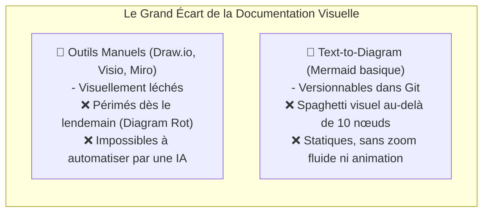
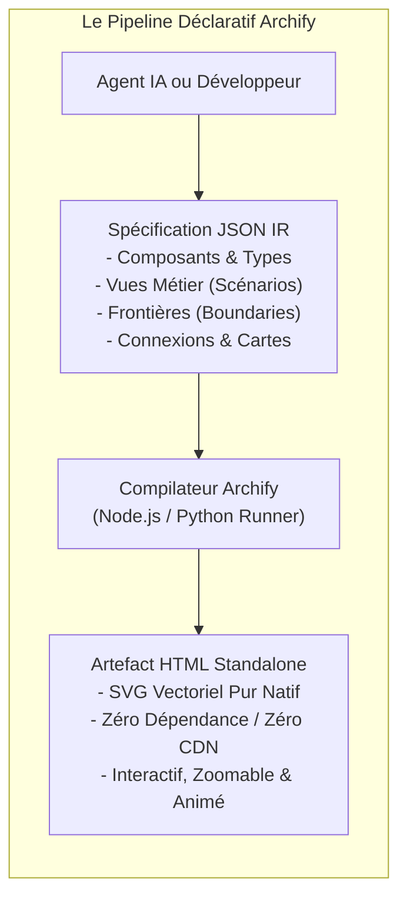
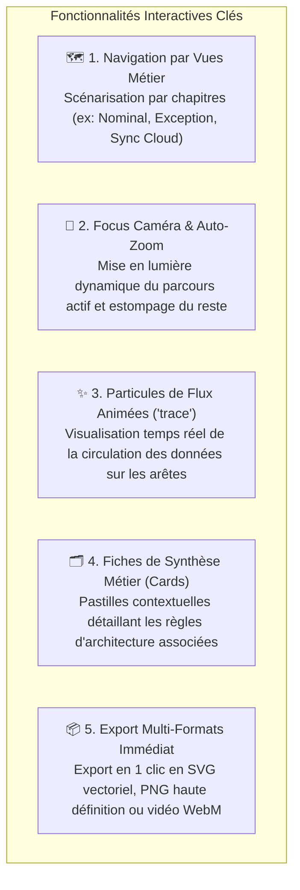

# 🎤 Présentation Table Ronde AI : Archify — La Cartographie d'Architecture Vivante & Déclarative pour l'IA

> **Auteur** : Marco Lefrançois & Équipe Architecture mLoop  
> **Audience** : Table Ronde AI, Architectes Logiciels, Tech Leads, Développeurs, CTOs & Product Owners  
> **Thème** : *Comment réconcilier la clarté visuelle et la rigueur du code grâce à la génération déclarative de diagrammes interactifs vectoriels à zéro dépendance.*

---

## 🧭 Plan de la Présentation (Pitch Deck 15-20 min)

1. **Le Cauchemar des Diagrammes d'Architecture** (Le fossé entre Visio/Draw.io et Mermaid brut)
2. **La Vision Archify : L'Architecture-as-Code Déclarative** (Le pivot du format JSON IR pour les agents IA)
3. **La Rigueur Sous le Capot : Le Validateur Showcase** (Les 9 contrôles géométriques stricts)
4. **L'Expérience Utilisateur Interactive** (Navigation par vues métier, focus caméra & animation de flux `trace`)
5. **Démonstration sur Projets Réels** (Metro Food 5 Couches, Couvoir Boire & Frères, Framework mLoop)
6. **L'Intégration dans la Boucle Agentique mLoop** (Génération automatique depuis les ADRs et le code)
7. **Impact, ROI & Boîte à Outils Prête à l'Emploi** (La phrase choc & les commandes CLI)

---

# 🔴 Slide 1 : Le Cauchemar des Diagrammes d'Architecture

### Le Dilemme Classique de l'Ingénierie Logicielle

Toute équipe d'ingénierie fait face à un dilemme frustrant lorsqu'il s'agit de cartographier son architecture :



### Les 3 Douleurs Majeures :
1. **La mort silencieuse de la documentation (*Diagram Rot*)** : Le schéma d'architecture archivé dans un wiki ne correspond plus au code déployé depuis 6 mois.
2. **La surcharge cognitive** : Présenter un système complexe d'un seul bloc noie l'audience dans un labyrinthe de flèches sans hiérarchie.
3. **L'incompatibilité avec les agents IA** : Les LLMs peinent à positionner manuellement des coordonnées graphiques sans créer des chevauchements de texte et des croisements illisibles.

> 💡 **Le constat** : L'architecture logicielle est **dynamique, vivante et multidimensionnelle** ; elle ne peut plus être figée dans un dessin statique ou un fichier PNG plat.

---

# 🟢 Slide 2 : La Vision Archify — L'Architecture-as-Code Déclarative

### Le Pivot Clé : Le Schéma Déclaratif JSON IR (*Intermediate Representation*)

**Archify** résout ce problème en séparant strictement l'intention architecturale de son rendu graphique vectoriel :



### Pourquoi le JSON IR change tout pour les Équipes et l'IA :
* **Déclaratif pur** : L'IA ou l'architecte déclare *« Voici mes composants, mes frontières et mes règles »*, Archify gère le positionnement, l'espacement et le tracé orthogonal parfait.
* **Versionnable dans Git** : Chaque diagramme vit sous la forme d'un fichier `.architecture.json` auditable et traçable en Pull Request.
* **Génération déterministe** : Même entrée JSON = même géométrie vectorielle irréprochable.

---

# 📐 Slide 3 : La Rigueur Sous le Capot — Le Validateur Showcase

### Les 9 Contrôles Géométriques Déterministes (`--quality showcase`)

Pour interdire formellement les « schémas bâclés », Archify intègre un moteur de validation mathématique et géométrique strict :

````carousel
```markdown
### 1. 🛡️ Contrôles de Collisions & Marges
- Zéro chevauchement de nœuds (Node Overlap Check).
- Zéro collision entre labels textuels et bordures (Margin Violation Check).
- Distance de sécurité minimale garantie entre composants voisins.
```
<!-- slide -->
```markdown
### 2. ⚡ Routage Orthogonal Strict
- Interdiction des diagonales anarchiques coupant les boîtes.
- Arêtes coudées orthogonales à angles nets (90°).
- Zéro croisement ambigu de flux (Ambiguous Crossing Check).
```
<!-- slide -->
```markdown
### 3. 🎯 Alignement de Grille & Conteneurs
- Snapping automatique sur la grille vectorielle.
- Délimitation hermétique des frontières logiques (Boundaries / Regions).
- Vérification d'existence des cibles de focus dans chaque vue métier.
```
````

### La Règle d'Or de l'Audit Archify :
Si une spécification JSON échoue à l'un des 9 contrôles, la commande `validate` rejette la compilation avec le rapport exact des coordonnées en conflit.

---

# 🎬 Slide 4 : L'Expérience Utilisateur Interactive

### Rendre l'Architecture Vivante, Compréhensible et Exploratoire

Un artefact généré par Archify n'est pas une image passive, c'est une **application web vectorielle autonome** dotée de super-pouvoirs de présentation :



### L'Atout Zéro Dépendance :
* **100 % Autonome** : Le fichier `.html` généré intègre l'intégralité de son CSS, JS vanilla et SVG.
* **Zéro Réseau Requis** : Fonctionne hors-ligne, en environnement bancaire ou réseau aérien déconnecté.
* **Double Thème** : Mode sombre natif calibré pour les projections et écrans modernes.

---

# 🔬 Slide 5 : Démonstration sur Projets Réels (Showcase mLoop)

### Cas Concrets Déployés dans le Répertoire `tools/archify/showcase/` :

````carousel
```markdown
### 📱 1. Metro Food — Cartographie des 5 Couches Logicielles (.NET)
Fichier : metro-food-layers.architecture.html
- Découpage granulaire des 5 couches de la solution Food.sln :
  UI Mobile ➔ Application & Orchestration ➔ Domaine Métier ➔ Passerelle API ➔ Sécurité & Cloud.
- Mise en évidence des frontières étanches (Boundaries) et flux Flurl / Azure Blob.
```
<!-- slide -->
```markdown
### ⚡ 2. Metro Food — Traversée Runtime (Diagramme de Séquence)
Fichier : metro-food-sequence.sequence.html
- Scénario complet : Chargement des coupons « Mes Offres » et points Moi.
- Traversée animée de l'action utilisateur XAML jusqu'au cache de session et retour réactif.
```
<!-- slide -->
```markdown
### 🥚 3. Boire & Frères — Noyau Couvoir (Dataverse-First)
Fichier : boirefrere-couvoir.architecture.html
- Isolation hermétique entre réception quai (Canvas App), exécution couvoir et CRM Dynamics.
- Visualisation des événements asynchrones via Azure Service Bus.
```
<!-- slide -->
```markdown
### 🧠 4. Framework Memory Loop (mLoop)
Fichier : mloop-framework.architecture.html
- Cartographie complète du cerveau agentique :
  CLI Swarm ➔ Workers Herdr ➔ Double Moteur Sémantique ➔ Usine à Récits.
```
````

---

# 🔄 Slide 6 : L'Intégration dans la Boucle Agentique mLoop

### Comment Archify s'imbrique dans le Cycle de Développement

Archify n'est pas un outil isolé ; il est nativement couplé aux décisions d'architecture (ADRs) et au backlog de Memory Loop :


### Le Pont avec les Autres Piliers :
* **Couplé au *Grill with Docs*** : Le diagramme Archify illustre les décisions prises lors de l'entrevue PO.
* **Couplé au *Vibe Check*** : L'agent vérifie l'intégrité de la cartographie avant d'autoriser une refactorisation majeure.

---

# 🚀 Slide 7 : Conclusion, Valeur Ajoutée & Boîte à Outils

| Avant Archify (Dessin Manuel / PNG) | Avec Archify (Architecture Déclarative) |
| :--- | :--- |
| **Périssable** : Obsolète 2 semaines après la livraison. | **Vivant** : Mis à jour par l'IA à chaque modification d'ADR. |
| **Statique** : Image plate illisible sans contexte. | **Interactif** : Vues scénarisées, zoom dynamique et flux animés. |
| **Subjectif** : Lignes diagonales confuses, boîtes mal alignées. | **Normé** : 9 contrôles géométriques stricts (*Showcase Quality*). |
| **Isolé du code** : Stocké dans un Google Drive ou Confluence oublié. | **Versionné** : Dans Git sous forme de spécification JSON IR. |

---

> ### 💬 La Phrase Choc à retenir :
> *« Ne dessinez plus l'architecture de vos systèmes à la main pour la regarder mourir dans un dossier partagé. Déclarez-la, validez-la mathématiquement et faites-la vivre à travers des artefacts interactifs autonomes. »*

---

### 🛠️ Les Commandes Essentielles Archify pour la Démo

```powershell
# 1. Valider une spécification JSON IR (9 contrôles géométriques stricts)
python tools/archify/archify_runner.py validate tools/archify/showcase/mloop-framework.architecture.json --quality showcase

# 2. Compiler et ouvrir directement le diagramme HTML interactif
python tools/archify/archify_runner.py deliver tools/archify/showcase/metro-food-layers.architecture.json output.html --quality showcase --open

# 3. Utilisation directe via le CLI mLoop Swarm
python src/swarm.py archify --file tools/archify/showcase/boirefrere-couvoir.architecture.json --open

# 4. Ouvrir l'un des artefacts de démonstration de la galerie
Start-Process "tools/archify/showcase/metro-food-layers.architecture.html"
```
