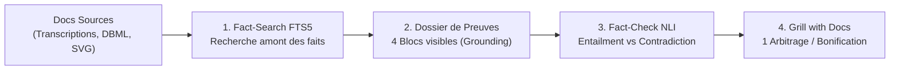
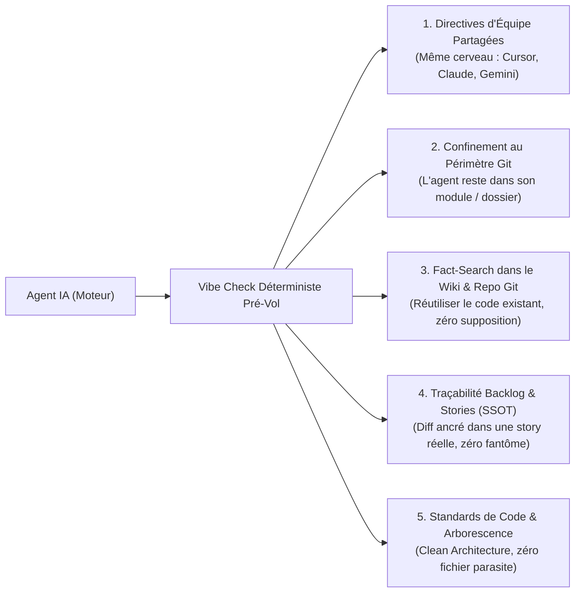

# ⚡ Synthèse Executive Table Ronde AI (10 Minutes Chrono)
## L'Ingénierie Agentique en Entreprise : De la Boîte Noire au Système Fondé sur des Preuves

> **Auteur** : Marco Lefrançois & Équipe Architecture mLoop  
> **Format** : Pitch Survol 10 min (avec repères de temps pour l'orateur)  
> **Audience** : Table Ronde AI, CTOs, Praticiens IA, Architectes & Analystes d'Affaires  
> **Thèse Centrale** : *« L'intelligence brute des LLMs est une commodité volatile. La véritable valeur d'ingénierie réside dans l'ancrage documentaire vérifiable (Grill with Docs & Fact-Check) et dans le harnais déterministe qui encadre leur code (Vibe Check). »*

---

## ⏱️ Découpage & Minutage du Pitch

```mermaid
gantt
    title Déroulé du Pitch 10 Minutes (Ordre Officiel)
    dateFormat mm:ss
    axisFormat %M:%S
    section Ordre du Pitch
    1. Introduction : Le Défi de l'IA en Entreprise          :00:00, 01:00
    2. 1er Sujet : Grill-Me with Docs, Preuves & Archify     :01:00, 05:30
    3. 2e Sujet : Vibe Coding vs Vibe Check (Harnais)        :05:30, 08:30
    4. Conclusion & Phrase Choc                               :08:30, 10:00
```

---

# 🎙️ 1. Introduction : Le Grand Défi de l'IA en Entreprise `[00:00 - 01:00]`

### Le Paradoxe de la Vitesse sans Confiance
* **L'attrait initial** : Des LLMs impressionnants qui répondent instantanément et génèrent des pavés de texte ou de code.
* **Le mur en production** : L'effet « boîte noire », les hallucinations indécelables, l'amnésie entre deux sessions et la rupture de confiance avec les experts métiers.
* **La mission mLoop** : Remplacer l'illusion par la certitude mathématique et documentaire. Comment ? En imposant deux règles d'acier :
  1. **Sur les exigences métier** : L'IA doit prouver ce qu'elle a compris avant de questionner (*Grill-Me with Docs*).
  2. **Sur le code produit** : L'IA doit être encadrée par un harnais déterministe impitoyable (*Vibe Check*).

---

# 🥩 2. 1ᵉʳ SUJET : Grill-Me with Docs x Fact-Search, Fact-Check & Évidences `[01:00 - 05:30]`

### A. Préambule : Du « Grill-Me » de Matt Pocock au « Grill with Docs » mLoop
* **Le concept originel de Matt Pocock (*Grill-Me*)** :  
  Plutôt que de laisser un développeur ou un analyste rédiger un prompt flou et subir des suppositions, on demande au LLM d'inverser les rôles : *« Grill me »* (cuisine-moi). L'agent prend l'initiative et pose une série de questions fermées et pertinentes pour cerner les contraintes, les cas limites et les zones grises avant d'écrire la moindre ligne de code ou de spécification.
* **La lacune en entreprise** :  
  Le Grill-Me classique excelle pour poser des questions pertinentes, mais en entreprise, face à des dizaines de spécifications, modèles DBML et transcriptions d'ateliers, **il agit comme une boîte noire**. Il pose d'excellentes questions, mais sans jamais prouver ce qu'il a compris au départ ni d'où proviennent ses postulats.


🎙️ **Préambule** 
> *« Tout le monde, connait ou utilise le skill de Matt Pocock : Grill me with docs !?!
> Moi, je l'utilise à tout les jours pour faire mes analyses fonctionnelles pour rédiger mes stories
> Ça m'aide vraiment à faire le tour du sujet scopé sur ma story
> Voici un exemple du skill en action »


https://chat-ia.nmedia.ca/s/e2f346d8-77ce-4706-8d52-5dbe7266e7eb

> *« Toute ces questions c'est bien beau, mais c'est quoi que l'agent a compris et retenu de toute cette documentation ? »

---

### B. Casser la Boîte Noire : Comprendre d'abord ce que l'IA a compris

> 🎙️ **Grill me with docs and Facts** 
> *« C'est à ce moment là que j'ai réfléchi à comment je pouvais savoir sur quel extrait de documentation l'agent s'était basé pour établir son raisonnement, j'avais deux voix sur mes épaules — un peu comme l'ange et le démon, vous choisirez qui est qui !  
> 
> D'un côté, **JF** me dit : "Il faut vérifier ce que ton agent te rapporte, être convaincu à 100 % que c'est la vérité, mais sans que l'humain devienne le goulot d'étranglement qui passe des heures à tout relire !".  
> 
> De l'autre, **Jean-Philippe** me rappelle : "Prouve tes points, ne fais pas aveuglément confiance à l'IA ; utilise-la comme un assistant vérifiable, validable et cohérent, et reste en pleine possession de ton sujet !".  
> 
> Et c'est là que le Grill-Me ordinaire a une lacune pour moi : **c'est une boîte noire**. La séquence de question est vraiment bien, il sait cerner le sujet et te poser les bonnes questions qu'il n'a pas les réponses et soulève même de très bonnes pistes, par contre il n'expose jamais ce qu'il a compris au départ.  
> Je me suis mis à penser qu'est-ce qui pourrait bonifier, pis ces temps-ci ma blonde regarder énormément de True Crime et j'ai trouvé ma réponse : Fact-Search et Fact-Check
> 
> J'ai jumelé avec le Fact-Search / Check et les fichiers d'évidence pour inverser la charge de la preuve : Dans un premier temps, l'agent m'expose ses faits sourcés et ses extraits textuels avec un dossier de preuve. Je valide ses preuves, je bonifie, et ensuite le Grill-Me déclenche sa session de question et soulève des explications, couvre les angles mort et propose même des améliorations qu'on n'aurait peut être pas vues à l'analyse initiale ! »

---

### C. Le Skill en Action : Les 2 Captures Choc sur le Couvoir Boire & Frères (`INC-001-BE`)

Voici comment notre skill matérialise cette promesse en direct sous les yeux de l'analyste :

#### 📸 Capture 1 : L'Anatomie du « Dossier de Preuves » (Ce que l'IA a compris)


> **Ce que l'écran montre** : Avant de poser la moindre question, l'IA dresse son dossier d'évidences en 4 blocs étanches :
> 1. *Maquettes SVG* + Note photo d'atelier (`10_15_35...jpg` pour la colonne Lot).
> 2. *Extraits verbatim transcrits* avec citations mot à mot et lignes exactes.
> 3. *Modèle relationnel DBML* (`InventoryLot`, statuts, clés).
> 4. *Question d'arbitrage unitaire* avec Option A recommandée et motivée.
> 
> 🌐 [**Ouvrir l'Artefact HTML du Dossier de Preuves (`dossier_preuves_INC-002-BE.html`)**](file:///C:/Memory%20Loop/docs/table_ronde/dossier_preuves_INC-002-BE.html)

---

#### 📸 Capture 2 : L'Écran Scindé IDE (Le Choc de la Traçabilité Immédiate)


* **💥 Pourquoi les collègues analystes ont « capoté » devant cet écran :**
  1. **Zéro hallucination & Preuve instantanée** : À gauche, l'agent cite les lignes **301–324** et **424–455**. À droite, la transcription brute est ouverte au même endroit. L'analyste valide la source en **2 secondes chrono**, sans réécouter 2 heures d'enregistrement.
  2. **Du québécois oral d'atelier aux règles d'ingénierie pures** : L'IA a traduit *« mes œufs les plus vieux overall »* et *« je me fous de ton troupeau »* en **3 règles univalentes** (`is_oldest_priority`, bascule Poule/Calendrier, contrainte de 2 à 3 buggies).
  3. **Réconciliation multimodale** : Convergence parfaite entre 11 maquettes SVG, 1 photo annotée sur place, 1 583 lignes de transcription et le schéma DBML.

---

### D. Le Flux Épistémique en 4 Temps & Le Verrou Fact-Check NLI



* **Le Verrou Aval Fact-Check NLI** : Les scénarios Gherkin sont certifiés automatiquement (`ENTAILMENT` = prouvé, `CONTRADICTION` = bloqué en 0.18s).

> 🌐 **Coup Double Live : Visualiser ce Flux avec Archify** :  
> 👉 [**`grill-with-docs-epistemic-flow.architecture.html`**](file:///C:/Memory%20Loop/docs/table_ronde/grill-with-docs-epistemic-flow.architecture.html)  
> *(Projetez ce schéma interactif en direct : « Et ce visuel animé avec flux de particules que vous voyez à l'écran pour illustrer notre méthode ? Il a été modélisé et généré par notre propre moteur maison d'Architecture-as-Code : **Archify** ! »)*

---

# 🛡️ 3. 2ᵉ SUJET : Vibe Coding vs Vibe Check — Le Regard Développeur `[05:30 - 08:30]`

### A. La Transition : De la Rigueur sur les Faits à la Rigueur sur le Code
Une fois les exigences cadrées avec l'analyste, l'agent passe au développement. Et c'est là que surgit la hantise de toute équipe de dev : **le Vibe Coding en roue libre**.

---

### B. Le Cauchemar du Développeur face au Vibe Coding Pur
* **L'illusion Karpathy** : Coder au feeling en langage naturel (*« I just see stuff, say stuff, run stuff »*).
* **Ce qui exaspère les développeurs en entreprise** :
  1. **La réinvention de la roue dans le Repo Git** : L'IA crée de nouvelles fonctions utilitaires ou installe des packages externes alors que le code existe déjà dans le dépôt Git !
  2. **L'ignorance des conventions du Wiki** : L'IA ignore les patrons d'architecture, les normes d'API et les guides consignés dans le Wiki d'équipe (Azure DevOps Wiki / Confluence).
  3. **L'amnésie et les régressions silencieuses** : L'agent touche à 15 fichiers à la fois, brise les interfaces TypeScript / C# / Python et introduit des bugs cachés.

---

### C. La Réponse mLoop : Le « Vibe Check » & l'Ingénierie de Harnais (ADR-0310)

> 🎙️ **La Métaphore de la Formule 1** :  
> *« Les freins d'une Formule 1 ne sont pas là pour ralentir le bolide, mais pour permettre au pilote de foncer à 300 km/h en toute confiance. Pour un dev, le Vibe Check, c'est le harnais qui permet à l'IA d'aller vite sans jamais polluer le repo Git ni casser l'architecture. »*



#### 🛠️ Les 5 Verrous Expliqués sous l'Angle Dev :
1. **Directives d'Équipe Partagées** : Peu importe que le dev utilise **Cursor**, **Claude Code** ou **Antigravity**, l'agent applique scrupuleusement les mêmes règles de code et conventions de nommage.
2. **Confinement au Périmètre Git** : L'agent est cadenassé dans son sous-module. Interdiction de modifier les fichiers transverses, les secrets `.env` ou le code d'un autre projet.
3. **Fact-Search dans le Wiki & le Repo Git** : **Le réflexe dev par excellence.** Avant d'écrire la moindre fonction, l'agent explore :
   * Le **Wiki d'équipe** (règles d'architecture, directives d'API, ADRs).
   * Le **Repo Git existant** (recherche de symboles, classes existantes, modèles de données).  
   ➔ *Résultat : L'agent réutilise les briques existantes au lieu de dupliquer du code !*
4. **Traçabilité Backlog (SSOT)** : Chaque modification de code doit être liée à une User Story formelle du backlog. Pas de commits sauvages ni de code orphelin.
5. **Standards de Code & Arborescence** : Respect de la structure du repo, typage strict, et interdiction formelle de créer des fichiers temporaires ou des READMEs sauvages polluant la codebase.

* **Règle Zero-Fail Carryover** : Si un seul des 5 contrôles échoue, l'agent **a l'interdiction de modifier le code**.
* **Anti-Amnésie Dev** : La commande `python src/swarm.py resume` réhydrate l'état mental de l'agent en **2 secondes** (backlog, stories actives, historique).

---

# 🚀 4. Conclusion & Message Clé `[08:30 - 10:00]`

### La Synthèse des Deux Sujets

| Dimension | Approche Naïve (Standard) | Solution mLoop Fondée sur les Preuves |
| :--- | :--- | :--- |
| **1ᵉʳ Sujet : Analyse & Vérité Métier** | **Grill-Me boîte noire** : questions vagues, hallucinations, suppositions | **Grill with Docs & Fact-Check** : Dossier de preuves en 4 blocs, L301-324 vérifiées en 2s, NLI déterministe |
| **2ᵉ Sujet : Code & Exécution** | **Vibe Coding amnésique** : code non relu, dérives d'API, perte de contexte | **Vibe Check & Harnais F1** : Pré-vol 5 points, Session Resume, Zero-Fail Carryover |
| **Outil Transversal Visuel** | Diagrammes statiques périmés sous Visio/Miro | **Archify** : Architecture-as-Code vivante et animée |

---

> ### 💬 La Phrase Choc à retenir pour la Table Ronde :
> *« L'IA ne doit pas être un devin complaisant qui improvise votre code ni une boîte noire qui interroge vos analystes à l'aveugle.  
> Elle doit être l'assistant le plus rigoureux de votre organisation : **adossée à des preuves documentaires irréfutables avec Grill-Me with Docs, et encadrée par un harnais déterministe impitoyable avec le Vibe Check.** »*

---

### 🧰 Liens vers les Ressources Clés du Dossier Table Ronde
- 📄 [**Guide des Démonstrations Concrètes (Live Démos)**](file:///C:/Memory%20Loop/docs/table_ronde/guide_demonstrations_concretes.md)
- 📄 [**Présentation Détaillée Grill with Docs & Fact-Check**](file:///C:/Memory%20Loop/docs/table_ronde/presentation_table_ronde.md)
- 📄 [**Présentation Vibe Coding vs Vibe Check**](file:///C:/Memory%20Loop/docs/table_ronde/presentation_vibe_coding_vs_vibe_check.md)
- 📄 [**Présentation Archify**](file:///C:/Memory%20Loop/docs/table_ronde/presentation_archify.md)
- 🌐 [**Visuel Interactif Archify (Flux Épistémique)**](file:///C:/Memory%20Loop/docs/table_ronde/grill-with-docs-epistemic-flow.architecture.html)
- 📑 [**Artefact HTML du Dossier de Preuves (`INC-002-BE`)**](file:///C:/Memory%20Loop/docs/table_ronde/dossier_preuves_INC-002-BE.html)
- 📸 [**Capture Dossier de Preuves**](file:///C:/Memory%20Loop/docs/table_ronde/assets/screenshot_dossier_preuves_verbatims.png)
- 📸 [**Capture Écran Scindé IDE**](file:///C:/Memory%20Loop/docs/table_ronde/assets/screenshot_ide_split_screen.png)
