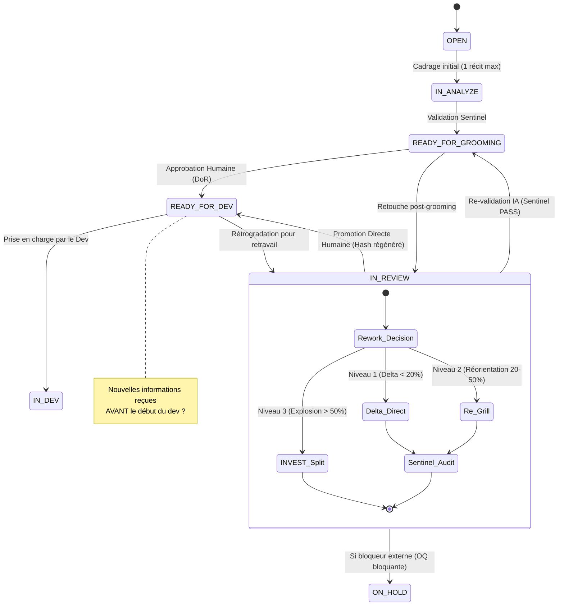

# ADR-0344 : Statut IN_REVIEW, Protocole de Révision Post-Validation & Re-Grill de Portée

- **Statut** : Accepté
- **Date** : 2026-08-30
- **Auteurs** : Équipe mLoop Swarm & Co-Architecte
- **Périmètre** : Machine à États (`src/pipelines/state_machine.py`), Cycle de Vie Récits (`src/state.py`), Synchronisation Jira Cloud, Anti-Tampering, Protocole Re-Grill

---

## 1. Contexte et Problématique

Dans le cycle de vie Spec-Driven Development de mLoop, un récit utilisateur franchit la phase de cadrage et de validation pour atteindre l'état **`READY_FOR_GROOMING`** (validé par l'IA via Sentinel) ou **`READY_FOR_DEV`** (approuvé par l'Humain pour l'équipe de développement).

Toutefois, dans la pratique opérationnelle des projets d'entreprise, il arrive fréquemment que de **nouvelles informations critiques** surviennent **avant** que l'équipe de développement n'entame le code (`not IN_DEV`) :
- Évolution ou clarification majeure d'une règle d'affaires client (Product Owner).
- Modification de contrats d'APIs tierces ou de contraintes d'infrastructure.
- Ajustement d'écrans ou de parcours utilisateur suite à des maquettes Figma révisées.
- Nouvelles contraintes légales, de conformité ou de sécurité (Loi 25, chiffrement, RBAC).

### Les 3 Verrous et Frictions Historiques :
1. **Verrou Anti-Tampering Bloquant (`ContentTamperingError`)** : L'empreinte SHA-256 (`content_hash`) injectée dans le frontmatter lors du passage en `READY_*` levait une exception fatale dès qu'une modification Markdown était apportée sans réinitialisation d'état.
2. **Goulot d'Étranglement Mono-Récit de `IN_ANALYZE`** : Rétrograder le récit en `IN_ANALYZE` entrait en collision avec la règle d'isolation cognitive (`validate_single_in_analyze`), interdisant d'avoir plus d'un seul récit en analyse simultanément par projet.
3. **Flou de Visibilité & Risque de Prise en Dev Prématurée** : Sans statut intermédiaire officiel, laisser le ticket en `READY_FOR_DEV` dans Jira exposait l'équipe de développement au risque de développer un ticket obsolète, tandis que le repasser en `OPEN` effaçait 90 % du travail d'analyse déjà accompli.

---

## 2. Décisions d'Architecture

---

### 2.1 Axe 1 : Typage du Statut `IN_REVIEW` & Visibilité Jira
- Ajout de `IN_REVIEW = "IN_REVIEW"` dans l'enum `StoryStatus` ([`src/state.py`](file:///c:/Memory%20Loop/src/state.py)).
- Les propriétés `grilled` et `jira_sync_eligible` de `SprintBacklogItem` intègrent `IN_REVIEW = True`.
- Lors de la synchronisation Jira Cloud (`python src/swarm.py jira_sync`), le ticket passe en état `In Review` / `En Révision`, servant de signal d'arrêt clair pour l'équipe de développement.

---

### 2.2 Axe 2 : Matrice des Transitions (`ALLOWED_TRANSITIONS`)
Le dictionnaire déterministe de la FSM autorise formellement les transitions bidirectionnelles suivantes :
- `READY_FOR_DEV` $\rightarrow$ `[IN_DEV, IN_REVIEW, IN_ANALYZE, ON_HOLD]`
- `READY_FOR_GROOMING` $\rightarrow$ `[READY_FOR_DEV, IN_REVIEW, IN_ANALYZE, ON_HOLD]`
- `IN_REVIEW` $\rightarrow$ `[READY_FOR_DEV, READY_FOR_GROOMING, IN_ANALYZE, ON_HOLD, OPEN, ERROR]`

> [!IMPORTANT]
> **Promotion Directe Humaine** : La transition directe `IN_REVIEW` $\rightarrow$ `READY_FOR_DEV` est expressément autorisée pour l'Humain, lui permettant de valider directement les retouches sans obligation de repasser par l'étape intermédiaire `READY_FOR_GROOMING`.

---

### 2.3 Axe 3 : Déverrouillage & Recalcul de l'Empreinte Anti-Tampering (SHA-256)
- **Pendant `IN_REVIEW`** : `validate_content_integrity` suspend son contrôle strict, permettant l'édition libre des critères d'acceptation, des maquettes et des 4 Piliers Gherkin.
- **Lors du retour en `READY_FOR_DEV` ou `READY_FOR_GROOMING`** : La méthode `stamp_content_hash` recalcule l'empreinte SHA-256 du nouveau corps Markdown et l'injecte dans le frontmatter YAML (`content_hash: <nouveau_hash>`).

---

### 2.4 Axe 4 : Multi-Récits en Revue (Découplage Mono-Analyse)
- La règle de contention cognitive `validate_single_in_analyze` s'applique exclusivement à `IN_ANALYZE` (création initiale *from scratch*).
- Plusieurs récits peuvent coexister simultanément au statut `IN_REVIEW` sans enfreindre la gouvernance de la machine à états.

---

### 2.5 Axe 5 : Protocole de Révision de Portée & Re-Grill (Scope Overhaul Framework)
Le retravail en mode `IN_REVIEW` est régi par la **Grille des 3 Niveaux de Révision** :

1. **Niveau 1 : Ajustement Mineur (*Delta < 20%*)**
   - *Exemple* : Ajout d'une règle de validation de champ, précision d'un code d'erreur HTTP.
   - *Protocole* : Édition directe du Markdown par l'utilisateur ou l'agent. Pas de Re-Grill nécessaire.
2. **Niveau 2 : Réorientation Métier / Technique (*20% à 50%*)**
   - *Exemple* : Changement de composant UI (upload unitaire $\rightarrow$ multiple), bascule d'une API synchrone vers une file asynchrone ServiceBus.
   - *Protocole* : L'utilisateur explicite l'intention métier en 1 à 2 phrases. Lancement d'un **Re-Grill ciblé** (`python src/swarm.py grill --story <ID>`) qui interroge exclusivement les nouvelles zones d'ombre, met à jour les 4 Piliers Gherkin et synchronise l'`EvidencePack`.
3. **Niveau 3 : Refonte Majeure / Alerte INVEST (*Explosion > 50%*)**
   - *Exemple* : L'exigence nouvelle double la taille du parcours ou introduit un nouveau sous-système.
   - *Protocole* : Application du critère **Small** d'INVEST. Le récit initial conserve son parcours de base et un nouveau récit vertical (`REC-XXX-b`) est créé pour absorber le surplus de portée.

---

## 3. Conséquences

### Positives :
- **Fluidité de révision** : Élimination totale des plantages `ContentTamperingError` lors du retravail de récits validés.
- **Sécurité du delivery** : Garantie que l'équipe de dev ne commence jamais à coder un récit en cours de révision.
- **Rigueur & Anti-Amnésie** : Préservation du capital d'analyse déjà réalisé tout en assurant l'alignement sur les faits vérifiés (Re-Grill + EvidencePack).

### Négatives / Mitigations :
- *Risque d'oubli de re-validation* : Un récit laissé en `IN_REVIEW` bloque son passage en sprint de développement.  
  *Mitigation* : Les rapports d'avancement (`cycle-status` et `sprint_backlog.md`) mettent en évidence les récits en révision pour suivi humain.

---

## 4. Références Constitutionnelles & ADRs Liées

- [`src/state.py`](file:///c:/Memory%20Loop/src/state.py) : Définition de `StoryStatus.IN_REVIEW`.
- [`src/pipelines/state_machine.py`](file:///c:/Memory%20Loop/src/pipelines/state_machine.py) : Implémentation de `ALLOWED_TRANSITIONS` et gestion du hash.
- [`standards/protocols/STORY_LIFECYCLE_PROTOCOL.md`](file:///c:/Memory%20Loop/standards/protocols/STORY_LIFECYCLE_PROTOCOL.md) : Protocole normatif d'autorité et de révision.
- **ADRs Associées** :
  - `ADR-0300` : Story Constraint Contract & Score INVEST
  - `ADR-0301` : Standard Gherkin Outlines & Règle des 4 Piliers
  - `ADR-0302` : Protocole Story-as-State & Single-Grill
  - `ADR-0310` : Vibe Code Common Sense & Guardrails Pré-Vol
  - `ADR-0320` : Grill-Me & Frontier Design Tree
  - `ADR-0339` : Portes de Gouvernance & Cycle de Vie Projet
