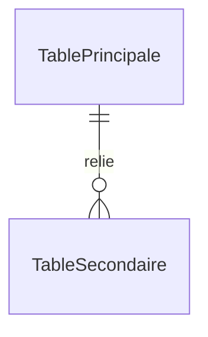

# 📑 Gabarit Officiel : Dossier de Preuves Documentaires & Cadrage

**Statut** : SSOT Normatif Blueprint  
**Standard** : mLoop Grounding & Fact Disclosure Engine 1.0  
**Référence** : [ADR-0320](../adr-system/0320-grill-me-frontier-design-tree-alignment.md) & [ADR-0326](../adr-system/0326-fact-search-and-substantive-content-review.md)  
**Emplacement de Persistance** : `memory/evidence/<STORY_ID>_fact_dossier.md`

---

```markdown
---
story_id: <STORY_ID>
dossier_status: VALIDATED # VALIDATED | STALE_PENDING_REVISION
created_at: YYYY-MM-DDTHH:MM:SSZ
updated_at: YYYY-MM-DDTHH:MM:SSZ
sources_hashes:
  source_1: sha256_hash
  source_2: sha256_hash
---

# 🐣 Dossier de Preuves Documentaires & Cadrage — `<STORY_ID>` (<Titre Fonctionnel Pur>)

> **Titre Fonctionnel Pur** : <Titre Métier sans bruit IA ni clé artificielle>  
> **Epic Jira** : `<EPIC_KEY>` (<Nom du Module>)  
> **Couche** : `backend` | `frontend` | `fullstack`  
> **Récit Précédent / Dépendances** : [`<DEP_STORY_ID>.md`](file:///<chemin>/<DEP_STORY_ID>.md)

---

### 📂 1. Sources Physiques & Maquettes SSOT (Liens Directs Cliquables)

| Source SSOT | Nature du Document | Lien Web Officiel (Figma / Wiki) | Lien Repo Local (`file:///...`) |
| :--- | :--- | :--- | :--- |
| **Maquette Principale** | Écran Figma / SVG | [Figma — Titre Frame](https://www.figma.com/...) *(ou N/A - Headless)* | [Titre.svg](file:///chemin/docs/05-assets/...) |
| **Spécification / Guide** | Règle fonctionnelle | [Wiki Azure DevOps](https://dev.azure.com/...) | [PLAN-XXX.md](file:///chemin/docs/00-ingested/...) |
| **Compte-Rendu Atelier** | Transcription verbatim | [Notes Réunion](https://...) | [Atelier.md](file:///chemin/docs/00-ingested/...) |
| **Architecture / ADR** | Décision structurante | [Wiki Architecture](https://...) | [ADR-XXX.md](file:///chemin/docs/00-ingested/...) |
| **Modèle de Données** | Modèle DBML / Schéma | [Wiki Modèle](https://...) | [modele.md](file:///chemin/docs/03-models/...) |

> 💡 *Note Headless* : Pour les tâches techniques, scripts ou Spikes sans interface visuelle, inscrire `N/A - Composant Headless` pour la maquette et citer le code source physique ou script technique en référence principale.

---

### ⚖️ 1.1 Matrice de Résolution des Conflits de Sources (si applicable)

En cas d'écart entre documents, appliquer la Hiérarchie de Vérité (Niveau 1 Grill PO > Niveau 2 Figma > Niveau 3 Specs > Niveau 4 Verbatims) :

| Conflit Identifié | Source A (Niveau & Valeur) | Source B (Niveau & Valeur) | Décision Retenue & Justification |
| :--- | :--- | :--- | :--- |
| *Ex: Capacité slot* | *PLAN-006 (Niveau 3 : 2 buggies)* | *Figma 2026 (Niveau 2 : 3 buggies)* | *3 buggies (Maquette approuvée Niveau 2 prévaut sur spec antérieure)* |

---

### 🎙️ 2. Extraits Verbatim Sourcés (Passage-Level Grounding)

> [!NOTE]
> **Extrait 1 — <Titre de la Règle / Notion Métier>**  
> **Source** : [`<NomFichierSource>.md#LXX-LYY`](file:///chemin/<NomFichierSource>.md#LXX-LYY)  
> *« <Citation mot-à-mot exacte du texte source d'au moins 15 mots> »*  
> ➔ **Fait établi** : <Traduction fonctionnelle concise, déterministe et chiffrée>.

> [!NOTE]
> **Extrait 2 — <Titre de la Règle / Notion Métier>**  
> **Source** : [`<NomFichierSource>.md#LXX-LYY`](file:///chemin/<NomFichierSource>.md#LXX-LYY)  
> *« <Citation mot-à-mot exacte du texte source> »*  
> ➔ **Fait établi** : <Traduction fonctionnelle concise, déterministe et chiffrée>.

---

### 🗄️ 3. Schéma de Données & Tables Clés (Modèle DBML / Dataverse)



* **Entités Référentielles** :
  - `table_ref` : Champs clés et contraintes.
* **Entités Transactionnelles** :
  - `table_tx` : Champs modifiés, états de transition et clés d'idempotence.

---

### 🎯 4. Contrats Déclaratifs Cibles (Endpoints REST / Matrice CTA)

* **Pour un Récit Backend (Endpoints REST)** :
  - `METHOD /api/v1/...` : Rôle métier, contrat JSON requête/réponse, idempotence et statut HTTP.
* **Pour un Récit Frontend (Matrice CTA)** :
  - Tableau des déclencheurs UI, états visuels (Default, Hover, Disabled, Loading, Error), navigation et feedback.

---

### 🏁 5. Évaluation de la Frontière Active (Issue A ou Issue B)

#### [CAS A — Si Arbitrage Requis] ❓ Question d'Arbitrage #N pour `<STORY_ID>`
<Contexte précis de l'arbitrage adossé aux faits vérifiés ci-dessus>.
* **Option A (Recommandée — <Motivation Technique>)** : <Description de l'option recommandée>.
* **Option B** : <Description de l'alternative viable>.
👉 **<Question fermée d'arbitrage posée à l'architecte / PO> ?**

#### [CAS B — Si Zéro Arbitrage Requis] ✅ Constat Formel de Frontière Vide
*Tous les faits nécessaires à la rédaction de la spécification sont vérifiés, documentés et exempts de zones d'ombre.*  
👉 **Validation formelle du socle factuel sollicitée auprès de l'humain avant d'enclencher la rédaction de la User Story.**
```
