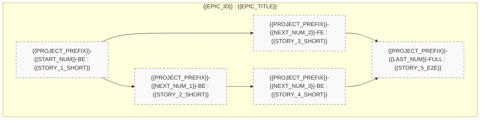

# 🏛️ Épopée — `{{EPIC_ID}}` : {{EPIC_TITLE}}

---

> **Référence d'Architecture** : [ADR-{{ADR_NUM}}](../../../../standards/adr-system/{{ADR_SLUG}}.md) · [ADR-0202](../../../../standards/adr-system/0202-modularite-interne-agents.md) (Modularité ≤ 300L) · [ADR-0375](../../../../standards/adr-system/0375-standard-preuve-epistemique-et-tracabilite-radicale.md) (Traçabilité Radicale) · [ADR-0376](../../../../standards/adr-system/0376-standard-rigueur-zero-blindspot-ecosysteme-mloop.md) (Rigueur 360° Zéro Blindspot)  
> **Composant(s)** : `{{COMPONENTS}}`  
> **Origine / Déclencheur** : {{ORIGIN_DESCRIPTION}}  
> **Statut** : `OPEN` — Récits Palier 1 (`status: DRAFT`, `grill_me: PENDING`)  
> **Décideurs** : {{DECIDERS}}  

---

## 🎯 1. Contexte & Intention Stratégique

{{STRATEGIC_CONTEXT_EXPLANATION}}

### Points de Friction Résolus / Objectifs Mesurables :
1. **{{OBJECTIVE_1_TITLE}}** : {{OBJECTIVE_1_DESC}}
2. **{{OBJECTIVE_2_TITLE}}** : {{OBJECTIVE_2_DESC}}
3. **{{OBJECTIVE_3_TITLE}}** : {{OBJECTIVE_3_DESC}}

---

## 🧭 2. Vérité Terrain & Ancrage Normatif

> En application de l'**ADR-0375** (Traçabilité Radicale) et de l'**ADR-0376** (Zéro Blindspot), cette épopée s'ancre sur les sources vérifiées suivantes :

* **Source de Référence** : `{{OFFICIAL_SPEC_URL_OR_CACHE_PATH}}`
* **Preuve / Cache Local** : `{{CRAWL_CACHE_PATH_OR_SPEC_FILE}}`
* **ADR Décisionnel Associé** : [`standards/adr-system/{{ADR_FILE}}`](../../../../standards/adr-system/{{ADR_FILE}})

### Extraits Verbatim Clés :
```text
"{{VERBATIM_EXTRACT_FROM_SPEC_OR_CODE}}"
— Référence : {{VERBATIM_SOURCE}}
```

---

## 🗺️ 3. Cartographie de l'Épopée (Story Mapping)



---

## 📋 4. Découpage en Récits Utilisateurs (Palier 1 Drafts)

| Récit ID | Rôle | Titre du Récit | Taille | Dépendances | Statut Initial | Fichier Story |
| :--- | :---: | :--- | :---: | :--- | :---: | :--- |
| **{{PROJECT_PREFIX}}-{{START_NUM}}-BE** | `BE` | {{STORY_1_TITLE}} | `S` | Aucune | `DRAFT` (Palier 1) | [`stories/{{PROJECT_PREFIX}}-{{START_NUM}}-BE.md`](../stories/{{PROJECT_PREFIX}}-{{START_NUM}}-BE.md) |
| **{{PROJECT_PREFIX}}-{{NEXT_NUM_1}}-BE** | `BE` | {{STORY_2_TITLE}} | `M` | `{{PROJECT_PREFIX}}-{{START_NUM}}-BE` | `DRAFT` (Palier 1) | [`stories/{{PROJECT_PREFIX}}-{{NEXT_NUM_1}}-BE.md`](../stories/{{PROJECT_PREFIX}}-{{NEXT_NUM_1}}-BE.md) |
| **{{PROJECT_PREFIX}}-{{NEXT_NUM_2}}-FE** | `FE` | {{STORY_3_TITLE}} | `M` | `{{PROJECT_PREFIX}}-{{START_NUM}}-BE` | `DRAFT` (Palier 1) | [`stories/{{PROJECT_PREFIX}}-{{NEXT_NUM_2}}-FE.md`](../stories/{{PROJECT_PREFIX}}-{{NEXT_NUM_2}}-FE.md) |
| **{{PROJECT_PREFIX}}-{{NEXT_NUM_3}}-BE** | `BE` | {{STORY_4_TITLE}} | `M` | `{{PROJECT_PREFIX}}-{{NEXT_NUM_1}}-BE` | `DRAFT` (Palier 1) | [`stories/{{PROJECT_PREFIX}}-{{NEXT_NUM_3}}-BE.md`](../stories/{{PROJECT_PREFIX}}-{{NEXT_NUM_3}}-BE.md) |
| **{{PROJECT_PREFIX}}-{{LAST_NUM}}-FULL** | `FULL`| {{STORY_5_TITLE}} | `L` | Tous précédents | `DRAFT` (Palier 1) | [`stories/{{PROJECT_PREFIX}}-{{LAST_NUM}}-FULL.md`](../stories/{{PROJECT_PREFIX}}-{{LAST_NUM}}-FULL.md) |

---

## 🛡️ 5. Matrice d'Impact Transversal Zéro Blindspot (ADR-0376)

| Couche ECOSYSTEM_RIGOR | Impact Identifié | Action Prévue | Statut |
| :--- | :--- | :--- | :---: |
| **Couche 1 : Blueprints** | `{{BLUEPRINTS_IMPACT}}` | Mise à jour / création gabarits sous `standards/blueprints/` | `PENDING` |
| **Couche 2 : Protocoles** | `{{PROTOCOLS_IMPACT}}` | Amendement de `standards/protocols/` | `PENDING` |
| **Couche 3 : Architecture ADR**| `{{ADR_IMPACT}}` | Scellé sous `standards/adr-system/{{ADR_FILE}}` | `SCELLED` |
| **Couche 4 : Directives Agents**| `{{AGENTS_IMPACT}}` | Mise à jour des personas dans `.agents/agents/` | `PENDING` |
| **Couche 5 : Skills Portables**| `{{SKILLS_IMPACT}}` | Déploiement / mise à jour `.agents/skills/` | `PENDING` |
| **Couche 6 : Core Python & CLI**| `{{CORE_IMPACT}}` | Modules sous `src/` (respect strict ADR-0202 ≤ 300L) | `PENDING` |
| **Couche 7 : Tests & Parité** | `{{TESTS_IMPACT}}` | Tests unitaires sous `tests/` + validation Vibe-Check | `PENDING` |

---

## 🏁 6. Critères de Sortie & Clôture de l'Épopée (DoD)

1. [ ] Tous les récits utilisateurs de l'épopée ont atteint le statut `DONE_TESTED` ou `SHIPPED`.
2. [ ] Les sessions Grill-Me 1:1 ont validé l'entrée en développement (passage Palier 2).
3. [ ] Aucun dépassement modulaire (`RULE-AST-01`, plafond 300L) n'a été introduit.
4. [ ] La suite complète des tests de non-régression est au vert (`pytest tests/`).
5. [ ] Le contrôle souverain `python src/swarm.py vibe-check --project {{PROJECT_NAME}}` retourne `0 FAIL`.
6. [ ] La table `Projects/{{PROJECT_NAME}}/backlog/sprint_backlog.md` est synchronisée.
