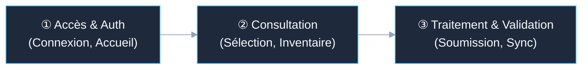

# 🗺️ Story Mapping - [Nom du Projet]

> [!ABSTRACT] 🌐 Cartographie 360° du Parcours Utilisateur
> - **Toile Spatiale Interactive** : 🗺️ `![[backlog/story_mapping.canvas]]` *(Ouvrir dans Obsidian Canvas pour naviguer en 2D)*
> - **Portée Globale** : Cartographie des récits verticaux par acteur, tranche d'activité et flux de valeur.

---

## 👥 Personas & Acteurs Principaux
- **[Nom Acteur 1]** : Description du rôle et de la responsabilité principale.
- **[Nom Acteur 2]** : Description du rôle et de la responsabilité principale.

---

## 🧭 Contexte & Parcours Utilisateur (User Journey Backbone)

---

## 🛒 Épopée / Codebase : [Nom de l'Épopée ou du Domaine]
*Complexité : [Faible/Moyenne/Élevée] | Objectif : Vue macro des fonctionnalités*

| ID Récit | Acteur / Persona | Étape du Parcours | Clé Jira (FE / BE) | Titre & Périmètre | Statut |
| :--- | :--- | :--- | :--- | :--- | :--- |
| **US-00** | [Acteur] | Étape 1 : Accès | JIRA-101 / 102 | Validation technique & Infrastructure | 🔒 **CLOSED (Validé)** |
| **US-01** | [Acteur] | Étape 2 : Consultation | JIRA-103 / 104 | Fonctionnalité principale | 🟢 **READY_FOR_DEV** |

---
*Dernière mise à jour : [Date]*
