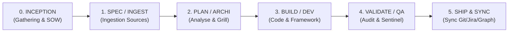

# 🧭 Guide d'Utilisation du Pipeline Python CLI — Memory Loop (mLoop)

**Statut** : SSOT Normatif & Guide de Référence  
**Standard** : mLoop Core CLI Pipeline & Agent Plugins 1.0  
**Date d'effet** : 21 août 2026  

---

## 1. 🌟 Vue d'Ensemble & Philosophie

Le backend d'état **Memory Loop (mLoop)** est piloté par un moteur CLI unifié (`python src/swarm.py`). Il orchestre l'ensemble du cycle de vie des projets, depuis l'ingestion documentaire brute jusqu'à la synchronisation Jira/Git et la livraison d'architectures prêtes pour les développeurs et agents IA (*Universal Dev Handoff*).

### La Séquence d'Amorçage Obligatoire (Boot Sequence - ADR-0323)
Au tout premier tour d'une session, l'orchestrateur exécute mécaniquement :
1. `python src/swarm.py resume --project <nom_projet>` : Restauration d'état et historique anti-amnésie.
2. `python src/swarm.py vibe-check --project <nom_projet>` : Guardrail pré-vol de sécurité (9 contrôles).
3. `python src/swarm.py focus --project <nom_projet> --story <story_id>` : Verrou d'attention sur le récit cible.

---

## 2. 🗺️ Matrice des Commandes par Phase du Cycle de Vie



---

### 🟡 Phase 0 : INCEPTION (Gathering, Cadrage & SOW)

| Commande CLI | Rôle / Description | Paramètres Clés | Sorties / Artefacts |
| :--- | :--- | :--- | :--- |
| `python src/swarm.py to-sow` | Générer l'Énoncé des Travaux (SOW) à partir du backlog | `--project <P>` | `docs/01-architecture/SOW_<PROJET>.md` |
| `python src/swarm.py ingest` | Ingérer les briefs et documents initiaux | `--project <P>` | `docs/00-ingested/` |
| `python src/swarm.py research` | Recherche et analyse documentaire préliminaire | `--project <P>`, `--url <U>` | Cache de recherche sémantique |

---

### 🟠 Phase 1 : SPEC / INGEST (Ingestion & Analyse Documentaire)

| Commande CLI | Rôle / Description | Paramètres Clés | Sorties / Artefacts |
| :--- | :--- | :--- | :--- |
| `python src/swarm.py crawl` | Web Crawler automatique avec détection Markdown Twin | `--project <P>`, `--url <U>` | `memory/crawler/cache/` |
| `python src/swarm.py markitdown_convert` | Conversion multi-formats (PDF, Word, Excel, PPT) vers Markdown | `--project <P>`, `--file <F>` | `docs/00-ingested/` normalisé |
| `python src/swarm.py extract` | Extraction déclarative YAML vers Knowledge Abstracts (ADR-0342) | `--project <P>`, `--template <T>`, `--source <F>`, `--format <M/J>` | `docs/02-business-rules/`, `docs/03-models/`, etc. |
| `python src/swarm.py agentic-extract` | Extraction sémantique de règles métier (RM-XXX) | `--project <P>` | `docs/02-business-rules/` |
| `python src/swarm.py code-init` | Initialisation de l'indexation AST CodeGraph | `--project <P>` | Base SQLite CodeGraph `.codegraph/` |

---

### 🔵 Phase 2 : PLAN / ARCHI (Planification, Grill & Découpage)

| Commande CLI | Rôle / Description | Paramètres Clés | Sorties / Artefacts |
| :--- | :--- | :--- | :--- |
| `python src/swarm.py focus` | Verrouiller l'attention sur une User Story | `--project <P>`, `--story <ID>` | Chargement de `backlog/stories/<ID>.md` |
| `python src/swarm.py grill` | Entrevue interactive ciblée Grill-with-Docs & Search-Before-Ask | `--project <P>` | Enregistrement synchrone d'ADRs & preuves console |
| `python src/swarm.py to-spec` | Distiller une discussion ou analyse en spec technique | `--project <P>` | `docs/01-architecture/` |
| `python src/swarm.py to-tickets` | Découper une spec en récits verticaux avec Fact-Search | `--project <P>` | `backlog/stories/` + `sprint_backlog.md` |
| `python src/swarm.py wayfinder` | Meta-Orchestration (carte de décisions dans le brouillard) | `--project <P>` | Plan de route contextuel |
| `python src/swarm.py chunk` | Découpage sémantique d'un document massif (ADR-0323) | `--project <P>`, `--file <F>` | Fragments normalisés |
| `python src/swarm.py parent-resolve` | Résolution des relations parent-enfant Epics/Stories | `--project <P>` | Hiérarchie de backlog |
| `python src/swarm.py archify` | Génération et validation de diagrammes d'architecture interactifs vectoriels (Archify) | `--file <F>`, `--output <O>`, `--type <T>`, `--quality <Q>` | Artefact HTML interactif standalone sous `docs/05-assets/` |

---

### 🟢 Phase 3 : BUILD / DEV (Développement & Workers Multi-Agents)

| Commande CLI | Rôle / Description | Paramètres Clés | Sorties / Artefacts |
| :--- | :--- | :--- | :--- |
| `python src/swarm.py self-dev` | Auto-évolution du framework mLoop (TDD Red-Green-Refactor) | `--project mLoop` | Code source sous `src/` |
| `python src/swarm.py confidence` | Évaluation du seuil de confiance (Confidence Gate) | `--file <F>` | Score de confiance pré-édition |
| `python src/swarm.py worker-spawn` | Instanciation d'un sous-agent isolé (Pattern Fork & Harvest) | `--project <P>`, `--task-type <T>` | Sous-session Herdr multiplexée |
| `python src/swarm.py worker-status` | Consultation de l'état des workers actifs | `--project <P>` | Statut d'exécution |
| `python src/swarm.py worker-close` | Clôture propre des workers terminés | `--project <P>` | Libération des terminaux PTY |
| `python src/swarm.py code-explore` | Exploration AST et Call Tree via CodeGraph | `--project <P>`, `--symbol <S>` | Graphe d'appels déterministe |
| `python src/swarm.py code-impact` | Rayon d'impact (Blast Radius) d'un symbole de code | `--project <P>`, `--symbol <S>` | Analyse d'impact transitive |
| `python src/swarm.py code-affected` | Identification des tests affectés par les changements | `--project <P>` | Liste ciblée de tests à rejouer |

---

### 🟣 Phase 4 : VALIDATE / QA (Validation Sémantique & Guardrails)

| Commande CLI | Rôle / Description | Paramètres Clés | Sorties / Artefacts |
| :--- | :--- | :--- | :--- |
| `python src/swarm.py wikifix` | Audit SSOT, linter déterministe Fact-Search et conformité INVEST | `--project <P>` | `memory/wikifix_report.md` |
| `python src/swarm.py struct-check` | **Gatekeeper structurel Read-Only pré-Sentinel** : hiérarchie H2/H3/H4, format listes `-`, Gold Standard diff (ADR-0338) | `--project <P>` `--file <story.md>` `--strict` `--verbose` | Rapport violations C1–C7 (BLOCKING / WARNING) |
| `python src/swarm.py rubber-duck` | Revue sémantique de contenu approfondie Sentinel (4 axes métier) | `--project <P>` | Rapport qualitatif de fond (Gherkin, Cas limites) |
| `python src/swarm.py audit-loop` | Validation déterministe des 3 couches de guardrails | `--project <P>` | Bilan de conformité de boucle |
| `python src/swarm.py aoep` | Évaluation de la gouvernance d'état persistant AOEP-v0 | `--project <P>` | Score AOEP |
| `python src/swarm.py eval` | Exécution de la suite d'évaluations agentiques | `--project <P>` | Métriques de fidélité |
| `python src/swarm.py eval-harvest` | Moisson des résultats d'évaluations multi-agents | `--project <P>` | Rapport consolidé |
| `python src/swarm.py worker-harvest` | Moisson synchrone des livrables de sous-agents | `--project <P>` | Intégration sur disque |
| `python src/swarm.py memory-hygiene` | Nettoyage des sessions expirées et compaction | `--project <P>` | Santé de session assainie |

---

### 🔴 Phase 5 : SHIP & SYNC (Synchronisation & Distribution)

| Commande CLI | Rôle / Description | Paramètres Clés | Sorties / Artefacts |
| :--- | :--- | :--- | :--- |
| `python src/swarm.py sync` | Synchronisation globale (WikiFix + Graphify + SQLite) | `--project <P>` | Index FTS5 et Graphe à jour |
| `python src/swarm.py jira_sync` | Synchronisation bidirectionnelle avec Jira Cloud | `--project <P>` | Tickets et statuts Jira à jour |
| `python src/swarm.py cycle-status` | Bilan de santé et statut d'avancement des 5 phases | `--project <P>` | Tableau de bord de phase |
| `python src/swarm.py calibrate` | Auto-étalonnage continu de l'écosystème mLoop (8 axes) | `--project mLoop` | Matrice de conformité |
| `python src/swarm.py plugin-validate` | Validation de conformité Agent Plugins 1.0 | `--project mLoop` | Rapport JSON AP 1.0 |
| `python src/swarm.py plugin-export` | Empaquetage portable du plugin mLoop | `--project mLoop`, `--output <D>` | Package Agent Plugin redistribuable |
| `python src/swarm.py install-hooks` | Installation des hooks Git de protection pré-commit | `--project <P>` | Hooks Git actifs |

---

### ⚙️ Commandes Transverses & Utilitaires

| Commande CLI | Rôle / Description | Paramètres Clés |
| :--- | :--- | :--- |
| `python src/swarm.py guide` | Afficher le guide d'utilisation du pipeline en console | `[--phase <P>]` (optionnel) |
| `python src/swarm.py dashboard` | Lancer le serveur d'interface web mLoop Dashboard | `--project <P>` |
| `python src/swarm.py drawdb` | Serveur de modélisation visuelle des données DrawDB | `--action serve` |
| `python src/swarm.py memo-search` | Sélection de la stratégie mémoire optimale ALMA | `--project <P>`, `--query <Q>` |
| `python src/swarm.py blast` | Calcul du rayon d'impact d'un fichier ou composant | `--project <P>`, `--file <F>` |
| `python src/swarm.py dream` | Routine de consolidation et hygiène de mémoire Overnight | `--project <P>` |
| `python src/swarm.py unlearn` | Désapprentissage sémantique et propagation de suppression | `--project <P>`, `--concept <C>` |
| `python src/swarm.py svg-optimize` | Optimisation et minification des fichiers vectoriels SVG | `--project <P>` |
| `python src/swarm.py hook` | Exécuter ou tester un hook de cycle de vie ou pré-compaction (ADR-0364) | `--event <pre_compact/resume/...>`, `[--project <P>]`, `[--format <text/json>]` |

---

## 3. ⌨️ Utilisation dans l'IDE OpenCode

Dans l'environnement interactif OpenCode, vous pouvez utiliser :

1. **Le Dispatcher Universel** :
   ```bash
   /loop <action> [arguments]
   # Exemples :
   /loop resume --project Metro_OneTrust
   /loop grill --project Metro_OneTrust
   /loop guide --phase plan
   ```

2. **Les Raccourcis Métier Essentiels** :
   - `/loop-guide` : Consulter le guide d'outillage directement.
   - `/loop-resume` : Restauration de session anti-amnésie.
   - `/loop-vibe-check` : Contrôle pré-vol de sécurité.
   - `/loop-focus` : Verrouillage sur une story.
   - `/loop-sync` : Synchronisation globale WikiFix + Graphify.
   - `/loop-grill` : Session Grill-with-Docs.
   - `/loop-to-spec` : Distillation en spécification.
   - `/loop-to-tickets` : Découpage en tickets verticaux.
   - `/loop-rubber-duck` : Audit Sentinel en lecture seule.
   - `/loop-cycle` : Diagnostic des 5 phases.
   - `/loop-calibrate` : Auto-étalonnage mLoop.
   - `/loop-crawl` : Web Crawler.
   - `/loop-dashboard` : Interface Web.
