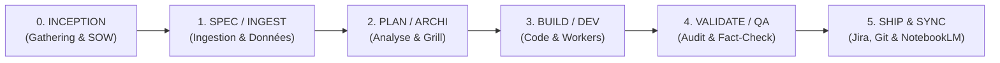

# 🧭 Guide Exhaustif du Pipeline Python CLI — Memory Loop (mLoop)

**Statut** : SSOT Normatif & Guide de Référence Déterministe (ADR-0370)  
**Standard** : mLoop Core CLI Pipeline, Agent Plugins 1.0 & Python Senior Standards (ADR-0369)  
**Commandes Actives** : 105 Commandes Enregistrées dans `src/commands/_registry.py`  
**Date de Synchronisation** : 15 septembre 2026  

---

## 1. 🌟 Vue d'Ensemble & Philosophie

Le backend d'état **Memory Loop (mLoop)** est piloté par un moteur CLI unifié (`python src/swarm.py`). Il orchestre l'ensemble du cycle de vie des projets, depuis l'ingestion documentaire brute jusqu'à la synchronisation Jira/Git, la modélisation de données, et la livraison d'architectures prêtes pour les développeurs et agents IA (*Universal Dev Handoff*).

### La Séquence d'Amorçage Obligatoire (Boot Sequence - ADR-0322)
Au tout premier tour d'une session, l'orchestrateur exécute mécaniquement et sans exploration préalable :
1. `python src/swarm.py resume --project <nom_projet>` : Restauration d'état et historique anti-amnésie.
2. `python src/swarm.py vibe-check --project <nom_projet>` : Guardrail pré-vol de sécurité (17 contrôles stricts).
3. `python src/swarm.py focus --project <nom_projet> --story <story_id>` : Verrou d'attention sur le récit cible.

---

## 2. 🗺️ Matrice Complète des 105 Commandes par Phase



---

### 🟡 Phase 0 : INCEPTION (Gathering, Cadrage & SOW)

> Cadrage amont, ingestion initiale des briefs clients et génération de l'Énoncé des Travaux (SOW).

| Commande CLI | Rôle / Description | Paramètres | Sorties / Artefacts Clés |
| :--- | :--- | :--- | :--- |
| `python src/swarm.py ingest` | Ingestion documentaire vers Markdown normalisé | [--initiative <STR>] | `docs/00-ingested/` normalisé |
| `python src/swarm.py init` | Initialiser un nouveau projet (Loi des 3 Piliers) | *(Aucun)* | Console / Mémoire d'état |
| `python src/swarm.py research` | Session de recherche automatisée | [--query <STR>] [--url <STR>] | Console / Mémoire d'état |
| `python src/swarm.py to-sow` | Générer un Énoncé des Travaux (SOW) et Évaluation Budgétaire (T-Shirt Size) | [--title <STR>] [--size <STR>] | `docs/01-architecture/SOW_<PROJET>.md` |

---

### 🟠 Phase 1 : SPEC / INGEST (Ingestion, Exploration & Données)

> Ingestion multimodale, Web Crawling, parsing de code source AST, conversion MarkItDown et normalisation tabulaire CSV.

| Commande CLI | Rôle / Description | Paramètres | Sorties / Artefacts Clés |
| :--- | :--- | :--- | :--- |
| `python src/swarm.py agentic-extract` | Extraction documentaire agentique multi-passes (ADR-0323) | --file <STR> | `docs/02-business-rules/RM-*.md` |
| `python src/swarm.py chunk` | Découpage sémantique d'un fichier Markdown (ADR-0323) | --file <STR> | Console / Mémoire d'état |
| `python src/swarm.py code-init` | Initialiser l'index CodeGraph sur le code source | [--path <STR>] | Base SQLite `.codegraph/` |
| `python src/swarm.py code-status` | Afficher les statistiques de l'index CodeGraph | [--path <STR>] | Console / Mémoire d'état |
| `python src/swarm.py crawl` | Crawl intelligent d'une URL ou du backlog (LLMs.txt fast-path, cache TTL, regex filters) | [--url <STR>] [--max-age <INT>] [--max-depth <INT>] [--include <STR>] [--exclude <STR>] [--allow-subdomains <STR>] [--no-llms-txt <STR>] [--ignore-query <STR>] [--json-schema <STR>] [--all-sources <STR>] [--render-js <STR>] [--no-github-tree <STR>] | `memory/crawler/cache/` (Markdown Twin) |
| `python src/swarm.py csv-normalize` | Normaliser l'encodage (BOM/CP1252) et les séparateurs d'un CSV vers UTF-8 propre | --file <STR> [--out <STR>] | Console / Mémoire d'état |
| `python src/swarm.py csv-validate` | Valider un fichier CSV en flux continu selon un schéma JSON déclaratif | --file <STR> --schema <STR> | Console / Mémoire d'état |
| `python src/swarm.py deep-search` | Session de Deep Search autonome (Fact-Search local FTS5, recherche web et aspiration ciblée) | --query <STR> [--max-sources <INT>] [--depth <INT>] [--render-js <STR>] [--include-superseded <STR>] | Console / Mémoire d'état |
| `python src/swarm.py extract` | Extraction déclarative YAML vers Knowledge Abstracts structurés (ADR-0342) | [--template <STR>] [--source <STR>] [--target <STR>] [--format <STR>] [--list <STR>] | `docs/02-business-rules/`, `docs/03-models/` |
| `python src/swarm.py jira-read` | Lecture Read-Only d'un ticket Jira Cloud (API v3) : restitue la description ADF convertie en Markdown lisible (diff Jira <-> récit local). Aucune écriture. | [--issue <STR>] [--out <STR>] | Console / Mémoire d'état |
| `python src/swarm.py parent-resolve` | Résoudre le bloc parent contextuel d'un extrait ou d'une règle (ADR-0328) | [--file <STR>] [--query <STR>] | Console / Mémoire d'état |

---

### 🔵 Phase 2 : PLAN / ARCHI (Planification, Architecture, Grill & Découpage)

> Entrevues interactives Grill-with-Docs, découpage vertical INVEST, modélisation de données (DrawDB/Mermaid), hypergraphe et toiles Obsidian Canvas.

| Commande CLI | Rôle / Description | Paramètres | Sorties / Artefacts Clés |
| :--- | :--- | :--- | :--- |
| `python src/swarm.py archify` | Générer et valider des diagrammes d'architecture interactifs vectoriels (Archify) | [--file <STR>] [--output <STR>] [--type <STR>] [--quality <STR>] [--validate-only <STR>] [--open <STR>] [--doctor <STR>] | Artefact HTML vectoriel interactif |
| `python src/swarm.py canvas` | Générer et synchroniser les toiles interactives 2D Obsidian Canvas (.canvas) (ADR-0337) | *(Aucun)* | `docs/05-assets/*.canvas` |
| `python src/swarm.py deepen` | Rapport HTML de profondeur d'architecture | *(Aucun)* | Console / Mémoire d'état |
| `python src/swarm.py distill-invest` | Générer un jeu de données de distillation pour l'audit INVEST et Gherkin (ADR-0328) | *(Aucun)* | Console / Mémoire d'état |
| `python src/swarm.py dossier-init` | Initialise le Dossier de Preuves Documentaires (_fact_dossier.md) pour un récit | --story <STR> [--force <STR>] | `memory/evidence/<STORY_ID>_fact_dossier.md` |
| `python src/swarm.py drawdb` | Lancer le hub souverain local de visualisation de schéma de base de données (ERD & Tables) | [--port <INT>] [--no-open <STR>] | Interface DrawDB locale |
| `python src/swarm.py drill` | Drill d'analyse approfondie | *(Aucun)* | Console / Mémoire d'état |
| `python src/swarm.py export-obsidian` | Exporter l'hypergraphe sous forme de coffre Obsidian avec wikilinks (ADR-0337 / ADR-0343) | [--out <STR>] | Coffre Obsidian structuré |
| `python src/swarm.py focus` | Verrouiller l'attention sur un récit spécifique | --story <STR> | Chargement de `backlog/stories/<ID>.md` |
| `python src/swarm.py goal-cascade` | Alignement stratégique et Goal-Cascading (Wayfinder -> Epics -> Stories) | *(Aucun)* | Console / Mémoire d'état |
| `python src/swarm.py graph-explain` | Restituer la fiche conceptuelle et le voisinage 1-hop d'un nœud du graphe | --concept <STR> [--global <STR>] | Console / Mémoire d'état |
| `python src/swarm.py graph-impact` | Calculer le rayon d'impact conceptuel et architectural (Blast Radius) | --target <STR> [--global <STR>] | Console / Mémoire d'état |
| `python src/swarm.py graph-query` | Interroger le graphe de connaissances sur un concept, ADR ou règle (Agentic Retrieval) | --query <STR> [--limit <INT>] [--global <STR>] | Console / Mémoire d'état |
| `python src/swarm.py graph-status` | Afficher les statistiques et la fraîcheur du graphe de connaissances | [--global <STR>] | Console / Mémoire d'état |
| `python src/swarm.py grill` | Session interactive Grill-with-Docs et génération d'ADR | [--title <STR>] [--decision <STR>] [--context <STR>] [--positives <STR>] [--negatives <STR>] [--story <STR>] | ADRs dans `standards/adr-system/` & preuves |
| `python src/swarm.py hyper-query` | Interroger l'hypergraphe pour une User Story ou inspecter les statistiques (ADR-0343) | [--story <STR>] | Console / Mémoire d'état |
| `python src/swarm.py story-clean` | Nettoyer les sections de mémoire temporaires (Suite Mémoire, Notes de Traçabilité) des stories (ADR-0301) | [--verbose <STR>] | Console / Mémoire d'état |
| `python src/swarm.py to-spec` | Générer une spécification technique | [--title <STR>] | `docs/01-architecture/` |
| `python src/swarm.py to-tickets` | Découpage en tickets verticaux depuis l'architecture | *(Aucun)* | `backlog/stories/` + `sprint_backlog.md` |
| `python src/swarm.py update-story` | Mettre à jour une section H2 spécifique d'une story de façon AST-déterministe | --story <STR> --section <STR> --content <STR> | Console / Mémoire d'état |
| `python src/swarm.py wayfinder` | Initialiser ou mettre à jour la carte Wayfinder | [--title <STR>] | Console / Mémoire d'état |

---

### 🟢 Phase 3 : BUILD / DEV (Développement & Workers Multi-Agents)

> Orchestration multi-agents isolée (Herdr Fork & Harvest), revue de code visuelle Plannotator, exploration d'impact AST et auto-évolution.

| Commande CLI | Rôle / Description | Paramètres | Sorties / Artefacts Clés |
| :--- | :--- | :--- | :--- |
| `python src/swarm.py annotate` | Annotation visuelle de récits, ADRs, documents ou URLs avec porte de décision | [--story <STR>] [--adr <STR>] [--file <STR>] [--url <STR>] [--no-gate <STR>] [--require-approval <STR>] [--json <STR>] [--result-file <STR>] [--tailscale <STR>] | Console / Mémoire d'état |
| `python src/swarm.py code-affected` | Identifier les tests affectés par les changements de code | [--files <STR>] [--path <STR>] | Console / Mémoire d'état |
| `python src/swarm.py code-explore` | Explorer le code source via CodeGraph (AST & Call Paths) | --query <STR> [--path <STR>] [--compact <STR>] | Console / Mémoire d'état |
| `python src/swarm.py code-impact` | Calculer le rayon d'impact (Blast Radius) d'un symbole | --symbol <STR> [--path <STR>] | Console / Mémoire d'état |
| `python src/swarm.py confidence` | Évaluer le score de confiance d'un fichier | --file <STR> | Console / Mémoire d'état |
| `python src/swarm.py csv-anonymize` | Anonymiser déterministement les colonnes PII sensibles et échantillonner | --file <STR> --fields <STR> [--out <STR>] [--sample <INT>] | Console / Mémoire d'état |
| `python src/swarm.py csv-diff` | Comparer deux instantanés de CSV et identifier les deltas sur clé primaire | --old <STR> --new <STR> --key <STR> | Console / Mémoire d'état |
| `python src/swarm.py review` | Revue de code visuelle interactive via Plannotator (diff Git local ou PR) | [--pr <STR>] [--tailscale <STR>] [--no-local <STR>] | Console / Mémoire d'état |
| `python src/swarm.py self-dev` | Auto-développement du framework mLoop | *(Aucun)* | Code source sous `src/` |
| `python src/swarm.py worker-close` | Fermer le volet d'un worker Herdr et libérer ses ressources | --story <STR> | Console / Mémoire d'état |
| `python src/swarm.py worker-handoff-test` | Tester la complétude et clarté d'une story par un dev naïf (Zero-Ask Simulator) | --story <STR> [--dry-run <STR>] | Console / Mémoire d'état |
| `python src/swarm.py worker-harvest` | Moissonner les preuves d'exécution PTY du worker et mettre à jour l'EvidencePack | --story <STR> [--lines <INT>] | Livrables intégrés sur disque |
| `python src/swarm.py worker-janitor-watch` | Auditer silencieusement l'intégrité de la mémoire et des liens | [--dry-run <STR>] | Console / Mémoire d'état |
| `python src/swarm.py worker-legacy-mine` | Extraire les règles métier et calculs d'une base de code legacy | --source <STR> [--domain <STR>] [--dry-run <STR>] | Console / Mémoire d'état |
| `python src/swarm.py worker-reap` | Purger les volets et agents orphelins ou inactifs (ADR-0355 Stall Detection) | [--timeout <INT>] [--force <STR>] | Console / Mémoire d'état |
| `python src/swarm.py worker-shadow-estimate` | Générer un contre-chiffrage contradictoire pessimiste basé sur les risques | [--epic <STR>] [--desc <STR>] [--dry-run <STR>] | Console / Mémoire d'état |
| `python src/swarm.py worker-spawn` | Instancier un sous-agent Herdr isolé pour un récit spécifique (Clean Slate) | --story <STR> [--kind <STR>] [--model <STR>] [--task-type <STR>] | Terminal PTY Herdr multiplexé |
| `python src/swarm.py worker-status` | Afficher le statut et la santé des workers Herdr actifs | *(Aucun)* | Console / Mémoire d'état |
| `python src/swarm.py worker-visual-dissect` | Dissecter une maquette et extraire la matrice des 8 états UI | --asset <STR> [--dry-run <STR>] | Console / Mémoire d'état |

---

### 🟣 Phase 4 : VALIDATE / QA (Validation Sémantique, Fact-Check & Guardrails)

> Audit de non-régression INVEST (WikiFix), Gatekeeper structurel (struct-check), audit contradictoire Sentinel (rubber-duck), Fact-Check NLI et Runnable Gates.

| Commande CLI | Rôle / Description | Paramètres | Sorties / Artefacts Clés |
| :--- | :--- | :--- | :--- |
| `python src/swarm.py aoep` | Évaluation AOEP (Agent Operational Excellence Protocol) | *(Aucun)* | Console / Mémoire d'état |
| `python src/swarm.py audit-loop` | Audit de boucle complet | *(Aucun)* | Console / Mémoire d'état |
| `python src/swarm.py check-leakage` | Vérifier l'absence de fuites de spécification et assertions tautologiques (ADR-0354) | [--file <STR>] | Console / Mémoire d'état |
| `python src/swarm.py diagnose` | Harnais de reproduction déterministe | [--symptom <STR>] | Console / Mémoire d'état |
| `python src/swarm.py eval` | Évaluation automatisée du projet | *(Aucun)* | Console / Mémoire d'état |
| `python src/swarm.py eval-harvest` | Moissonner les anomalies d'audit en cas d'évaluation Evals (ADR-0326) | *(Aucun)* | Console / Mémoire d'état |
| `python src/swarm.py fact-check` | Exécuter l'audit Fact-Check NLI sur une User Story et émettre son certificat | [--story <STR>] [--strict <STR>] | Certificat de véracité NLI |
| `python src/swarm.py fact-search` | Recherche factuelle haute précision dans l'index FTS5 SSOT documentaire | --query <STR> [--limit <INT>] [--layer <STR>] [--no-synonyms <STR>] [--include-superseded <STR>] | Console / Mémoire d'état |
| `python src/swarm.py gates` | Exécuter, vérifier ou auditer les portails d'acceptation (Runnable Gates - ADR-0341) | [--file <STR>] [--scope <STR>] [--status <STR>] [--reverify <STR>] [--lint <STR>] | Console / Mémoire d'état |
| `python src/swarm.py guardian-status` | Afficher l'état du Guardian Auto-Reviewer et du Circuit Breaker | *(Aucun)* | Console / Mémoire d'état |
| `python src/swarm.py hill-climb` | Test Hill-Climbing (mutation-évaluation) | *(Aucun)* | Console / Mémoire d'état |
| `python src/swarm.py rubber-duck` | Agent Sentinel — revue contradictoire de fond (Avocat du Diable avec discernement & rigueur) | [--file <STR>] [--suggest-patch <STR>] | Rapport sémantique 4 Piliers |
| `python src/swarm.py struct-check` | Gatekeeper structurel Read-Only : hiérarchie titres, format listes, cohérence du gabarit blueprint (pré-Sentinel) | [--file <STR>] [--strict <STR>] [--verbose <STR>] | Rapport violations C1–C7 |
| `python src/swarm.py tree` | Afficher l'arbre d'exécution Depth Tree et l'état des gates (ADR-0341) | [--file <STR>] [--scope <STR>] | Console / Mémoire d'état |
| `python src/swarm.py wikifix` | Alias de sync (audit de cohérence WikiFix) | [--verbose <STR>] [--incremental <STR>] [--fast <STR>] [--story <STR>] | `memory/wikifix_report.md` |

---

### 🔴 Phase 5 : SHIP & SYNC (Synchronisation, Jira Cloud & Distribution)

> Synchronisation bidirectionnelle Jira Cloud, synchronisation sémantique locale, export Oracle Google NotebookLM, et packaging Agent Plugins 1.0.

| Commande CLI | Rôle / Description | Paramètres | Sorties / Artefacts Clés |
| :--- | :--- | :--- | :--- |
| `python src/swarm.py calibrate` | Auto-étalonnage de l'écosystème mLoop | *(Aucun)* | Console / Mémoire d'état |
| `python src/swarm.py cycle-status` | Afficher le statut du cycle courant | *(Aucun)* | Console / Mémoire d'état |
| `python src/swarm.py guide-export` | Exporter un guide de revue autonome HTML portable via Plannotator | [--snapshot <STR>] [--id <STR>] [--out <STR>] | Guide HTML autonome Plannotator |
| `python src/swarm.py install-hooks` | Installer les hooks Git de protection (pre-commit vibe-check) | *(Aucun)* | Console / Mémoire d'état |
| `python src/swarm.py jira_sync` | Synchronisation ciblée Jira Cloud (Fail-Closed). Requiert --story ou --stories pour cibler des tickets. Le mode dry-run est actif par défaut ; utiliser --apply + --confirm-scope pour écrire. | [--story <STR>] [--stories <STR>] [--apply <STR>] [--confirm-scope <STR>] [--all <STR>] [--confirm-all-project-stories <STR>] [--allow-in-analyze <STR>] [--dry-run <STR>] | Tickets et champs Jira Cloud à jour |
| `python src/swarm.py notebooklm` | Gestion, export SSOT et connexion au carnet Google NotebookLM officiel | [--bundle <STR>] [--status <STR>] [--auth <STR>] | Export SSOT vers carnet officiel |
| `python src/swarm.py plugin-export` | Exporter un package Agent Plugin 1.0 portable | [--output <STR>] | Package AP 1.0 redistribuable |
| `python src/swarm.py plugin-validate` | Valider la conformité Agent Plugin 1.0 | [--plugin-root <STR>] [--strict <STR>] | Console / Mémoire d'état |
| `python src/swarm.py sync` | WikiFix + Synchronisation d'état et modélisation Hypergraphe | [--verbose <STR>] [--incremental <STR>] [--fast <STR>] [--story <STR>] | Index FTS5 + Graphe sémantique |
| `python src/swarm.py sync-antigravity` | Synchroniser les tokens et interactions de l'IDE Antigravity vers le Token Ledger | [--conversation-id <STR>] [--all <STR>] | Console / Mémoire d'état |

---

### ⚙️ Commandes Transverses (Observabilité, Mémoire, Tokens, Skills & Runtime)

> Surveillance de la fenêtre de contexte, audit des coûts TokenLedger, diagnostic des compétences (Skill Doctor), cache sémantique et serveurs d'API.

| Commande CLI | Rôle / Description | Paramètres | Sorties / Artefacts Clés |
| :--- | :--- | :--- | :--- |
| `python src/swarm.py app-server` | Démarrer le démon d'interfaçage JSON-RPC 2.0 mLoop App-Server | *(Aucun)* | Console / Mémoire d'état |
| `python src/swarm.py blast` | Calcul du rayon d'impact (Blast Radius) d'un fichier ou composant | [--file <STR>] [--target <STR>] | Console / Mémoire d'état |
| `python src/swarm.py cache-clear` | Effacer le cache sémantique déterministe LLM | [--model <STR>] | Console / Mémoire d'état |
| `python src/swarm.py cache-stats` | Afficher les statistiques du cache sémantique déterministe LLM | *(Aucun)* | Console / Mémoire d'état |
| `python src/swarm.py context-watch` | Surveiller l'occupation de la fenêtre de contexte et alerter la Dumb-Zone (ADR-0326) | *(Aucun)* | Console / Mémoire d'état |
| `python src/swarm.py dashboard` | Tableau de bord d'observabilité et supervision souverain mLoop (FastAPI / Zero-Docker) | [--port <INT>] [--no-browser <STR>] | Console / Mémoire d'état |
| `python src/swarm.py doctor` | Bilan de santé global et diagnostic d'hygiène des compétences mLoop | [--skills <STR>] [--threshold <INT>] [--json <STR>] [--no-tombstone <STR>] | Console / Mémoire d'état |
| `python src/swarm.py dream` | Consolidation nocturne et compression mémorielle (Sleep-Wake) | *(Aucun)* | Console / Mémoire d'état |
| `python src/swarm.py graph-run` | Exécution Graph Engineering (DAG Multi-Agents) | [--title <STR>] | Console / Mémoire d'état |
| `python src/swarm.py guide` | Afficher le guide d'utilisation du pipeline CLI mLoop par phase ou synchroniser le SSOT | [--phase <STR>] [--sync <STR>] | Console / Mémoire d'état |
| `python src/swarm.py hook` | Déclencher ou tester un hook de cycle de vie ou de pré-compaction (ADR-0364) | [--event <STR>] [--format <STR>] [--story <STR>] | Console / Mémoire d'état |
| `python src/swarm.py memo-search` | Sélectionner la stratégie mémoire ALMA optimale | [--query <STR>] | Console / Mémoire d'état |
| `python src/swarm.py memory-hygiene` | Balayage de confiance de la mémoire vive | *(Aucun)* | Console / Mémoire d'état |
| `python src/swarm.py optimize` | Optimisation RHO | --keyword <STR> --msg <STR> [--scope <STR>] | Console / Mémoire d'état |
| `python src/swarm.py resume` | Restaurer la session anti-amnésie | *(Aucun)* | Console / Mémoire d'état |
| `python src/swarm.py role-list` | Lister les manifestes de rôles agentiques déclaratifs disponibles | *(Aucun)* | Console / Mémoire d'état |
| `python src/swarm.py skill-doctor` | Auditer l'hygiène et le coût en jetons des compétences .agents/skills/ (ADR-0348 / Claude Code v2.1.261) | [--threshold <INT>] [--json <STR>] [--no-tombstone <STR>] | Console / Mémoire d'état |
| `python src/swarm.py skill-invoke` | Invoquer une compétence via son URI skill:// (SEP-2640) | --uri <STR> | Console / Mémoire d'état |
| `python src/swarm.py skill-list` | Lister les compétences enregistrées dans le registre skill:// (SEP-2640) | *(Aucun)* | Console / Mémoire d'état |
| `python src/swarm.py supersession-sync` | Synchroniser le registre de supersession des règles et décisions (ADR-0326) | *(Aucun)* | Console / Mémoire d'état |
| `python src/swarm.py svg-optimize` | Optimisation et minification des fichiers SVG | [--input <STR>] | Console / Mémoire d'état |
| `python src/swarm.py teach` | Auto-apprentissage et mise à jour de la mémoire | *(Aucun)* | Console / Mémoire d'état |
| `python src/swarm.py token-tracker` | Auditer la consommation de tokens et de coûts par interaction, projet et clé LiteLLM (ADR-0329) | [--today <STR>] [--date <STR>] [--top <INT>] | Console / Mémoire d'état |
| `python src/swarm.py unlearn` | Désapprentissage d'un concept | --concept <STR> | Console / Mémoire d'état |
| `python src/swarm.py vibe-check` | Guardrail pré-vol de la session (gouvernance de phase ADR-0339) | [--stage <STR>] [--phase <STR>] | Console / Mémoire d'état |

---

## 3. ⌨️ Utilisation dans l'IDE OpenCode

Dans l'environnement interactif OpenCode, l'ensemble des commandes sont invoquables via :

1. **Le Dispatcher Universel** :
   ```bash
   /loop <action> [arguments]
   # Exemples :
   /loop resume --project BoireFrere_Segment2
   /loop vibe-check --project BoireFrere_Segment2
   /loop grill --project BoireFrere_Segment2
   /loop guide --phase plan
   /loop guide --sync   # Régénération automatique du guide CLI SSOT
   ```

2. **Gouvernance Anti-Drift Déterministe (ADR-0370)** :
   Ce guide est le produit compilé de `src/commands/_registry.py`. Tout ajout de commande dans le code source Python est automatiquement répercuté lors de l'exécution de `python src/swarm.py guide --sync` ou par auto-healing lors du contrôle pré-vol `vibe-check`.
