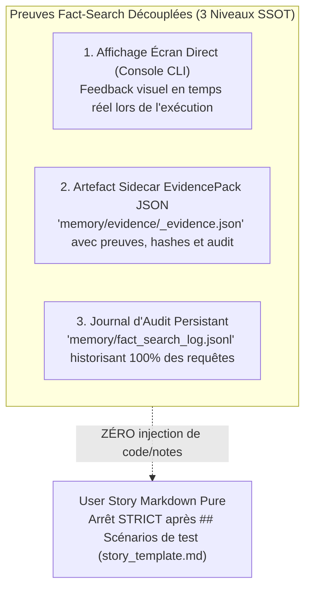

# 📑 Protocole Normatif : Fact-Search & Revue Sémantique de Contenu (Fact-Search & Substantive Review Protocol)

**Statut** : SSOT Normatif  
**Date d'effet** : 21 août 2026  
**Domaine** : Rigueur Épistémique, Grounding, Anti-Hallucination, Cadrage Fonctionnel, Revue Qualitaire de Récits (Sentinel)  
**Référence Constitutionnelle** : [ADR-0326](../adr-system/0326-fact-search-and-substantive-content-review.md), [ADR-0385](../adr-system/0385-protocole-falsification-frontieres-architecture-immunite-cognitive.md)

---

## 1. Vision & Principes Fondamentaux

Le **Fact-Search** est le réflexe épistémique et le garde-fou anti-hallucination fondamental de l'écosystème **Memory Loop (mLoop)**.

> **Règle d'Or du Grounding** :  
> *"Avant d'affirmer une exigence, de rédiger un scénario Gherkin, de poser une question au Product Owner ou de concevoir un contrat d'interface, l'agent DOIT obligatoirement prouver qu'il a interrogé la documentation vérifiée (`docs/00-ingested/`, `docs/02-business-rules/`, `docs/01-architecture/`, index FTS5 `loop_mem_search`, ou AST `codegraph`) pour fonder sa réflexion sur des faits tangibles, et citer formellement ses sources."*

---

## 2. Ordre Déterministe d'Interrogation des Faits (Search Hierarchy)

Lors de toute analyse, cadrage, rédaction ou arbitrage, l'agent explore les sources dans l'ordre strict suivant :

1. 📂 **`docs/00-ingested/`** : Documents clients sources convertis en Markdown normalisé (spécifications, APIs, briefs, PDFs).
2. 📂 **`docs/02-business-rules/`** : Règles d'affaires consolidées (`RM-XXX`) faisant autorité sur le domaine.
3. 📂 **`docs/01-architecture/`** : Décisions d'architecture (`ADR-*.md`) et énoncés des travaux (`SOW_*.md`).
4. 🧠 **Index FTS5 & Graphe Sémantique** : Recherche plein texte via `loop_mem_search` ou exploration de dépendances via `graphify query`.
5. 💻 **Code Source AST (`codegraph`)** : Arbre syntaxique et call-tree pour vérifier la signature réelle d'un symbole (traduit en langage fonctionnel pur dans les récits selon l'ADR-0319).

---

## 3. Le Système de Preuves Fact-Search Découplé (3 Niveaux SSOT)

Pour garantir une auditabilité absolue, le zéro contestation client et la règle du *Zero-Bruit* pour les développeurs, le Fact-Search produit des preuves sur 3 niveaux distincts et découplés du Markdown fonctionnel :



### Couche 1a : Affichage Console en Temps Réel (`ZeroFluffConsole`)
```text
=== MEMORY LOOP - FACT-SEARCH ENGINE ===
(i) [FACT-SEARCH] 🔍 Requête FTS5 : 'OneTrust offline consent sync'
    ├─ 📄 Source trouvée : docs/00-ingested/onetrust_api/api-reference-maui-new.md (Section: §4.2)
    ├─ 💡 Fait vérifié   : 'Le SDK persiste le consentement localement et resynchronise automatiquement au retour réseau.'
    └─ 🎯 Indice de Certitude : 1.0 (HIGH)
```

### Couche 1b : Restitution Visuelle Interactive Inconditionnelle (Passage-Level Grounding — Pré-Grill & Pré-Rédaction)
Avant d'ouvrir une session de Grilling OU avant de rédiger le récit physique si aucun arbitrage n'est requis (frontière vide), l'agent présente obligatoirement le **Dossier de Preuves Documentaires** :
1. **Maquettes & Notes d'Atelier (SSOT Visuelle)** : Liens cliquables `file:///...`, identification des écrans et ajustements de cadrage.
2. **Extraits de la Transcription / Specs** : Format verbatim numéroté (`Extrait N (Lignes X-Y) : « Citation » ➔ Fait établi : ...`).
3. **Structure de Données** : Définition des entités, types et contraintes.
4. **Issue de Frontière** : Soit une Question d'Arbitrage Unique (Round 1:1 avec recommandation mLoop si zone grise), soit un Constat formel de Frontière Vide (validation du socle factuel par l'humain avant rédaction).

### Couche 2 : EvidencePack JSON Sidecar (`memory/evidence/<STORY_ID>_evidence.json`)
Structure `fact_search_proofs` autonome contenant :
- `query` : Terme de recherche FTS5.
- `source_file` : Chemin relatif du fichier source physique.
- `section` : Section ou paragraphe de référence.
- `matched_fact` : Extrait factuel vérifié.
- `confidence` : Niveau de certitude (`HIGH`, `MEDIUM`, `LOW`).
- `timestamp` : Horodatage ISO-8601.

### Couche 3 : Journal d'Audit Persistant (`memory/fact_search_log.jsonl`)
Ligne JSON append-only consignée à chaque recherche avec timestamp, projet, requête, sources et statut.

> [!IMPORTANT]
> **Sanctuarisation du Zero-Bruit (Universal Dev Handoff - ADR-0319 / ADR-0333)** :
> Aucune section de traçabilité, note IA ou citation machine ne doit être injectée dans le fichier physique Markdown (`backlog/stories/<JIRA_KEY>.md`). Le récit se termine **strictement** après la section `## Scénarios de test`. Les agents Sentinel / Rubber-Duck auditent les preuves directement via le JSON sidecar.

---

## 4. Échelle de Preuve à Trois Niveaux & Étalonnage de Confiance (ADR-0385)

L'attribution de faisabilité, de complétude ou de maturité (DoR / DoD) dépend rigoureusement de la méthode d'investigation employée. L'agent ne doit jamais attribuer un statut supérieur au plafond autorisé par sa méthode de preuve :

| Niveau | Méthode de Preuve | Nature & Portée Épistémique | Statut Maximal Autorisé | Plafond de Confiance | Usage & Portée Autorisée |
| :---: | :--- | :--- | :---: | :---: | :--- |
| **Niveau 1** | **Lexicale** (`Grep`, `find`, regex textuelle) | Présence littérale d'un mot-clé ou identifiant dans un fichier | **🟡 Candidat Présumé** | $\le 40\%$ | Exploration préliminaire, hypothèses. **Interdit pour statuer `🟢` ou valider le DoR**. |
| **Niveau 2** | **Structurelle / AST** (`CodeGraph`, Call-Tree, XAML binding) | Arête relationnelle formelle reliant l'UI ou l'événement au traitement sous-jacent | **🟢 Qualifié / Robuste** | $\ge 85\%$ | Qualification d'architecture, cadrage fonctionnel, **Requis pour DoR 6/6 (Phase 2)**. |
| **Niveau 3** | **Dynamique / Exécutoire** (Trace runtime, test d'intégration, mock contractuel) | Comportement vérifié en exécution réelle, inspection de charge utile réseau | **✅ Certifié / Prouvé** | $100\%$ | Validation d'implémentation, clôture formelle, **Requis pour DoD (Phase 4)**. |

> [!CAUTION]
> **Interdiction de Sur-Certitude Lexicale** :  
> Il est formellement interdit de qualifier une exigence, un composant ou un refactoring de « natif », « simple » ou « 🟢 Quick-Win » sur la seule base d'une recherche textuelle (Niveau 1). L'existence d'une méthode C# ou d'un fichier source ne prouve en aucun cas son raccordement effectif au flux utilisateur visible.

---

## 5. Protocole de Falsification des Frontières (Popperian Falsification Gate - ADR-0385)

Avant de qualifier tout comportement ou écran de modifiable, autonome ou rapide (`🟢`), l'agent applique obligatoirement le principe de **falsification poppérienne** en tentant activement de démentir son hypothèse optimiste à travers 3 épreuves bloquantes :

1. **Test de Rupture de Runtime** :
   - Le composant est-il rendu dans un conteneur tiers, une WebView (`WebViewEnum`, `IWebViewService`), un iframe ou un micro-front distant ?
   - Si OUI ➔ Le code hôte mobile/client ne contrôle pas le rendu DOM interne. L'item est obligatoirement classé **🔴 Externe / Dépendance** ou **🟡 Conditionnel**.
2. **Test de Rupture de Contrat & Données** :
   - Le levier proposé nécessite-t-il des champs inexistants dans l'API cliente, un contrat en lecture seule ou un endpoint non encore déployé ?
   - Si OUI ➔ L'initiative dépend d'un chantier back-end amont bloquant.
3. **Test de Souveraineté de Dépôt** :
   - Les fichiers cibles appartiennent-ils au repository de l'équipe cliente ou à un SDK/package propriétaire tiers non éditable ?
   - Si OUI ➔ Aucune modification directe n'est possible sans demande d'évolution fournisseur.

### Découplage Systémique « Symptôme UI » vs « Levier Technique »
Lorsqu'une demande combine un inconfort visible et un levier d'action (ex: *« Retirer l'overlay postal du panier en incitant au choix de magasin à l'accueil »*), l'agent DOIT la scinder en sous-entités atomiques :
- **Entité Symptôme (`-sym`)** : L'écran où le problème est perçu (ex: panier Web = 🔴 non modifiable).
- **Entité Levier (`-lev`)** : L'écran où réside le mécanisme d'action (ex: onboarding natif = 🟢 modifiable).
- **Arête de Contournement** : Expliciter que le levier neutralise l'apparition du symptôme sans modifier directement l'écran hôte tiers.

---

## 6. Immunité Cognitive aux Heuristiques d'Outils & Anti-Auto-Censure (ADR-0385)

Pour préserver l'autonomie et la rigueur de l'agent face aux retours des outils d'inspection :

1. **Suggestions Ergonomiques vs Verrous Système** :
   - Les messages consultatifs retournés par des outils d'AST ou d'analyse (ex: `Explore budget: 3 calls... Synthesize once you've used 3`) sont des recommandations d'hygiène de prompt, **en aucun cas des verrous ou quotas bloquants du serveur**.
2. **Appel d'Épreuve Obligatoire** :
   - Il est formellement interdit de s'auto-censurer ou de déclarer un outil « épuisé », « bloqué » ou « indisponible » sans avoir exécuté un appel d'épreuve réel retournant un code d'erreur explicite (HTTP 429, Timeout, Crash, Exception bloquante).
3. **Déclaration Formelle du Mode Dégradé** :
   - Si un outil structurel échoue réellement sur un appel d'épreuve, l'agent doit déclarer explicitement à l'utilisateur : `[MODE DÉGRADÉ DÉCLARÉ — Perte temporaire de l'outil structurel X]`.
   - Dans ce mode, toute affirmation basée sur le Niveau 1 (lexical) est plafonnée à `🟡 Candidat Présumé` ($\le 40\%$) jusqu'au rétablissement effectif de l'outil.

---

## 7. Protocole de Revue Sémantique de Contenu (Substantive Review)

La revue contradictoire de récits (exécutée par l'agent `sentinel` ou la commande `rubber-duck`) est une **revue de fond qualitative**, strictement séparée du linter de forme.

### Les 4 Axes Métier de la Revue Sémantique

1. **Cohérence Métier & Clarté Fonctionnelle** :
   - Conformité des règles d'affaires aux exigences documentées.
   - Détection des ambiguïtés, des termes vagues ou des règles orphelines.
2. **Analyse Critique des Scénarios Gherkin (4 Piliers)** :
   - *Nominal* : Chemin heureux complet et testable.
   - *Exceptions* : Gestion des cas d'erreurs réels (erreurs réseau, 4xx/5xx, timeouts, données partielles).
   - *Résilience* : Comportements hors-ligne, concurrence, rollbacks et persistance locale.
   - *UX* : Retours visuels à l'utilisateur (toasts, bannières, états de chargement, accessibilité).
3. **Confrontation Fact-Search & Falsification de Frontière (ADR-0385)** :
   - Audit de conformité de chaque affirmation contre les documents ingérés, les ADRs et le code physique.
   - Rejet immédiat de toute qualification `🟢` reposant uniquement sur une preuve lexicale de Niveau 1 non falsifiée.
4. **Recommandations Constructives d'Amélioration** :
   - Suggestions d'ajouts de critères, formulation de questions ouvertes (`OQ-XXX`) si un arbitrage manque.
