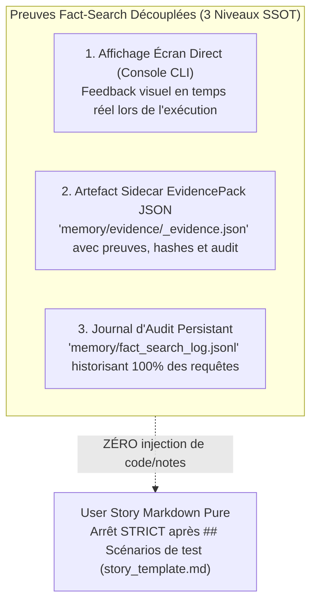

# 📑 Protocole Normatif : Fact-Search & Revue Sémantique de Contenu (Fact-Search & Substantive Review Protocol)

**Statut** : SSOT Normatif  
**Date d'effet** : 21 août 2026  
**Domaine** : Rigueur Épistémique, Grounding, Anti-Hallucination, Cadrage Fonctionnel, Revue Qualitaire de Récits (Sentinel)  
**Référence Constitutionnelle** : [ADR-0326](../adr-system/0326-fact-search-and-substantive-content-review.md)

---

## 1. Vision & Principes Fondamentaux

Le **Fact-Search** est le réflexe épistémique et le garde-fou anti-hallucination fondamental de l'écosystème **Memory Loop (mLoop)**.

> **Règle d'Or du Grounding** :  
> *"Avant d'affirmer une exigence, de rédiger un scénario Gherkin, de poser une question au Product Owner ou de concevoir un contrat d'interface, l'agent DOIT obligatoirement prouver qu'il a interrogé la documentation vérifiée (`docs/00-ingested/`, `docs/02-business-rules/`, `docs/01-architecture/`, index FTS5 `loop_mem_search`, ou AST `codegraph`) pour fonder sa réflexion sur des faits tangibles, et citer formellement ses sources."*

---

## 2. Ordre Déterministe d'Interrogation des Faits (Search Hierarchy)

Lors de toute analyse, cadrage, rédaction ou arbitrage, l'agent explore les sources dans l'ordre strict suivant :

1. 📂 **`docs/00-ingested/`** : Documents clients sources convertis en Markdown normalisé (spécifications, APIs, briefs, PDFs).
2. 📂 **`docs/02-business-rules/`** : Règles d'affaires consolidées (`RM-XXX`) faisant autorité sur le domaine.
3. 📂 **`docs/01-architecture/`** : Décisions d'architecture (`ADR-*.md`) et énoncés des travaux (`SOW_*.md`).
4. 🧠 **Index FTS5 & Graphe Sémantique** : Recherche plein texte via `loop_mem_search` ou exploration de dépendances via `graphify query`.
5. 💻 **Code Source AST (`codegraph`)** : Arbre syntaxique et call-tree pour vérifier la signature réelle d'un symbole (traduit en langage fonctionnel pur dans les récits selon l'ADR-0319).

---

## 3. Le Système de Preuves Fact-Search Découplé (3 Niveaux SSOT)

Pour garantir une auditabilité absolue, le zéro contestation client et la règle du *Zero-Bruit* pour les développeurs, le Fact-Search produit des preuves sur 3 niveaux distincts et découplés du Markdown fonctionnel :



### Couche 1a : Affichage Console en Temps Réel (`ZeroFluffConsole`)
```text
=== MEMORY LOOP - FACT-SEARCH ENGINE ===
(i) [FACT-SEARCH] 🔍 Requête FTS5 : 'OneTrust offline consent sync'
    ├─ 📄 Source trouvée : docs/00-ingested/onetrust_api/api-reference-maui-new.md (Section: §4.2)
    ├─ 💡 Fait vérifié   : 'Le SDK persiste le consentement localement et resynchronise automatiquement au retour réseau.'
    └─ 🎯 Indice de Certitude : 1.0 (HIGH)
```

### Couche 1b : Restitution Visuelle Interactive en Séance Grill-with-Docs (Passage-Level Grounding)
Lors des sessions interactives d'interrogatoire unitaire (`/grill`, `grill-with-docs`), l'agent ouvre chaque question par le **Dossier de Preuves Documentaires** :
1. **Maquettes & Notes d'Atelier (SSOT Visuelle)** : Liens cliquables `file:///...`, identification des écrans et ajustements de cadrage.
2. **Extraits de la Transcription / Specs** : Format verbatim numéroté (`Extrait N (Lignes X-Y) : « Citation » ➔ Fait établi : ...`).
3. **Structure de Données** : Définition des entités, types et contraintes.
4. **Question d'Arbitrage Unique** : 1 question avec options A (Recommandée)/B/C.

### Couche 2 : EvidencePack JSON Sidecar (`memory/evidence/<STORY_ID>_evidence.json`)
Structure `fact_search_proofs` autonome contenant :
- `query` : Terme de recherche FTS5.
- `source_file` : Chemin relatif du fichier source physique.
- `section` : Section ou paragraphe de référence.
- `matched_fact` : Extrait factuel vérifié.
- `confidence` : Niveau de certitude (`HIGH`, `MEDIUM`, `LOW`).
- `timestamp` : Horodatage ISO-8601.

### Couche 3 : Journal d'Audit Persistant (`memory/fact_search_log.jsonl`)
Ligne JSON append-only consignée à chaque recherche avec timestamp, projet, requête, sources et statut.

> [!IMPORTANT]
> **Sanctuarisation du Zero-Bruit (Universal Dev Handoff - ADR-0319 / ADR-0333)** :
> Aucune section de traçabilité, note IA ou citation machine ne doit être injectée dans le fichier physique Markdown (`backlog/stories/<JIRA_KEY>.md`). Le récit se termine **strictement** après la section `## Scénarios de test`. Les agents Sentinel / Rubber-Duck auditent les preuves directement via le JSON sidecar.

---

## 4. Protocole de Revue Sémantique de Contenu (Substantive Review)

La revue contradictoire de récits (exécutée par l'agent `sentinel` ou la commande `rubber-duck`) est une **revue de fond qualitative**, strictement séparée du linter de forme.

### Les 4 Axes Métier de la Revue Sémantique

1. **Cohérence Métier & Clarté Fonctionnelle** :
   - Conformité des règles d'affaires aux exigences documentées.
   - Détection des ambiguïtés, des termes vagues ou des règles orphelines.
2. **Analyse Critique des Scénarios Gherkin (4 Piliers)** :
   - *Nominal* : Chemin heureux complet et testable.
   - *Exceptions* : Gestion des cas d'erreurs réels (erreurs réseau, 4xx/5xx, timeouts, données partielles).
   - *Résilience* : Comportements hors-ligne, concurrence, rollbacks et persistance locale.
   - *UX* : Retours visuels à l'utilisateur (toasts, bannières, états de chargement, accessibilité).
3. **Confrontation Fact-Search aux Sources Réelles** :
   - Audit de conformité de chaque affirmation contre les documents ingérés et les ADRs.
4. **Recommandations Constructives d'Amélioration** :
   - Suggestions d'ajouts de critères, formulation de questions ouvertes (`OQ-XXX`) si un arbitrage manque.
