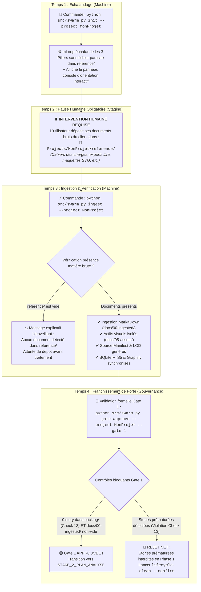

# 📑 Protocole Normatif : Ingestion Documentaire & Exploration Sémantique (Phase 1)

> **Statut :** SSOT Normatif  
> **Date d'effet :** 18 Septembre 2026  
> **Autorité Constitutionnelle :** [ADR-0377](../adr-system/0377-phase-1-ingest-and-explore-contract-and-gate-1.md), [ADR-0100](../adr-system/0100-structure-repertoire-projet-client.md), [ADR-0101](../adr-system/0101-ingestion-markitdown-local.md), [ADR-0102](../adr-system/0102-structure-ssot-dossier-docs.md), [ADR-0332](../adr-system/0332-docs-assets-standard-visual-artifacts.md), [ADR-0335](../adr-system/0335-deep-paper-note-ingestion-epistemic-grounding.md), [ADR-0375](../adr-system/0375-project-lifecycle-5-phases-and-analysis-types.md).  
> **Domaine :** Amorçage de Projet, Ingestion Multimodale MarkItDown, Séparation des Actifs Visuels, Grounding Épistémique & Gouvernance Gate 1.

---

## 1. 🌟 Vision & Philosophie de la Phase 1

Dans le framework **Memory Loop (mLoop)**, la **Phase 1 : INGEST & EXPLORE** constitue le socle préalable inviolable de tout projet client ou interne.
Elle a pour mandat exclusif de :
1. **Échafauder la structure normalisée** du projet selon la Loi des 3 Piliers (`python src/swarm.py init`).
2. **Moissonner et convertir l'ensemble de la matière première brute** (cahiers des charges, spécifications, exports Jira, présentations, bases de données tabulaires, maquettes d'écrans) en une Source Unique de Vérité (SSOT) Markdown propre sous `docs/00-ingested/`.
3. **Isoler et optimiser les actifs visuels** (maquettes vectorielles SVG, diagrammes, captures) sous `docs/05-assets/` selon le contrat visuel normatif (ADR-0332).
4. **Construire la mémoire sémantique** : génération du `source_manifest.json`, auto-consolidation du lexique métier, génération des sidecars de granularité cognitive LOD (`.overview.md`), synchronisation de la base de recherche SQLite FTS5 et de l'hypergraphe Graphify (`python src/swarm.py sync`).

---

## 2. 🚦 Le Découplage Hermétique des Espaces de Stockage

Le système impose une séparation stricte et étanche entre les espaces :

```text
┌──────────────────────────────────────────────────────────────────────────────────┐
│                         LES 3 PILIERS EN PHASE 1                                 │
├──────────────────────────────────────────────────────────────────────────────────┤
│ 1. reference/       │ Staging brut local, EXCLU DE GIT (.gitignore).             │
│                     │ Zéro sous-readme ("forbidden_subreadmes": true, ADR-0100). │
│                     │ Dépôt manuel réservé à l'humain.                           │
├─────────────────────┼────────────────────────────────────────────────────────────┤
│ 2. docs/            │ SSOT Documentaire Markdown, VERSIONNÉ DANS GIT.            │
│  ├─ 00-ingested/    │ Matière convertie par MarkItDown + source_manifest.json    │
│  └─ 05-assets/      │ Maquettes SVG nettoyées et schémas versionnés (ADR-0332).  │
├─────────────────────┼────────────────────────────────────────────────────────────┤
│ 3. backlog/stories/ │ Terrain Agile d'implémentation.                            │
│                     │ STRICTEMENT INTERDIT ET VIDE EN PHASE 1 (Check 13).        │
└──────────────────────────────────────────────────────────────────────────────────┘
```

---

## 3. 🔄 Le Flux Opérationnel en 4 Temps Déterministes



---

## 4. 📦 Formats Supportés & Moteurs de Conversion

| Type de Données | Extensions Reconnues | Moteur / Convertisseur mLoop | Destination SSOT |
| :--- | :--- | :--- | :--- |
| **Documents Textuels & Bureautiques** | `.pdf`, `.docx`, `.txt`, `.md`, `.cs` | Microsoft MarkItDown (`markitdown_convert`) | `docs/00-ingested/01-sow-et-contrats/` ou `02-guides-et-specs/` |
| **Données Tabulaires & Chiffrées** | `.xlsx`, `.csv` | Engine Tabulaire Résilient (`csv-normalize`) | `docs/00-ingested/03-scans-et-inventaires/` |
| **Spécifications d'API & Swagger** | `.json`, `.yaml`, `.yml` | MarkItDown & Ast Parser | `docs/00-ingested/04-api-et-techniques/` |
| **Maquettes UI/UX Vectorielles** | `.svg` | Convertisseur SVG (`svg_to_md`) + `svg-optimize` | Note Markdown dans `docs/00-ingested/05-maquettes-notes/` ET SVG copié dans `docs/05-assets/maquettes/` |
| **Transcriptions Audio / Réunions** | `.vtt` | Parser VTT Déterministe (`_parse_vtt`) | `docs/00-ingested/` (dialogue horodaté) |
| **Captures d'Écran & Illustrations** | `.png`, `.jpg`, `.jpeg` | Gestionnaire d'actifs visuels | `docs/05-assets/` + Note liée |
| **Documentation Web & Backlog Externe** | URLs, repos Git | WebCrawler Intelligent (`crawl`) | `memory/crawler/cache/` (Markdown Twin) |

---

## 5. 🧠 Rigueur Épistémique & Grounding Anti-Hallucination (ADR-0335)

L'ingestion en Phase 1 applique les principes du standard **DeepPaperNote** :

1. **Autorité de la Matière Brute (*Raw-Source Authority*)** :
   - Le système mLoop extrait déterministement les sections hiérarchiques réelles (`sections`) et calcule l'empreinte SHA-256 de chaque fichier original.
   - Les résumés ou introductions ne font jamais autorité face aux données brutes ou aux tableaux de spécifications.
2. **Manifeste Canonique d'Ingestion (`source_manifest.json`)** :
   - Tout projet consolidé dispose sous `docs/00-ingested/source_manifest.json` de la cartographie complète de ses sources.
   - Pour chaque source dense, le système segmente épistémiquement :
     - **`what_it_actually_proves`** : Ce que la source démontre formellement.
     - **`what_it_does_not_prove`** : Ce que la source laisse en suspens ou n'aborde pas.
     - **`claim_boundaries`** : Le périmètre exact de validité de l'assertion.
3. **Plafonnement Terminologique Adaptatif (*Length-Aware*)** :
   - L'extraction des concepts et acronymes est proportionnelle au volume textuel (10 termes pour <10k caractères, 18 pour <30k, 25 pour <60k, max 35 au-delà).
   - Les termes alimentent automatiquement le lexique transverse sous `docs/04-transverse/lexique_domaine.md`.
4. **Sidecars LOD (Level of Detail L0 / L1)** :
   - Pour chaque sous-dossier de `docs/00-ingested/`, un sidecar `.overview.md` synthétise la matière pour permettre aux agents d'interroger la mémoire sans saturer leur fenêtre de contexte.
5. **Politique Fail-Closed (Registre d'Anomalies)** :
   - En cas d'erreur I/O ou de fichier corrompu, l'anomalie est immédiatement consignée dans `docs/00-ingested/ingest_anomalies.json`. Aucune spécification dégradée ou synthétique n'est générée.

---

## 6. 🚫 Règle Inviolable : Le Check 13 (Anti-Ghost-Bias)

> [!CAUTION]
> **Interdiction Formelle de Rédaction de Stories en Phase 1** :
> Avant l'approbation formelle de Gate 1, il est **strictement interdit** de créer des User Stories sous `backlog/stories/` ou de positionner des récits en analyse dans `sprint_backlog.md`.
> - **Pourquoi ?** : La présence de stories prématurées crée un biais cognitif majeur (*Ghost Bias*) qui altère la neutralité des agents d'architecture lors du cadrage macro ultérieur.
> - **Enforcement Automatisé** :
>   1. Le `vibe-check` échoue (Check 13 FAIL) si des stories sont présentes.
>   2. La commande `gate-approve --gate 1` **rejette net** la validation tant que des stories existent.
>   3. La commande `python src/swarm.py lifecycle-clean --confirm` archive de façon sécurisée et réversible les stories prématurées dans `memory/archive/premature_stories/<timestamp>/`.

---

## 7. 🚪 Définition de l'Ingéré & Les 5 Critères de Gate 1

Pour franchir formellement la **Gate 1** (`python src/swarm.py gate-approve --gate 1 --approver <Nom>`), le projet doit satisfaire 5 critères bloquants :

| Portail | Intitulé Normatif | Commande de Vérification | Critère de Succès |
| :---: | :--- | :--- | :--- |
| **G1** | **Conversion MarkItDown Complète** | `docs/00-ingested/**/*.md` | Tous les fichiers de `reference/` sont convertis en Markdown propre. |
| **G2** | **Optimisation des Actifs Visuels** | `python src/swarm.py svg-optimize --input docs/05-assets` | Maquettes SVG épurées de métadonnées d'éditeurs (ADR-0332). |
| **G3** | **Synchronisation de la Mémoire** | `python src/swarm.py sync --project <nom>` | SQLite FTS5 et hypergraphe Graphify indexés et à jour. |
| **G4** | **Intégrité du Source Manifest & LOD** | `docs/00-ingested/source_manifest.json` | Manifeste présent et sidecars `.overview.md` générés. |
| **G5** | **Conformité Check 13 (Zéro Story)** | `backlog/stories/` | 0 story sauvage présente (hors `README.md`). |

Une fois ces 5 critères réunis, Gate 1 est validée, un hash SHA-256 déterministe est consigné dans `memory/lifecycle_state.json`, et le projet transite officiellement vers **`STAGE_2_PLAN_ANALYSE`**.
