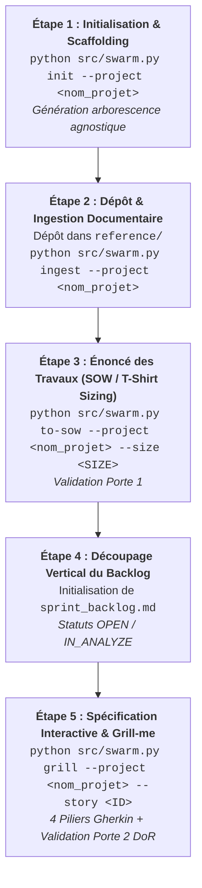

# 🚀 Protocole Opérationnel : Procédure Normative de Création & Initialisation de Projet mLoop

> **Statut :** Normatif & Obligatoire (SSOT)  
> **Référence Architecture :** ADR-0330 / ADR-0329 / ADR-0319  
> **Dernière révision :** 18 Août 2026  

---

## 🎯 1. Vision & Principes Directeurs

Ce protocole définit la séquence obligatoire en **5 étapes déterministes** pour la création, l'initialisation, le cadrage et l'alimentation de tout nouveau projet client dans l'écosystème **mLoop**.

### ⚖️ Règles d'Or :
1. **Universal Dev Handoff (ADR-0319)** : Le dossier projet (`Projects/<nom_projet>/`) est destiné à être versionné sur Azure DevOps / GitHub et partagé avec des développeurs externes. Ses fichiers racines (`AGENTS.md`, `opencode.json`, `README.md`) doivent être **100 % agnostiques de mLoop** (aucune commande `python src/swarm.py` ni ponts MCP internes locaux).
2. **Primauté de la Matière Première (Loi des 3 Piliers)** : Il est **strictement interdit** d'inventer des règles métier, des maquettes ou des User Stories sans avoir préalablement ingéré les documents bruts du client déposés sous `reference/`.
3. **Alignement sur les 6 Phases Projet (ADR-0329)** : Tout projet progresse séquentiellement à travers les portes de gouvernance (Porte 0 ➔ Porte 1 ➔ Porte 2).

---

## 🗺️ 2. La Matrice des 5 Étapes Séquentielles



---

## 📋 3. Détail Opérationnel Étape par Étape

### 🔹 Étape 1 : Initialisation & Scaffolding Agnostique
* **Commande CLI** :
  ```bash
  python src/swarm.py init --project <nom_projet>
  ```
* **Livrables Créés Automatiquement** :
  - `Projects/<nom_projet>/README.md` (Point d'entrée produit et vue d'ensemble).
  - `Projects/<nom_projet>/AGENTS.md` (Guide développeur agnostique + 4 Piliers Gherkin).
  - `Projects/<nom_projet>/opencode.json` (Configuration IDE standardisée).
  - `Projects/<nom_projet>/.gitignore` (Exclusions de build et protection de `reference/` non versionné).
  - Arborescence : `reference/`, `docs/` (`00-ingested/`, `01-architecture/`, `02-business-rules/`, `04-transverse/`, `05-assets/maquettes/`, `05-assets/diagrams/`), `backlog/` (`stories/`, `reviews/`), `memory/` (`evidence/`, `plan/`).

---

### 🔹 Étape 2 : Dépôt de la Matière Première & Ingestion Normalisée
* **Action Utilisateur** : Déposer les documents bruts (PDF, Word, Excel, export Figma, notes de réunion) dans le dossier de staging local :
  👉 `Projects/<nom_projet>/reference/`
* **Commande CLI** :
  ```bash
  python src/swarm.py ingest --project <nom_projet>
  ```
* **Résultat** : Conversion et normalisation Markdown sous `Projects/<nom_projet>/docs/00-ingested/` et transfert/optimisation des actifs visuels et maquettes vectorielles sous `Projects/<nom_projet>/docs/05-assets/maquettes/` (ADR-0332).

---

### 🔹 Étape 3 : Cadrage Macro & Énoncé des Travaux (SOW / Phase 1)
* **Commande CLI** :
  ```bash
  python src/swarm.py to-sow --project <nom_projet> --size <T-SHIRT_SIZE>
  ```
  *(Valeurs de `--size` : `xs`, `XS`, `s`, `S`, `m`, `M`, `l`, `L`, `xl` selon la grille Kevin Chamberland)*.
* **Livrable Produit** : `Projects/<nom_projet>/docs/01-architecture/SOW_<nom_projet>.md` conforme au Gold Standard `standards/blueprints/sow_evaluation_template.md`.
* **Porte de Gouvernance 1** : Signature / Accord de cadrage du client avant le découpage fin.

---

### 🔹 Étape 4 : Découpage Vertical du Backlog (Phase 2)
* **Action de l'Agent / Humain** :
  - Créer ou actualiser `Projects/<nom_projet>/backlog/sprint_backlog.md` avec la liste ordonnée des User Stories (`US-01`, `US-02`...).
  - Les statuts initiaux sont **`OPEN`** ou **`IN_ANALYZE`**.
  - **Interdiction formelle** de positionner les récits en `READY_FOR_DEV` avant l'étape de Grilling.

---

### 🔹 Étape 5 : Spécification Interactive & Validation (Grill with Docs)
* **Commande CLI** :
  ```bash
  python src/swarm.py grill --project <nom_projet> --story <ID_OU_CHEMIN>
  ```
* **Actions** :
  1. Interview interactive 1 question par tour avec l'utilisateur pour trancher les zones d'ambiguïté.
  2. Rédaction au gabarit `standards/blueprints/story_template.md` (4 Piliers Gherkin).
  3. Génération autonome de l'EvidencePack sous `memory/evidence/<STORY_ID>_evidence.json`.
  4. Audit contradictoire Sentinel : `python src/swarm.py rubber-duck --project <nom_projet> --file <story_path>`.
* **Porte de Gouvernance 2 (Definition of Ready - DoR)** : Passage du statut en `READY_FOR_DEV`.

---

## 🚫 4. Pièges & Interdictions Stricts (Zero-Drift)

* ❌ **Zéro Récit Spéculatif** : Ne jamais inventer des User Stories sans documents réels ingérés sous `docs/00-ingested/`.
* ❌ **Zéro Commande Interne dans les Dépôts Clients** : Ne jamais réintroduire `python src/swarm.py` ou des MCP locaux dans `Projects/<nom_projet>/AGENTS.md` ou `opencode.json`.
* ❌ **Zéro Raccourci vers READY_FOR_DEV** : Ne jamais approuver un récit sans l'interview Grill et l'audit Rubber Duck.
