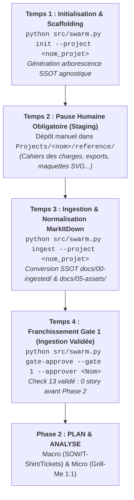

# 🚀 Protocole Opérationnel : Procédure Normative de Création & Initialisation de Projet mLoop

> **Statut :** Normatif & Obligatoire (SSOT)  
> **Référence Architecture :** ADR-0330 / ADR-0329 / ADR-0319  
> **Dernière révision :** 18 Août 2026  

---

## 🎯 1. Vision & Principes Directeurs

Ce protocole définit la séquence obligatoire en **5 étapes déterministes** pour la création, l'initialisation, le cadrage et l'alimentation de tout nouveau projet client dans l'écosystème **mLoop**.

### ⚖️ Règles d'Or :
1. **Universal Dev Handoff (ADR-0319)** : Le dossier projet (`Projects/<nom_projet>/`) est destiné à être versionné sur Azure DevOps / GitHub et partagé avec des développeurs externes. Ses fichiers racines (`AGENTS.md`, `opencode.json`, `README.md`) doivent être **100 % agnostiques de mLoop** (aucune commande `python src/swarm.py` ni ponts MCP internes locaux).
2. **Primauté de la Matière Première (Loi des 3 Piliers)** : Il est **strictement interdit** d'inventer des règles métier, des maquettes ou des User Stories sans avoir préalablement ingéré les documents bruts du client déposés sous `reference/`.
3. **Alignement sur les 6 Phases Projet (ADR-0329)** : Tout projet progresse séquentiellement à travers les portes de gouvernance (Porte 0 ➔ Porte 1 ➔ Porte 2).

---

## 🗺️ 2. La Matrice Séquentielle en 5 Phases Universelles (ADR-0375)



---

## 📋 3. Détail Opérationnel Étape par Étape

### 🔹 Étape 1 : Initialisation & Scaffolding Agnostique (Phase 1)
* **Commande CLI** :
  ```bash
  python src/swarm.py init --project <nom_projet>
  ```
* **Livrables Créés Automatiquement** :
  - `Projects/<nom_projet>/README.md` (Point d'entrée produit et vue d'ensemble).
  - `Projects/<nom_projet>/AGENTS.md` (Guide développeur agnostique + 4 Piliers Gherkin).
  - `Projects/<nom_projet>/opencode.json` (Configuration IDE standardisée).
  - `Projects/<nom_projet>/.gitignore` (Exclusions de build et protection de `reference/` non versionné).
  - Arborescence canonique : `reference/` (staging brut sans sub-readme), `docs/` (`00-ingested/`, `01-architecture/`, `02-business-rules/`, `03-models/`, `04-transverse/`, `05-assets/maquettes/`, `05-assets/diagrams/`), `backlog/` (`stories/`), `memory/` (`evidence/`, `plan/`).

---

### 🔹 Étape 2 : Pause Humaine Obligatoire — Dépôt de la Matière Première
* **Action Utilisateur Explicite** : Déposer les documents bruts (PDF, Word, Excel, export Figma, notes de réunion, maquettes vectorielles SVG) dans le dossier de staging local :
  👉 `Projects/<nom_projet>/reference/`
* **Règle absolue** : Aucun sous-readme interne dans `reference/` (`forbidden_subreadmes: true`, ADR-0100).

---

### 🔹 Étape 3 : Ingestion Normalisée MarkItDown & Synchronisation
* **Commande CLI** :
  ```bash
  python src/swarm.py ingest --project <nom_projet>
  ```
* **Résultats Automatiques** :
  - Conversion et normalisation Markdown sous `docs/00-ingested/`.
  - Transfert et optimisation des maquettes SVG sous `docs/05-assets/maquettes/` (ADR-0332).
  - Génération du `source_manifest.json` et des sidecars LOD `.overview.md` (ADR-0335).
  - Synchronisation de l'index SQLite FTS5 et de l'hypergraphe Graphify.

---

### 🔹 Étape 4 : Validation de la Porte 1 (Gate 1 : Ingestion Complète)
* **Commande CLI** :
  ```bash
  python src/swarm.py gate-approve --project <nom_projet> --gate 1 --approver "<Nom>"
  ```
* **Contrôles Déterministes Bloquants** :
  - Tous les fichiers de `reference/` sont convertis sous `docs/00-ingested/`.
  - Check 13 (Anti-Ghost-Bias) respecté : zéro story sous `backlog/stories/`.
  - Transition officielle vers `STAGE_2_PLAN_ANALYSE`.

---

### 🔹 Étape 5 : Phase 2 — Planification Macro & Analyse Fine (Grill-Me)
* **Macro-Planification (Optionnelle selon contrat)** :
  - Dimensionnement T-Shirt : `python src/swarm.py to-tshirt --project <nom_projet>`
  - Énoncé des Travaux (SOW) : `python src/swarm.py to-sow --project <nom_projet> --size <SIZE>`
  - Découpage Macro : `python src/swarm.py to-tickets --project <nom_projet>`
* **Micro-Analyse 1:1 Récit par Récit** :
  - Entrevue Grill-Me : `python src/swarm.py grill-me --project <nom_projet> --story <ID>`
  - Validation DoR 6/6 (Porte 2) ➔ statut `READY_FOR_DEV`.

---

## 🚫 4. Pièges & Interdictions Stricts (Zero-Drift)

* ❌ **Zéro Récit Spéculatif** : Ne jamais inventer des User Stories sans documents réels ingérés sous `docs/00-ingested/`.
* ❌ **Zéro Commande Interne dans les Dépôts Clients** : Ne jamais réintroduire `python src/swarm.py` ou des MCP locaux dans `Projects/<nom_projet>/AGENTS.md` ou `opencode.json`.
* ❌ **Zéro Raccourci vers READY_FOR_DEV** : Ne jamais approuver un récit sans l'interview Grill et l'audit Rubber Duck.
