# 🚦 Protocole Normatif : Phases et Portes d'Étape du Cycle de Vie Projet (Project Lifecycle Stages)

**Statut** : SSOT Normatif  
**Date d'effet** : 18 août 2026  
**Domaine** : Gouvernance de Projet, Cadrage Macro, Contractualisation, Découpage Spécifications, Ingénierie Logicielle  

---

## 1. Vue d'Ensemble du Cycle de Vie en 6 Phases

Tout projet client géré dans l'écosystème mLoop transite obligatoirement par ces **6 phases séquentielles**, chacune verrouillée par une **Porte d'Étape (*Quality Gate*)** :

```mermaid
flowchart LR
    P0["0. T-SHIRT-SIZE<br>(Cadrage Macro)"] -->|Gate 0 : Validation Enveloppe| P1["1. SOW<br>(Énoncé des Travaux)"]
    P1 -->|Gate 1 : Signature Client| P2["2. PLAN / GRILL-ME<br>(Analyse Fine Récit/Récit)"]
    P2 -->|Gate 2 : Definition of Ready| P3["3. BUILD<br>(Développement Physique)"]
    P3 -->|Gate 3 : Definition of Done| P4["4. VALIDATE<br>(Audit QA & Evals)"]
    P4 -->|Gate 4 : Conformité Métier| P5["5. SHIP & SYNC<br>(Mise en Prod & Jira)"]
```

---

## 2. Définition Détaillée des 6 Phases & Portes d'Étape

### 🟡 Phase 0 : `T-SHIRT-SIZE` (Cadrage Macro & Enveloppe Budgétaire)
* **Objectif** : Évaluer l'effort et le coût de haut niveau pour arbitrage par la direction et le client.
* **Activités** :
  - Identification des briques majeures du parcours utilisateur à partir des maquettes et briefs initiaux.
  - Attribution d'une taille T-Shirt selon la grille officielle client (ex: Grille Kevin Chamberland : `xs` à `xl`, 1 000 $/jour).
  - Définition explicite des exclusions de périmètre (`-` = 0 $ / 0 j).
* **Livrables Autorisés** :
  - Tableau macro dans `backlog/sprint_backlog.md` (identifiant chaque brique avec sa taille T-Shirt).
  - Fiche de dimensionnement dans `docs/02-business-rules/`.
* **🚫 Interdictions** : Interdiction de rédiger des récits détaillés au format Gherkin ou de produire du code.
* **🚪 Porte 0 (*Exit Criteria*)** : Accord de la direction et du client sur l'enveloppe globale.

---

### 🟠 Phase 1 : `SOW` (Statement of Work / Énoncé des Travaux)
* **Objectif** : Transformer l'enveloppe macro en engagement contractuel formel.
* **Activités** :
  - Formalisation du périmètre d'affaires, des jalons de livraison et du calendrier prévisionnel.
  - Définition des hypothèses techniques, contraintes légales (ex: Loi 25) et prérequis tiers (ex: RxPro, SSO).
  - Clarification de la matrice des responsabilités (RACI).
* **Livrables Autorisés** :
  - Document SOW officiel sous `docs/01-architecture/SOW_<NOM_PROJET>.md`.
* **🚪 Porte 1 (*Exit Criteria*)** : Signature et approbation formelle du SOW par le client.

---

### 🔵 Phase 2 : `PLAN / GRILL-ME` (Analyse & Cadrage Récit par Récit)
* **Objectif** : Spécifier chaque récit avec zéro ambiguïté et un contrat fonctionnel limpide.
* **Activités** :
  - Entrevue interactive ciblée **Grill-with-Docs** (1 question ciblée + recommandation par tour).
  - Découpage en User Stories verticales selon le Gold Standard `standards/blueprints/story_template.md`.
  - Rédaction obligatoire des **4 Piliers Gherkin** (1. Nominal, 2. Exceptions, 3. Résilience, 4. UX).
  - Génération synchrone de l'EvidencePack sous `memory/evidence/<STORY_ID>_evidence.json`.
* **Livrables Autorisés** :
  - Fichiers de récits sous `backlog/stories/<JIRA_KEY>.md`.
  - EvidencePacks JSON et registres de questions ouvertes (`docs/04-transverse/`).
* **🚪 Porte 2 (*Definition of Ready*)** : Validation 100% sans erreur par WikiFix & Sentinel (zéro fuite technique `ADR-0319`, gabarit complet).

---

### 🟢 Phase 3 : `BUILD` (Développement & Delivery)
* **Objectif** : Implémenter physiquement la solution technique.
* **Activités** :
  - Handoff propre aux développeurs / agents IA aval (Renaud, Cursor, Copilot, Herdr workers).
  - Développement guidé par les tests (TDD) et respect des contrats déclaratifs.
* **Livrables Autorisés** :
  - Code source applicatif physique, tests unitaires et d'intégration.
* **🚪 Porte 3 (*Definition of Done*)** : Tous les tests unitaires et d'intégration passent au vert.

---

### 🟣 Phase 4 : `VALIDATE` (Assurance Qualité & Evals)
* **Objectif** : Auditer contradictoirement la qualité, la sécurité et la non-régression.
* **Activités** :
  - Audit contradictoire Sentinel / Rubber Duck.
  - Moisson automatique d'Evals (`AutoEvalHarvester`) à partir des anomalies.
  - Vérification de conformité stricte aux 4 Piliers Gherkin.
* **Livrables Autorisés** :
  - Rapports d'audit de santé et suite de tests d'évaluation (`memory/evals/`).
* **🚪 Porte 4 (*Exit Criteria*)** : Approbation formelle QA / Sentinel.

---

### ⚪ Phase 5 : `SHIP & SYNC` (Mise en Production & Synchronisations)
* **Objectif** : Déployer en production et aligner tous les registres de mémoire.
* **Activités** :
  - Synchronisation Jira Cloud (`python src/swarm.py jira_sync`).
  - Synchronisation Git distant (`git push origin main`).
  - Clôture et archivage mémoire dans `memory/supersession_ledger.json`.
* **Livrables Autorisés** :
  - Release notes, tickets Jira à l'état fermé, base sémantique mise à jour (`swarm.py sync`).

---

## 3. Matrice Récapitulative des Statuts de Projet

| Phase # | Code Statut | Phase Cycle mLoop | Livrable Pivot | Validation de Porte Requise |
| :---: | :--- | :--- | :--- | :--- |
| **0** | `STAGE_TSHIRT_SIZE` | 1: SPEC / INGEST | Matrice T-Shirt Sizing | Accord Enveloppe / Direction |
| **1** | `STAGE_SOW` | 1: SPEC / INGEST | Document SOW validé | Signature Client |
| **2** | `STAGE_PLAN_GRILL` | 2: PLAN / ARCHI | Stories 4 Piliers + EvidencePacks | Definition of Ready (WikiFix) |
| **3** | `STAGE_BUILD` | 3: BUILD / DEV | Code Source & Tests | Definition of Done (Tests Verts) |
| **4** | `STAGE_VALIDATE` | 4: VALIDATE / QA | Rapport QA & Evals Pack | Validation Sentinel / QA Lead |
| **5** | `STAGE_SHIP_SYNC` | 5: SHIP / SYNC | Sync Jira & Git Release | Clôture de Cycle (Orchestrateur) |

---

## 4. Amorçage de Projet & Procédure Opérationnelle

Pour initialiser un nouveau projet dans le respect strict de ce cycle de vie, se référer au protocole opérationnel :
👉 [`standards/protocols/PROJECT_CREATION_PROCEDURE.md`](PROJECT_CREATION_PROCEDURE.md) *(Scaffolding agnostique, ingestion, SOW et découpage).*

