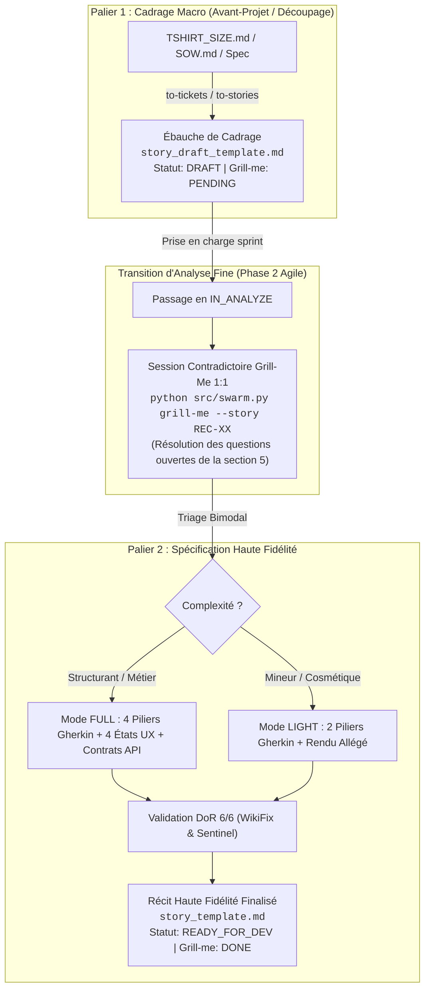

# 🏛️ Framework Universel de Rédaction des User Stories mLoop (SSOT Global)

**Statut** : SSOT Normatif Global (ADR-0375 / ADR-0376)  
**Date d'effet** : Septembre 2026  
**Domaine** : Cycle de maturation des récits, gabarits officiels, triage bimodal, handoff tripartite et qualité INVEST  

Ce document constitue le **standard protocolaire officiel et universel** du framework **Memory Loop (mLoop)** pour le cadrage, l'analyse contradictoire et la rédaction des User Stories, applicable à l'ensemble des projets (Mobile, Web, Backend, Cloud, Data).

---

## 🎯 1. Principes Directeurs & Règle des 2 Seuls Templates

1. **Règle des 2 Seuls Gabarits Officiels** : L'écosystème mLoop reconnaît exclusivement deux gabarits de récits :
   - **Palier 1 : Ébauche de Cadrage (`standards/blueprints/story_draft_template.md`)** ➔ Récits issus de l'avant-projet, chiffrage T-Shirt, SOW ou décomposition de spécification (`status: DRAFT`, `grill_me: PENDING`, `invest_score: 0/6`).
   - **Palier 2 : Récit Haute Fidélité (`standards/blueprints/story_template.md`)** ➔ Récit complet prêt pour le développement suite à l'analyse fine **Grill-Me 1:1** (`status: READY_FOR_DEV`, `grill_me: DONE`, `invest_score: 6/6`).
2. **Cycle de Maturation Déterministe** : Aucune story ne peut être développée sans avoir accompli la transition Palier 1 (`DRAFT`) ➔ Palier 2 (`READY_FOR_DEV`).
3. **Gestion de la Charge Cognitive (Triage Bimodal)** : Adapter l'effort de spécification haute-fidélité à la complexité réelle de l'exigence :
   - 🚀 **Mode FULL (Standard & Architecture)** pour les récits structurants.
   - ⚡ **Mode LIGHT (Allégé & Rapide)** pour les ajustements cosmétiques et textuels mineurs.
4. **Pureté Déclarative Inviolable (Règle de la Cloison Étanche)** : Zéro méta-commentaire de processus, zéro mention de tables physiques de données ou de requêtes techniques SQL/HTTP dans la description métier.
5. **Handoff Développeur & Agentique Universel** : Spécifications sans ambiguïté directement exécutables par des développeurs humains ou des agents IA (Cursor, Copilot, OpenCode, Herdr).

---

## 🔄 2. Le Cycle de Maturation en Deux Paliers

---

## ⚖️ 3. Matrice Universelle de Triage Bimodal (Palier 2)

Lors de la transition vers le Palier 2 via Grill-Me 1:1, l'analyste/IA qualifie le récit :

| Dimension | 🚀 Mode Standard / FULL | ⚡ Mode LIGHT (Allégé) |
| :--- | :--- | :--- |
| **Typologie de Tâche** | • Intégration de SDKs / APIs tierces / Webhooks • Logique métier asynchrone, State Management, Event Bus • Flux d'authentification, SSO, gestion des tokens et sessions • Règles de sécurité, conformité (Loi 25, RGPD, SOC2) & Chiffrement • Flux transactionnels, calculs critiques | • Ajustements de textes statiques & libellés i18n • Modifications cosmétiques simples (styles, couleurs, padding) • Variations mineures de layout sans logique conditionnelle • Écrans informatifs simples sans persistance locale |
| **Couverture Gherkin** | **4 Piliers obligatoires** : 1. Nominal (*Happy Path*) 2. Exceptions (*Rejets Métier / Validations*) 3. Résilience (*Timeouts / Offline / Mode dégradé*) 4. UX & Observabilité (*Logs / Accessibilité*) | **2 Piliers ciblés** : 1. Nominal (*Rendu nominal attendu*) 2. UX / Repli simple (*Cas vide ou indisponibilité*) |
| **Matrice UX** | **États signifiants obligatoires** (4 au plancher : *Initial, Processing, Fallback, Success* — voir `INTERACTION_MANIFESTO.md`) | **1 État direct** : *Affichage statique nominal* |
| **Contrats d'Interface** | Profil A/B exhaustif (Interfaces, signatures asynchrones `Task<T>` / `Promise`, types OpenAPI, erreurs) | Mention déclarative simplifiée |
| **EvidencePack Sidecar** | Complet (`fact_search_proofs`, sources de vérité, audit épistémique) | Standard allégé |

---

## 📐 4. Règles de Style & Cloison Étanche (Zero-Bruit)

1. **Corps Fonctionnel** :
   - Langage fonctionnel pur, direct et intemporel.
   - ❌ *Interdit* : « Conformément à l'ADR-0339 et au chiffrage TS-02... »
   - ✅ *Recommandé* : « L'utilisateur valide la sélection et reçoit un accusé de réception synchrone. »
2. **Section Technique (`Contrats d'Échange API & UX`)** :
   - Contrats OpenAPI canoniques, schémas JSON, routes déclaratives sans invention d'URL.
3. **Fin Stricte** :
   - Le fichier Markdown se termine **strictement** après la section `## Scénarios de test` (ou `## Références`).

---

## 🛡️ 5. Contrôle Qualité & Portes de Sortie

Tout récit prétendant au statut `READY_FOR_DEV` doit obligatoirement satisfaire :
1. `python src/swarm.py struct-check --file <story.md>` : Conformité au gabarit `story_template.md`.
2. `python src/swarm.py rubber-duck --file <story.md>` : Revue contradictoire Sentinel.
3. `python src/swarm.py sync --project <nom>` : Synchronisation du graphe sémantique et mise à jour de l'EvidencePack.
