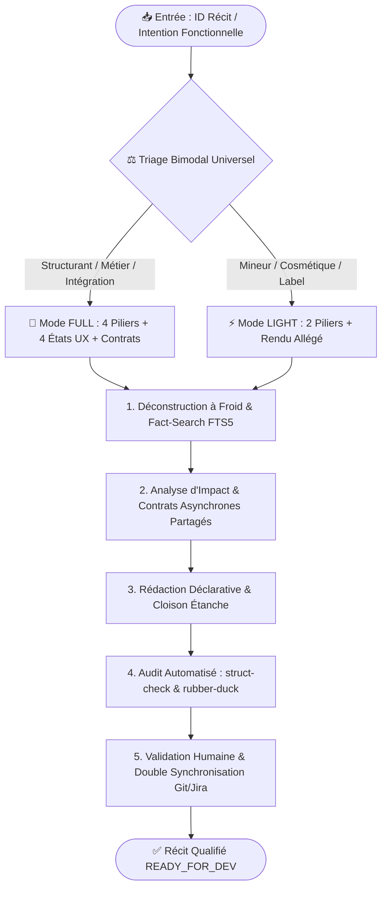

# 🏛️ Framework Universel de Rédaction des User Stories mLoop (SSOT Global)

Ce document constitue le **standard protocolaire officiel et universel** du framework **Memory Loop (mLoop)** pour l'accompagnement, l'analyse différentielle et la rédaction de User Stories à haute valeur ajoutée, applicable à tous les projets (Mobile, Web, Backend, Cloud, Data).

---

## 🎯 1. Principes Directeurs Fondamentaux

1. **Universalité & Agnosticisme Technologique** : Ce standard s'applique de manière uniforme à l'ensemble des dépôts et codebases du framework mLoop (`Projects/*`).
2. **Gestion de la Charge Cognitive (Triage Bimodal)** : Adapter l'effort de spécification à la complexité réelle de l'exigence :
   - 🚀 **Mode FULL (Standard & Architecture)** pour les récits structurants.
   - ⚡ **Mode LIGHT (Allégé & Rapide)** pour les ajustements cosmétiques et textuels mineurs.
3. **Pureté Déclarative Inviolable (Règle de la Cloison Étanche)** : Zéro méta-commentaire de processus, zéro identifiant de décision interne ou historique de ticket dans le corps narratif fonctionnel.
4. **Handoff Développeur & Agentique Universel** : Des spécifications fonctionnelles sans ambiguïté directement exécutables par des développeurs humains ou des agents IA (Cursor, Copilot, VS Code, OpenCode).

---

## ⚖️ 2. Matrice Universelle de Triage Bimodal

Avant toute rédaction, l'Agent et le Lead/PO qualifient la story dans l'une des deux catégories :

| Dimension | 🚀 Mode Standard / FULL | ⚡ Mode LIGHT (Allégé) |
| :--- | :--- | :--- |
| **Typologie de Tâche** | • Intégration de SDKs / APIs tierces / Webhooks • Logique métier asynchrone, State Management, Event Bus • Flux d'authentification, SSO, gestion des tokens et sessions • Règles de sécurité, conformité (Loi 25, RGPD, SOC2) & Chiffrement • Flux transactionnels, paiements, pipelines critiques | • Ajustements de textes statiques & libellés i18n • Modifications cosmétiques simples (styles, couleurs, padding) • Variations mineures de layout sans logique conditionnelle • Écrans informatifs simples sans persistance locale |
| **Couverture Gherkin** | **4 Piliers obligatoires** : 1. Nominal (*Happy Path*) 2. Exceptions (*Rejets Métier / Validations*) 3. Résilience (*Timeouts / Offline / Mode dégradé*) 4. UX & Observabilité (*Logs / Accessibilité*) | **2 Piliers ciblés** : 1. Nominal (*Rendu nominal attendu*) 2. UX / Repli simple (*Cas vide ou indisponibilité*) |
| **Matrice UX** | **4 États visuels obligatoires** : *Initial, Processing, Fallback, Success* | **1 État direct** : *Affichage statique nominal* |
| **Contrats d'Interface** | Profil A/B exhaustif (Interfaces, signatures asynchrones `Task<T>` / `Promise`, types, erreurs) | Mention déclarative simplifiée |
| **EvidencePack Sidecar** | Complet (`fact_search_proofs`, sources, audit épistémique) | Standard allégé |

---

## 🔄 3. Pipeline d'Exécution en 5 Étapes

---

## 📐 4. Règles de Style & Structure des Fichiers

### A. Règle de la Cloison Étanche (Zero-Bruit)
- **Dans le corps fonctionnel (Description, Contexte, Critères, Règles)** :
  - Langage fonctionnel pur, direct et intemporel.
  - ❌ *Interdit* : « Conformément à l'ADR-XXX et à la résolution de QD-YYY... »
  - ✅ *Recommandé* : « L'autorisation du service est régie exclusivement par les paramètres système et les préférences de compte. »
- **Dans la section technique (`## Contrats UI & API Backend`)** :
  - Liens HTTPS vers les documentations officielles, interfaces C#/TypeScript déclaratives, et références d'architecture.
- **Fin stricte** : Le fichier Markdown se termine **strictement** après la section `## Scénarios de test`.

### B. Gestion des Contrats Asynchrones Partagés
Pour tout projet comportant des bibliothèques partagées ou des flux multi-modules :
- Spécifier les signatures asynchrones (`Task<T>`, `async/await`, `Promise`).
- Définir le comportement d'initialisation sécurisée (*Fail-Safe / Silent-First by Default*).
- Spécifier la résilience en cas d'erreur de communication (Timeouts, Retry, Offline cache).

---

## 🛡️ 5. Contrôle Qualité & Gatekeepers Automatisés

Toute User Story rédigée doit franchir mécaniquement les 4 portes de validation mLoop :
1. `python src/swarm.py struct-check --file <story.md>` : Vérification structurelle et respect du gabarit.
2. `python src/swarm.py rubber-duck --file <story.md>` : Revue de fond contradictoire (Avocat du Diable).
3. `python src/swarm.py sync --project <nom>` : Mise à jour synchrone de l'EvidencePack JSON et du graphe sémantique.
4. `git commit & push` : Sauvegarde atomique sur la branche principale du dépôt.
