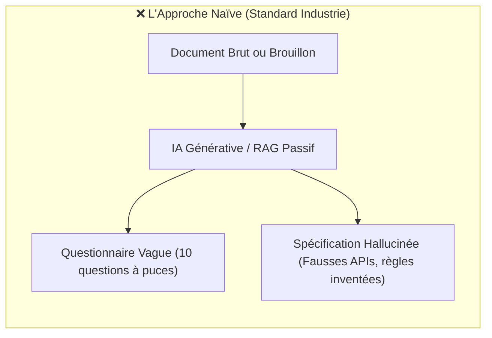
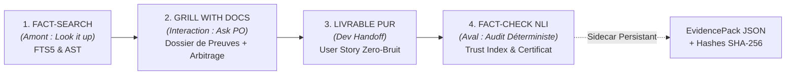
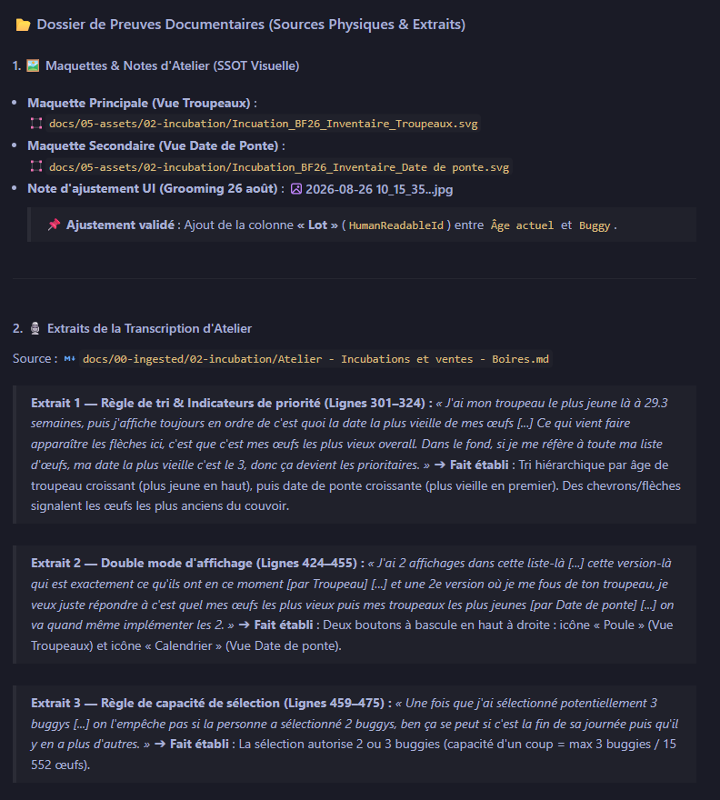
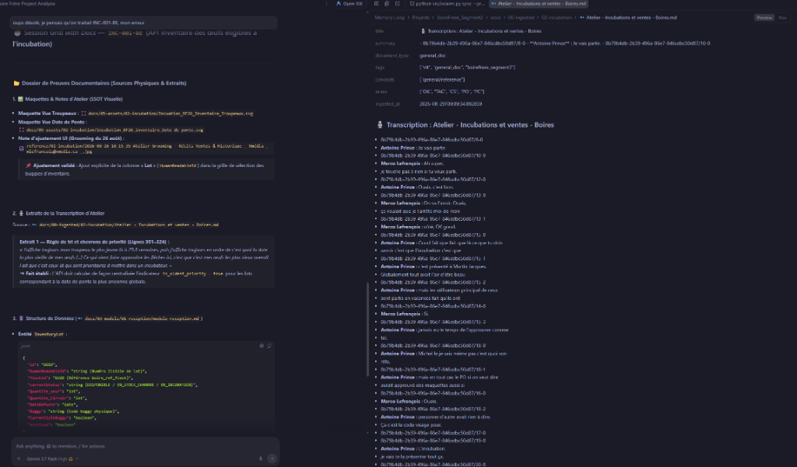
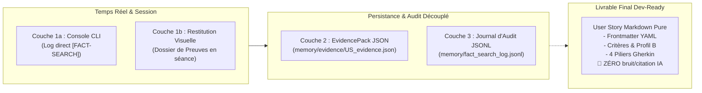
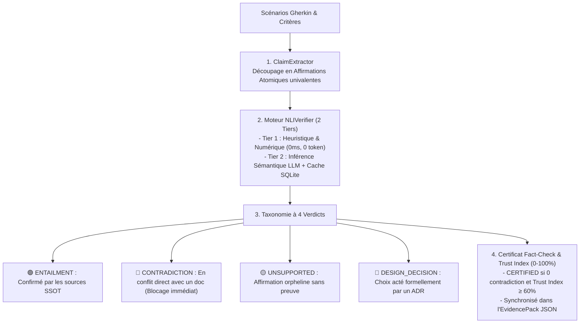

# 🎤 Présentation Table Ronde AI : L'Ingénierie du « Grill with Docs » & le Passage-Level Grounding

> **Auteur** : Marco Lefrançois & Équipe Architecture mLoop  
> **Audience** : Table Ronde AI & Praticiens IA / Devs / Product Owners  
> **Thème** : *Comment transformer l'IA d'un générateur de texte complaisant en un auditeur d'architecture infaillible, transparent et fondé sur des preuves.*

---

## 🧭 Plan de la Présentation (Pitch Deck 15-20 min)

1. **Le Problème Invisible des Assistants IA Actuels** (Le piège de la complaisance & du RAG passif)
2. **Le Changement de Paradigme : « Faits vs Décisions »** (The Brooks & Pocock Principle & la Boucle mLoop)
3. **Le Standard « Dossier de Preuves Documentaires »** (Passage-Level Grounding & Transparence Inconditionnelle)
4. **Démonstration Concrète : Étude de Cas Réelle** (Projet Boire & Frères — Couvoir Avicole & Incubation)
5. **L'Architecture Technique Sous le Capot (ADR-0326 & ADR-0319)** (Le Système de Preuves en 4 Couches & Règle du « Zero-Bruit »)
6. **Le Verrou Aval : Moteur Fact-Check & Inférence NLI** (Vérification Automatisée, Trust Index & Certificat Formel)
7. **Impact Mesuré, ROI & Conclusion** (Pourquoi l'équipe « capote » et comment l'adopter)

---

# 🔴 Slide 1 : Le Problème Invisible de l'IA en Entreprise

### Le Syndrome du « *Docile Polisher* » (Complaisance Artificielle / Anti-Sycophancy)



### Les 3 Failles Majeures du RAG Classique :
1. **L'IA assume au lieu de chercher** : Elle extrapole des règles métiers logiques... mais fausses pour le client.
2. **La fatigue décisionnelle du PO** : L'IA pose des listes interminables de questions triviales dont les réponses sont **déjà écrites** dans la documentation ingérée.
3. **La rupture de confiance** : *« Est-ce que l'IA a vraiment lu notre transcription de 45 minutes et le modèle de données, ou est-ce qu'elle improvise ? »*

> 💡 **Le constat fondamental** : L'intelligence d'un modèle ne réside pas dans sa vitesse à répondre, mais dans sa **rigueur à prouver**.

---

# 🟢 Slide 2 : La Philosophie mLoop — « Faits vs Décisions »

### 🌟 Du « Grill-Me » de Matt Pocock au « Grill with Docs » mLoop
* **Le pattern originel de Matt Pocock (*Grill-Me*)** : Inverser les rôles. Au lieu d'écrire un prompt flou et d'espérer que l'IA devine juste, on lui demande de nous « cuisiner » (*Grill me*) avec des questions ciblées pour cerner le besoin, les contraintes et l'architecture avant d'implémenter.
* **La lacune en entreprise** : Le Grill-Me classique sait cerner le sujet et poser de très bonnes questions, mais face à un écosystème complexe (transcriptions, DBML, maquettes), il agit comme une boîte noire : il n'expose jamais ce qu'il a compris au départ.

### 💡 La Vision Fondatrice : Casser la « Boîte Noire » du Grill-Me Traditionnel

> 🎙️ **Les Propos Fondateurs (Marco Lefrançois)** :  
> *« Quand j'ai réfléchi à comment je pouvais savoir sur quel extrait de documentation l'agent s'était basé pour établir son raisonnement, j'avais constamment deux voix sur mes épaules, un peu comme l'ange et le démon — vous choisirez qui est qui !*  
>  
> *D'un côté, j'ai tout le temps **Jean-François (JF)** qui me martèle : "Il faut que tu sois capable de vérifier efficacement ce que ton agent te rapporte ! Il faut tout le temps valider, être convaincu que c'est la vérité... mais sans passer des heures et des heures à tout réanalyser à la main. L'humain ne doit surtout pas devenir le goulot d'étranglement de l'IA, il faut un juste milieu pour valider !"*  
>  
> *De l'autre côté, j'ai tout le temps **Jean-Philippe** qui me rappelle : "Prouve tes points ! Ne fais pas trop confiance à l'IA, utilise-la en tant qu'assistant, mais un assistant qui soit vérifiable, validable et cohérent. Pour utiliser l'IA à bon escient, c'est fondamental d'être en pleine possession de son sujet, de comprendre sa matière et de ne rien laisser passer."*  
>  
> *Et c'est exactement là que le Grill-Me ordinaire a une lacune pour moi : **c'est une boîte noire**. La séquence de question est vraiment bien, il sait cerner le sujet et te poser les bonnes questions qu'il n'a pas les réponses et soulève même de très bonnes pistes, par contre il n'expose jamais ce qu'il a compris au départ.*  
>  
> *Là où je voulais aller pour répondre aux exigences de JF et de Jean-Philippe, c'était d'abord de comprendre ce que lui avait compris avec un **Fact-Search** qui me ramène les faits factuels, les extraits exacts sur quoi il s'est appuyé dans les documents analysés pour comprendre son raisonnement, puis en arriver à son découpage et à son analyse d'un récit bien précis.*  
>  
> *En m'exposant ces faits-là sous les yeux :*  
> 1. *Je suis en mesure de **valider ce qu'il a compris**, de m'assurer qu'il a compris la bonne chose au départ, et de **bonifier** immédiatement.*  
> 2. *Ensuite seulement, on passe à la session de **Grill-Me with Docs** pour justement cadrer les zones grises et répondre aux questions.*  
> 3. *Et c'est là que l'IA devient un véritable copilote : elle soulève des explications et **suggère des améliorations qu'on n'aurait pas vues** qui manquent à l'analyse initiale, ce qui vient faire un complément exceptionnel ! »*


### Les 3 Temps Infaillibles du Protocole :
1. **Temps 1 : Exposition des Faits (Look it up)** ➔ L'IA montre d'abord ce qu'elle a compris et sourcé via FTS5.
2. **Temps 2 : Validation & Bonification Humaine** ➔ Le PO/Analyste valide que le socle de départ est sain avant de concevoir.
3. **Temps 3 : Grilling des Zones Grises & Révélation d'Angles Morts** ➔ L'interrogatoire 1:1 arbitre les compromis et révèle les améliorations manquées.

### La Boucle Fermée de Bout en Bout :



> 🌐 **Cartographie Interactive Vivante (Produite en direct avec Archify)** :  
> 👉 [**`grill-with-docs-epistemic-flow.architecture.html`**](file:///C:/Memory%20Loop/tools/archify/showcase/grill-with-docs-epistemic-flow.architecture.html)  
> *(Projetez cet artefact en direct : admirez les 3 vues métier scénarisées et les particules lumineuses `trace` qui visualisent la circulation des preuves depuis le Fact-Search jusqu'au Fact-Check NLI et à l'EvidencePack !)*


---

# 🏆 Slide 3 : L'Anatomie du « Dossier de Preuves Documentaires »

Avant de poser la moindre question d'arbitrage au PO (ou avant de rédiger si la frontière est vide), l'agent génère systématiquement un **Dossier de Preuves Visibles en 4 Blocs** :



````carousel
```markdown
### 1. 🖼️ Maquettes & Notes d'Atelier (SSOT Visuelle)
- Maquette Principale : docs/05-assets/02-incubation/Incubation_BF26_Inventaire_Troupeaux.svg
- Maquette Secondaire : docs/05-assets/02-incubation/Incubation_BF26_Inventaire_Date de ponte.svg
- Note d'ajustement UI (Grooming 26 août) : 2026-08-26 10_15_35...jpg
  ➔ Ajustement validé : Ajout explicite de la colonne « Lot » (HumanReadableId) entre Âge actuel et Buggy.
```
<!-- slide -->
```markdown
### 2. 🎙️ Extraits Verbatim Sourcés (Passage-Level Grounding)
Source : docs/00-ingested/02-incubation/Atelier - Incubations et ventes - Boires.md

> Extrait 1 — Règle de tri & Priorité (Lignes 301–324) :
> « J'ai mon troupeau le plus jeune là à 29.3 semaines, puis j'affiche toujours en ordre de c'est quoi la date la plus vieille de mes œufs [...] Ce qui vient faire apparaître les flèches ici, c'est que c'est mes œufs les plus vieux overall. »
> ➔ Fait établi : Tri hiérarchique par âge, puis date de ponte croissante. Des chevrons signalent les œufs les plus anciens du couvoir.

> Extrait 2 — Double mode d'affichage (Lignes 424–455) :
> « J'ai 2 affichages dans cette liste-là [...] par Troupeau [...] et une 2e version où je me fous de ton troupeau, par Date de ponte [...] on va quand même implémenter les 2. »
> ➔ Fait établi : Deux boutons à bascule en haut à droite : icône « Poule » (Troupeaux) et « Calendrier » (Date de ponte).

> Extrait 3 — Règle de capacité (Lignes 459–475) :
> « Une fois que j'ai sélectionné potentiellement 3 buggys [...] on l'empêche pas si la personne a sélectionné 2 buggys, ben ça se peut si c'est la fin de sa journée... »
> ➔ Fait établi : Capacité d'un coup = 2 ou 3 buggies (max 15 552 œufs).
```
<!-- slide -->
```markdown
### 3. 🗄️ Structure de Données & Modèle DBML
- Entité InventoryLot :
  - id (UUID), humanReadableId (string)
  - flockId (UUID boire_ref_flock)
  - currentStatus (DISPONIBLE / EN_STOCK_CHAMBRE / EN_INCUBATION)
  - Quantite_oeuf, Quantite_tiroir, DateDePonte, Buggy, CurrentlyInBuggy, archived
```
<!-- slide -->
```markdown
### 4. ❓ Question d'Arbitrage Unitaire (Option A Recommandée / B / C)
- Mise en situation contextualisée adossée aux faits 1, 2 et 3
- Option A motivée techniquement
- Question fermée de décision (zéro dispersion)
```
````

### 📌 Les Deux Règles Clés d'Exécution :
1. **Transparence Inconditionnelle (ADR-0326 §2b)** : Même si la frontière active est vide (aucun arbitrage requis, règles 100 % claires), l'agent **doit obligatoirement restituer ce dossier complet** pour faire valider son socle factuel par l'humain avant d'entamer la rédaction physique du récit.
2. **Support Dual-Pane vs Mode Inline (ADR-0345 / ADR-0346)** :
   * **Dans Herdr (TUI Multiplexé)** : Le dossier complet est déporté dans un volet latéral split (`_fact_dossier.md`) pour garder le chat principal épuré.
   * **Hors Herdr (PowerShell, Cursor, VS Code, CI/CD)** : Dégradation gracieuse en mode **Inline complet** affiché directement dans la console.

---

# 🔬 Slide 4 : Étude de Cas Réelle (Projet Boire & Frères — Couvoir Avicole)

### Cas concret : Récit `INC-001-BE` (*API Inventaire des Œufs Éligibles à l'Incubation*)



### 💥 Pourquoi les Collègues Analystes ont « Capoté » devant cet Écran :
1. **Zéro Hallucination & Preuve Cliquable** : À gauche, l'agent présente le dossier de preuves ; à droite, la transcription brute est ouverte. N'importe quel analyste ou PO peut vérifier les **lignes 301–324** en 2 secondes.
2. **Du Verbatim Parlé au Fait Technique Structuré** : L'IA a transformé le langage d'atelier oral québécois (*« mes œufs les plus vieux overall »*, *« je me fous de ton troupeau »*, *« ben ça se peut si c'est la fin de sa journée »*) en **spécifications fonctionnelles pures et univalentes** (indicateur booléen `is_oldest_priority`, bascule Poule/Calendrier, contrainte de capacité 2 à 3 buggies).
3. **Réconciliation Multimodale Parfaite** : L'agent fait converger :
   - 11 Maquettes vectorielles SVG (`Incubation_BF26_Inventaire_Troupeaux.svg`).
   - 1 note visuelle annotée en atelier (`10_15_35...jpg` pour l'ajout de la colonne *Lot*).
   - 1 583 lignes de transcription verbatim (`Atelier - Incubations et ventes - Boires.md`).
   - Le modèle de données relationnel (`InventoryLot`).
4. **Gain pour l'Équipe d'Analyse** :
   - Fin de la corvée de réécoute des enregistrements de 2 heures.
   - Alignement immédiat avec le client (Michel) et le designer UX sur la planification en 2 étapes, **gelant le front-end et débloquant le back-end sans aucun rework**.

---

# 🏗️ Slide 5 : L'Architecture Technique Sous le Capot (ADR-0326)

Le système de preuves mLoop repose sur une architecture découplée en **4 Couches étanches** :



### 🛡️ Le Principe du « Zero-Bruit » (ADR-0319 Universal Dev Handoff) :
* Le dossier de preuves sert à **l'arbitrage pendant le dialogue**.
* Une fois validé, le récit Markdown final est **100 % no-code, pur et fonctionnel**, prêt à être consommé par n'importe quel développeur ou agent de build (Cursor, Copilot, Renaud, OpenSpec).
* **Arrêt STRICT** : Le récit physique s'arrête après la section `## Scénarios de test`. Zéro section de traçabilité machine ou note IA dans le fichier du dev.

---

# 🧪 Slide 6 : Le Verrou Aval — Moteur Fact-Check & Inférence NLI

Une fois le récit rédigé, comment garantir mathématiquement qu'aucune hallucination ne s'est glissée dans les scénarios Gherkin ?  
C'est le rôle du **Moteur Fact-Check Automatisé** (`src/engine/fact_check/`) :



### 🔒 Le Guardrail Physique Déterministe (**WikiFix / Sentinel**) :
* **Vérification `Path.exists()` sur disque** : 100 % des chemins de fichiers, maquettes et règles (`RM-XXX`) cités font l'objet d'un contrôle d'existence physique.
* **Éradication totale des citations fantômes** : Si un fichier source mentionné n'existe pas sur le système de fichiers, le linter rejette instantanément la validation.

---

# 📈 Slide 7 : Pourquoi l'Équipe « Capote » ? (Bénéfices & ROI)

| Axe d'Évaluation | Avant (IA Standard / RAG Passif) | Avec *Grill with Docs & Fact-Check* (mLoop) |
| :--- | :--- | :--- |
| **Niveau de Confiance** | Faible (*« Est-ce halluciné ou inventé ? »*) | **Total** (*Verbatims et lignes exactes à l'écran + Certificat NLI*). |
| **Temps d'Alignement PO** | 3 à 5 allers-retours de clarification | **1 tour unique** avec recommandation claire et motivée. |
| **Traçabilité Client** | Diffuse, orale et dispersée | **Inattaquable** (*Adossée aux verbatims, maquettes SSOT et hashes SHA-256*). |
| **Qualité des Récits** | Scores cosmétiques regex superficiels | **4 Piliers Gherkin** blindés, sans pollution IA (*Zero-Bruit*). |
| **Garde-fou Anti-Régression** | Relecture humaine manuelle fastidieuse | **Audit NLI automatique** bloquant toute contradiction métier. |

---

# 🚀 Conclusion & Message Clé pour la Table Ronde

> ### 💬 La Phrase Choc à retenir :
> *« L'IA ne doit pas être un devin complaisant qui vous dit ce que vous voulez entendre. Elle doit être l'auditeur le plus rigoureux de votre projet, qui vous montre la preuve avant d'exiger votre décision, et qui certifie chaque exigence avant le premier commit. »*

---

### 🛠️ Boîte à Outils Prête à l'Emploi pour les Démos
- **Recherche de faits FTS5 en CLI** : `python scripts/fact_search.py search "<requête>"`
- **Indexation documentaire SQLite FTS5** : `python scripts/fact_search.py index --docs-dir docs/`
- **Lancement d'une session Grill interactive** : `python src/swarm.py grill --project <nom_projet>`
- **Revue contradictoire & Audit sémantique** : `python src/swarm.py rubber-duck --project <nom_projet> --file <story.md>`
- **Directive d'agent universelle** : [`.agents/skills/grill/SKILL.md`](file:///c:/Memory%20Loop/tools/export/grill-with-docs-kit/SKILL.md)
- **ADR de référence SSOT** : [`standards/adr-system/0326-fact-search-and-substantive-content-review.md`](file:///c:/Memory%20Loop/standards/adr-system/0326-fact-search-and-substantive-content-review.md)
