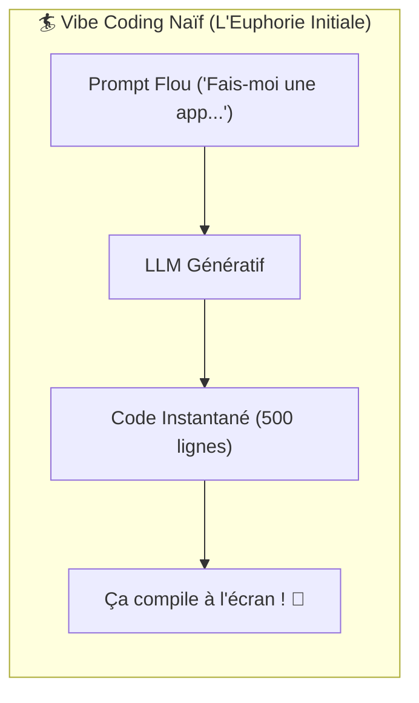
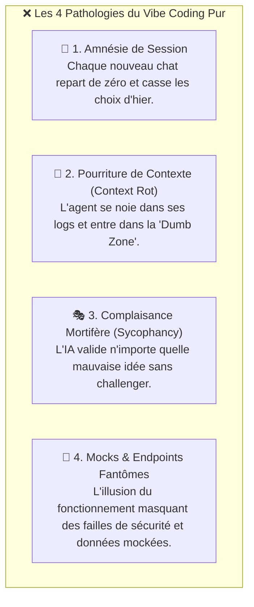
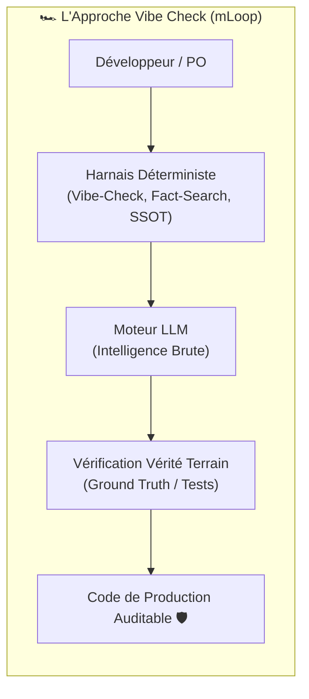
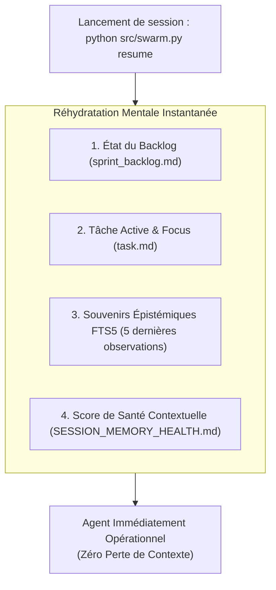

# 🎤 Présentation Table Ronde AI : Du « Vibe Coding » au « Vibe Check »

> **Auteur** : Marco Lefrançois & Équipe Architecture mLoop  
> **Audience** : Table Ronde AI, Praticiens IA, Développeurs, CTOs, Tech Leads & Product Owners  
> **Thème** : *Comment dépasser l'euphorie du « Vibe Coding » pour bâtir des systèmes d'entreprise pérennes grâce au « Vibe Check » et à l'ingénierie de harnais déterministe.*

---

## 🧭 Plan de la Présentation (Pitch Deck 15-20 min)

1. **L'Euphorie du Vibe Coding** (Le mythe du développeur sans mains & la promesse de la vitesse brute)
2. **Le Mur de la Réalité : The Scaling Cliff** (Pourquoi le Vibe Coding pur implose en entreprise)
3. **Le Changement de Paradigme : Qu'est-ce que le « Vibe Check » ?** (L'ingénierie de harnais comme accélérateur de confiance)
4. **L'Anatomie du « Vibe Check » Pré-Vol** (Le contrôle déterministe en 5 points - ADR-0310 & ADR-0339)
5. **L'Armure Anti-Amnésie : Session Resume & Persistance** (Comment ne plus jamais perdre le fil de l'architecture)
6. **Matrice Comparative : Vibe Coding vs Vibe Check** (Du prototype jetable au logiciel de production)
7. **Conclusion & Boîte à Outils Prête à l'Emploi** (La phrase choc & les commandes mLoop)

---

# 🔴 Slide 1 : L'Euphorie du Vibe Coding

### La Promesse Populaire : *« Just vibe with it »*

Popularisé par **Andrej Karpathy** début 2025, le *Vibe Coding* a captivé l'industrie :
- Programmer uniquement en **langage naturel** sans toucher à la syntaxe.
- Accepter les diffs proposés par les LLMs sans les lire en détail (« *if it runs, it ships* »).
- Une sensation grisante de **super-pouvoir** et de vitesse de prototypage décuplée.



### Le Contexte Initial :
* Idéal pour les *side-projects*, les démos de week-end et les hackathons.
* Élimination de la friction syntaxique et accélération du *Time-to-Hello-World*.

> ⚠️ **Mais que se passe-t-il le lundi matin quand on doit mettre ce code en production critique avec 10 développeurs ?**

---

# 💥 Slide 2 : Le Mur de la Réalité (*The Scaling Cliff*)

### Pourquoi le Vibe Coding Pur s'Effondre en Entreprise

Le passage du script jetable au système d'entreprise révèle les **4 pathologies mortelles** de l'IA sans harnais :



### Les Symptômes Observés sur le Terrain :
1. **La régression silencieuse** : Corriger le bouton A casse discrètement le calcul B car l'IA n'a pas vérifié les dépendances.
2. **La dette cognitive maximale** : Plus personne dans l'équipe ne sait comment le code fonctionne réellement.
3. **Le mur de complexité à l'échelle (Scaling Cliff)** : À 2 000 lignes de code, tout refactor devient une roulette russe.

> 💡 **Le constat** : Le code généré à la volée sans garde-fous n'est pas un actif, c'est **une dette technique à intérêt composé**.

---

# 🛡️ Slide 3 : Le Changement de Posture — Qu'est-ce que le « Vibe Check » ?

### L'Ingénierie de Harnais (*Harness Engineering*) comme Solution

Inspiré de la méthodologie **"Vibe Code Common Sense (Ships Faster & Never Forgets)"** de Joe Njenga et des principes fondateurs de **mLoop (ADR-0310)** :

> **La Thèse Fondamentale** :  
> L'intelligence brute du LLM est une **commodité volatile** (le moteur).  
> La vraie valeur d'ingénierie réside dans **l'infrastructure déterministe qui l'entoure** (le harnais).



### Le Vibe Check ne ralentit pas, il sécurise la vitesse :
* Comme les **freins d'une Formule 1** : ils ne sont pas là pour aller moins vite, mais pour permettre de piloter à 300 km/h en toute maîtrise.
* **Ground Truth vs Vibe Truth** : On ne fait pas confiance à la mémoire volatile du modèle ; on confronte chaque action à la vérité physique du disque et du code.

---

# 🔍 Slide 4 : L'Anatomie du « Vibe Check » Pré-Vol

### Le Contrôle Déterministe en 5 Points Déterministes (ADR-0310 & ADR-0339)

Avant d'autoriser la moindre modification de code, l'agent exécute automatiquement un **audit pré-vol mécanique en 5 points** :

````carousel
```markdown
### 1. 🪞 Directives d'Équipe Partagées (Multi-IDE)
- Vérification stricte : `AGENTS.md` ↔ `CLAUDE.md` ↔ `GEMINI.md`.
- Synchronisation automatique : l'agent obéit aux mêmes règles qu'on code dans **Cursor**, **Claude Code** ou **Antigravity**.
- Résultat : Zéro contradiction d'équipe, même cerveau pour toutes les IA.
```
<!-- slide -->
```markdown
### 2. 🚧 Confinement au Périmètre Git (Carré de Sable)
- Confinement absolu dans le sous-module / dossier projet du dépôt Git (`Projects/<Nom>`).
- Interdiction formelle de modifier des fichiers transverses, des configs globales ou des `.env`.
- Prévention totale des effets de bord sur le monorepo et la chaîne CI/CD.
```
<!-- slide -->
```markdown
### 3. 🔍 Fact-Search dans le Wiki & le Repo Git (Zéro Supposition)
- **Le réflexe dev par excellence** : avant d'écrire une seule ligne, l'agent fouille :
  1. Le **Wiki d'équipe** (Azure DevOps Wiki / Confluence : patterns, conventions d'API, ADRs).
  2. Le **Repo Git existant** (classes utilitaires, signatures de méthodes, schémas DBML).
- Résultat : L'agent **réutilise le code existant** au lieu de réinventer la roue ou d'installer des dépendances inutiles.
```
<!-- slide -->
```markdown
### 4. 🗂️ Traçabilité Backlog & User Stories (SSOT)
- Gouvernance contextuelle (INIT vs RUN - ADR-0339).
- En mode dév : chaque diff et chaque commit est obligatoirement ancré dans une User Story réelle du backlog.
- Élimination absolue des tickets fantômes et du code orphelin non traçable.
```
<!-- slide -->
```markdown
### 5. 🧹 Standards de Code & Arborescence Git Propre
- Respect des standards d'architecture logicielle (Clean Architecture, typage strict).
- Interdiction formelle des sous-READMEs sauvages et fichiers temporaires polluant la codebase.
- Code prêt pour la revue de PR humaine sans dette visuelle.
```
````

### La Règle d'Or : *Zero-Fail Carryover*
Si l'un des 5 contrôles échoue, l'agent **a l'interdiction de continuer**. Il doit réparer la dérive ou lever une alerte immédiate.

---

# 🧠 Slide 5 : L'Armure Anti-Amnésie — Session Resume & Rétention

### Le Problème #1 Résolu : *« L'IA a oublié ce qu'on a fait hier »*

Dans le Vibe Coding ordinaire, chaque nouvelle session de chat efface l'ardoise mentale de l'agent.  
Avec le moteur **Session Resume (ADR-0310)**, l'agent se réveille avec un état mental intact :



### Le Diptyque d'Hygiène de Session :
* **En début de session** : `python src/swarm.py resume` (Réinjection déterministe).
* **En fin de session** : Handoff propre (`memory/sessions/handoff.md`) réinitialisant la mémoire vive avant que la fenêtre de contexte n'entre dans la zone de dégénérescence.

---

# ⚖️ Slide 6 : Matrice Comparative — Vibe Coding vs Vibe Check

| Dimension | 🏄 Vibe Coding Naïf | 🛡️ Vibe Check (mLoop) |
| :--- | :--- | :--- |
| **Philosophie** | « Just vibe, if it runs it ships » | « Ships faster & never forgets » |
| **Mémoire de Contexte** | Volatile, amnésique à chaque chat | **Persistante** via SQLite FTS5 & Session Resume |
| **Vérification du Code** | Visuelle superficielle (l'humain relit) | **Déterministe** (5 contrôles pré-vol + NLI Fact-Check) |
| **Gestion des Faits** | Le LLM extrapole et assume | **Fact-Search FTS5 obligatoire** avant modification |
| **Résistance au Scale** | S'effondre au-delà de 2 000 lignes | **Scalable** en multi-projets hermétiques (ADR-0342) |
| **Cohérence Multi-Outils** | Chaotique (Cursor ≠ Claude ≠ Antigravity) | **Parité Miroir garantie** (`AGENTS.md` SSOT) |
| **Livrable Final** | Code opaque sans spécifications | **User Stories pures (4 Piliers Gherkin)** prêtes pour la prod |

---

# 🚀 Slide 7 : Conclusion & Boîte à Outils Prête à l'Emploi

> ### 💬 La Phrase Choc à retenir pour la Table Ronde :
> *« Le Vibe Coding vous donne l'illusion de voler ; le Vibe Check s'assure que vous avez des ailes, des instruments de bord et un train d'atterrissage. Ne vibez plus dans le vide : pilotez avec un harnais déterministe. »*

---

### 🛠️ Les Commandes Essentielles du Vibe Check mLoop

```powershell
# 1. Vérification pré-vol déterministe d'un projet
python src/swarm.py vibe-check --project <nom_projet>

# 2. Réveil de session anti-amnésie (restauration d'état mental)
python src/swarm.py resume --project <nom_projet>

# 3. Verrouiller l'attention de l'agent sur une User Story active
python src/swarm.py focus --project <nom_projet> --story backlog/stories/<story.md>

# 4. Calibrer et synchroniser la parité miroir des directives
python src/swarm.py calibrate

# 5. Recherche documentaire et factuelle avant toute édition
python scripts/fact_search.py search "<sujet_ou_regle_metier>"
```

### 📚 Références d'Architecture SSOT Associées
- **ADR-0310** : [`standards/adr-system/0310-vibe-code-session-resume.md`](file:///c:/Memory%20Loop/standards/adr-system/0310-vibe-code-session-resume.md) (Vibe Code Common Sense & Session Resume)
- **ADR-0339** : [`standards/adr-system/0339-project-lifecycle-stages-governance-gates.md`](file:///c:/Memory%20Loop/standards/adr-system/0339-project-lifecycle-stages-governance-gates.md) (Gouvernance des Étapes INIT vs RUN)
- **Philosophie Harnais** : [`docs/01-architecture/framework/executive_summaries/01_mloop_Philosophie_Harness.md`](file:///c:/Memory%20Loop/docs/01-architecture/framework/executive_summaries/01_mloop_Philosophie_Harness.md)
