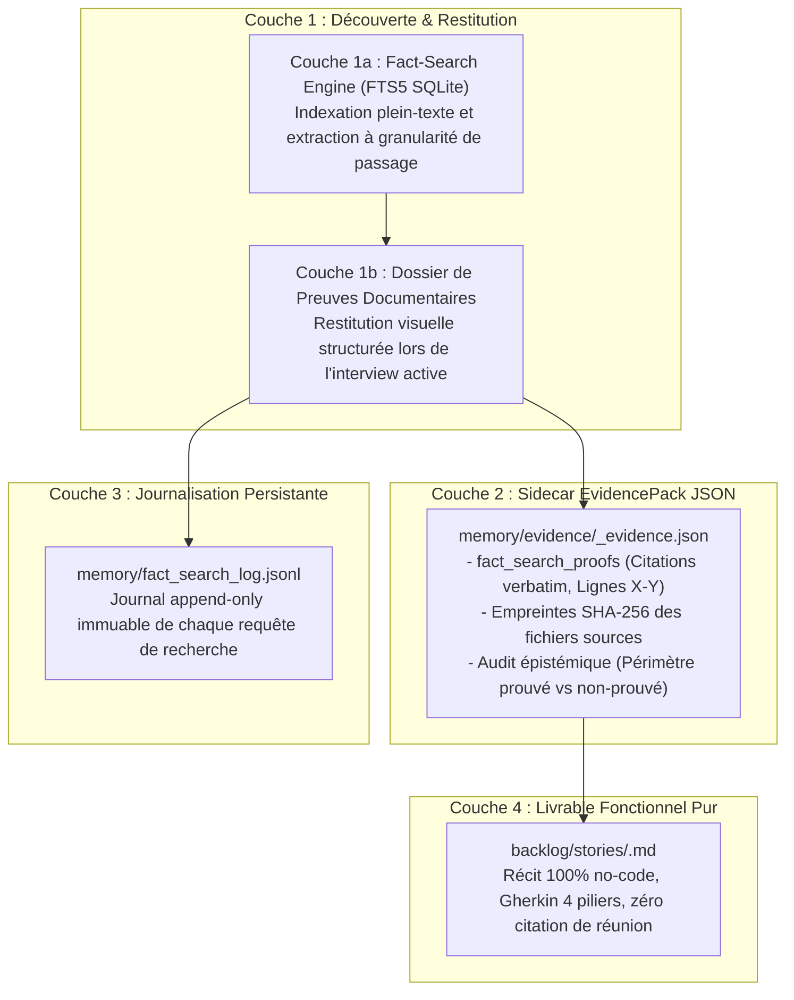

# 🏛️ Spécification d'Architecture : Système de Preuves & Passage-Level Grounding

> **Référence** : ADR-0326 / Universal Dev Handoff ADR-0319  
> **Domaine** : Assurance Qualité Sémantique, Traçabilité Documentaire & Anti-Hallucination

---

## 1. Contexte & Problématique

Dans les cycles de spécification assistés par IA, deux modes de défaillance majeurs sont régulièrement observés :
1. **Hallucination Non Groundée** : L'IA formule des questions ou des récits fondés sur des extrapolations logiques mais contraires aux sources documentaires réelles du client.
2. **Pollution Textuelle du Récit** : Pour prouver sa rigueur, l'IA injecte des extraits de compte-rendu de réunions, des noms d'intervenants ou des traces d'ateliers directement dans la User Story, créant du bruit pour les développeurs.

---

## 2. Architecture en 4 Couches Découplées

Le système sépare strictement la découverte, la présentation, l'archivage et le livrable final :

---

## 3. Contrats d'Intégrité (Invariants de Production)

1. **Search-Before-Ask** : Aucune question ne doit être posée à l'humain si la réponse est présente dans la base documentaire.
2. **Visual Grounding** : Chaque question d'arbitrage doit être accompagnée de son dossier de preuves sourcé.
3. **Zero-Noise Markdown** : Le récit Markdown final s'arrête strictement après la section `## Scénarios de test`. Zéro injection de trace d'atelier dans le `.md`.
4. **Deterministic EvidencePack** : L'EvidencePack JSON sidecar est validé contre `schemas/evidence_pack.schema.json`.
